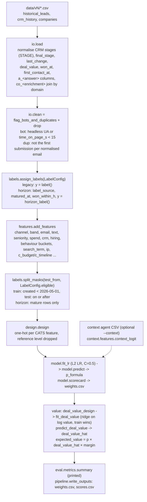
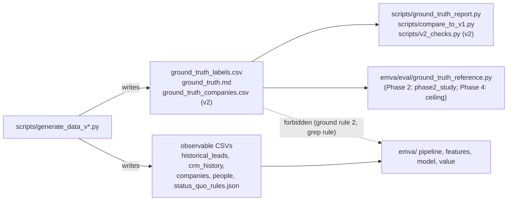

# Architecture

How data moves through EMVA, which module owns each step, where ground truth is allowed to flow, and
how the phases depend on each other. Vocabulary is defined in `docs/CONTEXT.md`; rulings in
`docs/adr/`. State as of `main` 92168cf (Phase 1 merged), 2026-09-25, with the in-flight Phase 2 and
Phase 5 v2 branches described where they change things.

## 1. The scoring pipeline

`emva.pipeline.run(data, margin, context, test_from, labels)` is the whole pipeline. With
`labels=LEGACY` it reproduces `baseline/emva_score.py::main` step for step and byte for byte.



| step | owner | notes |
|---|---|---|
| constants | `emva/constants.py` | `AS_OF` 2026-09-24 UTC, `TEST_FROM` 2026-05-01, `STALLED_DAYS`/`GHOSTED_DAYS` 90, `HORIZON_DAYS` 120, `CATS` (feature → reference level, also design column order), `LR_C` 0.5, `POINTS_TO_DOUBLE_ODDS` 20, `TOP_FRACTION` 0.2 |
| load | `emva/io.py::load` | Raises on a lead with two Won rows. Enrichment columns are NaN when the domain is not in `companies.csv` |
| clean | `emva/io.py::clean` | Bots and duplicates are dropped before labelling; 9,311 of 10,000 v1 leads remain |
| labels | `emva/labels.py` | Two definitions side by side; see section 2 |
| features | `emva/features.py` | `text_cat` (regex + three copy-paste prefixes + `VAGUE` list), `seniority` (title regex), `channel` (UTM rules) |
| design | `emva/design.py` | Levels absent from the data make no column; a missing reference level is silently kept (baseline behaviour) |
| fit | `emva/model.py` | `make_lr` is the unfitted estimator, reused by the coefficient bootstrap |
| value | `emva/value.py` | `DEAL_LOG_RESIDUAL_SD_FROM_GENERATOR = 0.45` is the ground-rule-2 violation removed by Phase 2 (plan 2.4). Capping/compression and `value_at_submit`/`value_at_close` are Phase 3 |
| orchestration | `emva/pipeline.py` | `PipelineResult` (X, masks, design, weights, summary, labels, messages); `scores()` adds horizon label columns only in horizon mode (ADR 0007) |
| CLI | `emva/__main__.py`, `emva/cli.py` | `cli.py` holds the label flags shared with the report |
| context | `emva/context/` | `agent.py` (Phase 0 move of `baseline/context_agent.py`: requests-based Haiku call, sha256 cache, logged retries), `contract.py` (current implicit JSON shape), `features.py` (clip + logit). Phase 6 replaces all three |

`emva/pipeline.py` imports `emva.eval.metrics.summary`; `metrics.py` is kept apart from `report.py` to
avoid a pipeline ↔ report import cycle. Nothing in `emva/` outside `eval/` imports from `eval/` otherwise.

## 2. The two switches and what "legacy" means

"Legacy" always means *the baseline's behaviour, preserved exactly* so it can be compared against.

**Label mode** (`--label-mode`, `emva.labels.LabelMode`, default `horizon`, merged in Phase 1):

- `legacy`: Won = 1; Lost = 0; open stage idle ≥ 90 whole days = 0; still New and ≥ 90 days old = 0;
  otherwise unlabelled. All labelled rows train/test. `scores.csv` has only the baseline columns.
- `horizon`: `won_within_h` (Won at or before `created_at + H`) on mature leads; ghosted-at-H excluded
  (`--include-ghosted` makes them 0) and stalled censored (`--stalled-as-lost` makes them 0). Only mature
  rows train/test. `scores.csv` adds `won_within_h`, `label_source`, `matured_at`.
- `LabelConfig` rejects the horizon-only flags in legacy mode; `cli.label_config` rejects an explicit
  `--horizon-days` with legacy.

**Feature set** (`--feature-set`, `emva.features.FeatureSet`, default `v2`; **in progress on
`phase2-features`, not on `main`**):

- `legacy`: `add_features` as above (missing inputs fall into reference levels, `no_company`, three-prefix
  copy-paste rule, fixed 0.45 residual sd; that constant moves to `emva/eval/regression.py` so the grep
  rule holds).
- `v2`: `add_features_v2`: company-name enrichment (`en_<column>`, domain then normalised-name match),
  `enrichment_missing` replaces `no_company`, `session_missing` indicator for absent telemetry with the
  seven behavioural features left at reference (ADR 0009), `band` keeps its own `missing` level,
  boilerplate detection by token-set Jaccard ≥ 0.6 (`emva/boilerplate.py`), `c_budget`, `c_timeline`,
  `ip_type`, `edits_1_4` dropped (plan 2.6), residual sd estimated from training residuals.
- `--label-mode legacy --feature-set legacy` must stay byte-identical to `baseline/`; `make baseline`
  runs exactly that.

## 3. The evaluation package (`emva/eval/`)

The only place that may read ground truth (ground rule 2), and even here only one module does on `main`.

| file | reads | purpose |
|---|---|---|
| `bootstrap.py` | arrays only | `auc_ci`, `paired_auc` (shared resamples, two-sided bootstrap p), `coef_bootstrap`; 1000 resamples, seed 0; single-class resamples redrawn |
| `metrics.py` | arrays only | `summary`, `top_share` (numpy argsort), `tie_averaged_top_share`, `ties_at_cut`, `bottom_share`, `calibration_by_decile`, `auc_by_month`, `value_scale` |
| `regression.py` | `baseline/weights.csv`, pipeline stdout | `EXPECTED_SUMMARY` (0.814 / 0.1006 / 0.571 / 0.795), canonical weights comparison, `reordered_rows` |
| `status_quo.py` | `status_quo_rules.json`, leads | Reconstructs the status-quo value (form base × country/channel multipliers × tier) |
| `report.py` | data CSVs, runs `baseline/emva_score.py` in a temp dir | The standard report; `FROZEN_HORIZON` fixes test definition (b); `frozen_test_labels` builds both test sets independent of the candidate's flags |
| `label_study.py` | data CSVs (via the pipeline) | Phase 1: size weights with coefficient CIs, flag combinations, horizon sensitivity |
| `ground_truth_reference.py` | **`ground_truth_labels.csv`, `ground_truth.md`** | Phase 1 reference numbers (39.4% true 201-1000 rate, R1 true 120-day effects). Run as a script only; a test asserts nothing imports it |
| `collinearity.py`, `feature_selection.py`, `phase2_study.py` | (Phase 2 branch) | 2.7 collinearity check (fails on any pair with \|corr\| > 0.95), 2.6 coefficient-bootstrap selection, Phase 2 study (uses ground truth for match/boilerplate precision) |
| `rolling.py`, `ceiling.py` | (Phase 4, planned) | rolling-origin splits; oracle-feature ceiling (reads ground truth) |

## 4. The data generator (`scripts/`)

`scripts/generate_data_v1.py` rewrites the lost `scripts/generate_data.py` from `data/v1/ground_truth.md`
plus a profile of the v1 files (ADR 0003). It never reads `data/v1` at runtime; everything not stated in
`ground_truth.md` is hard-coded from that profile. All parameters live on the `Config` dataclass.

Stages, one function each, run by `generate(cfg)`:

```
make_companies -> make_people (personas) -> make_leads (channel, form, answers, timestamps)
-> add_behaviour -> add_text -> hidden_log_odds (tier, contact decision, reply time, deal value)
-> draw_outcome -> add_duplicates -> make_crm -> make_vendor_people -> labels -> write (+ ground_truth.md)
```

**RNG streams.** `rng_for(cfg, stage) = np.random.default_rng([cfg.seed, zlib.crc32(stage.encode())])`.
Each stage has its own stream, so adding a draw in one stage never shifts another stage's draws.
Streams are per stage, not per row: an extra draw inside a stage shifts every later row of *that* stage.
The planted close model is additive logistic: intercept −3.12, the effects in `ground_truth.md`, noise
sd 0.5; a regression of logit(`p_close_true`) on the planted features recovers every coefficient
(residual sd 0.505 on v1).

**v2 (in progress, `phase5-generator-v2`).** The plan 5.2-5.8 options are `Config` fields tagged with
their task (paraphrase, typos, languages, boilerplate, enrichment dropout, consent missingness,
interactions, ghosting by tier, context-only persona, fast humans), all off by default. Each option
draws from its own `v2_*` stream (`v2_consent`, `v2_persona`, `v2_paraphrase`, `v2_ghosting`, ...), so
with every option off the output for seed 20260924 is byte-identical to v1 behaviour (pinned by sha256
in the tests). `scripts/generate_data_v2.py` = v1 defaults + `V2_SETTINGS`, writes `data/v2/`
including `ground_truth_companies.csv` and five extra label columns. Paraphrases come only from the
committed cache `scripts/paraphrase_cache.json` (written by `scripts/paraphrase_templates.py`); a
missing entry raises `MissingParaphraseError`. `persona_safe` imports `emva.features.text_cat`; the
dependency is one way (`emva/` never imports the generator).

Generator-side tooling: `scripts/ground_truth_report.py` (measures the `ground_truth.md` tables; reads
ground truth), `scripts/compare_to_v1.py` (fidelity tables, baseline model on both directories, seed
spread), and on the v2 branch `scripts/v2_checks.py` (mechanism measurements; reads ground truth).

## 5. Where ground truth may flow



Allowed: the generator and its measurement scripts; modules under `emva/eval/` that are run as scripts
and not imported by the pipeline; tests that check those modules. Forbidden: any read, import or
hard-coded number from ground truth in `emva/` outside `eval/`, including constants copied from
`ground_truth.md` (the 0.45 residual sd was exactly that). The context agent never sees CRM stages,
deal values or ground truth.

## 6. Phase dependencies

From `REBUILD_PLAN.md`, with state on 2026-09-25:


Phases 3, 4 and 5 can run in parallel once Phase 2 lands. Phase 6 waits for 2 and 5. Phase 7 waits for
everything. Phase 4's rolling-origin evaluation becomes the headline number (ADR 0006).
