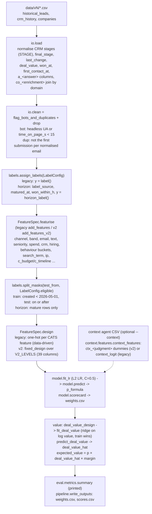
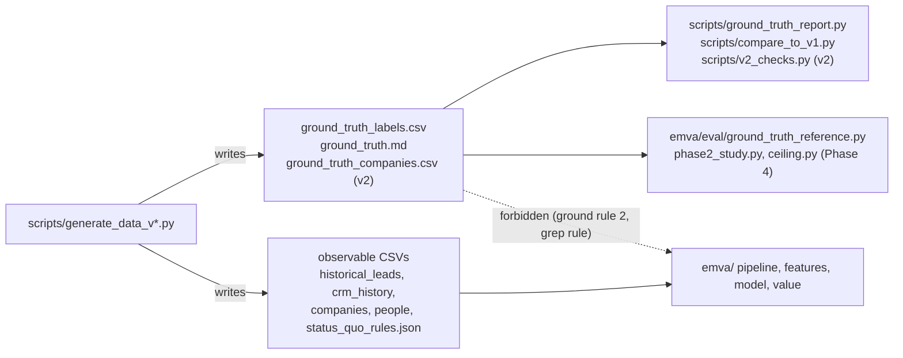
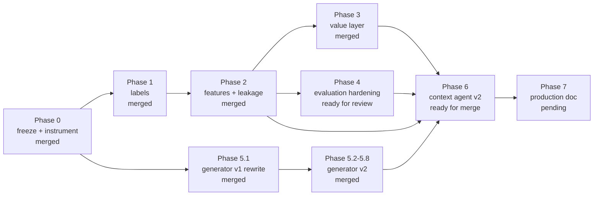
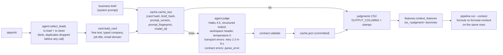
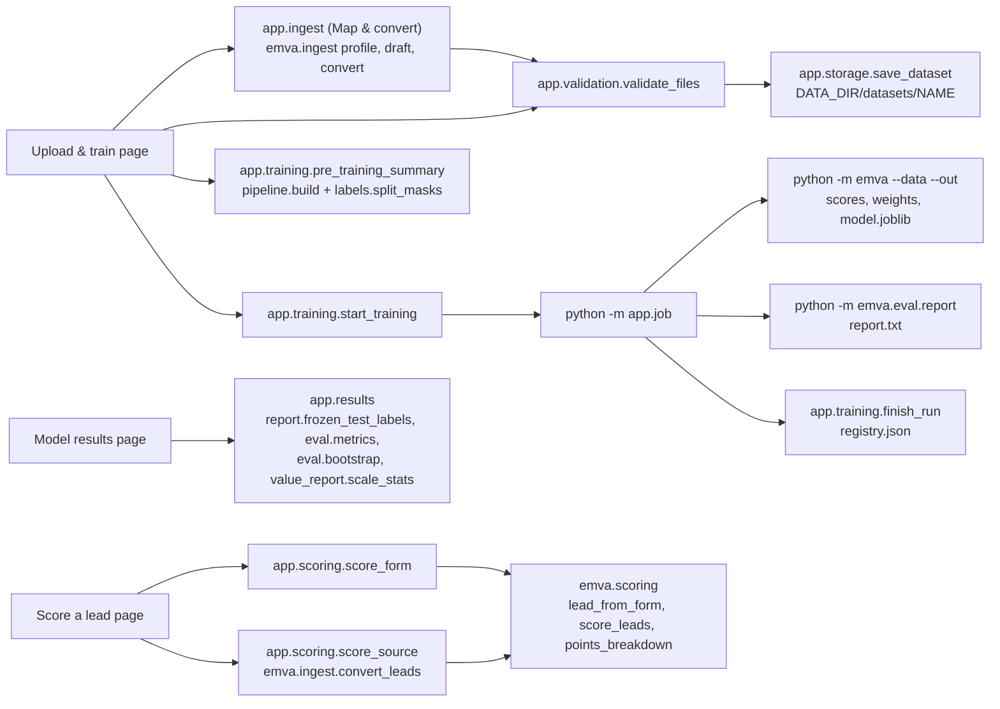
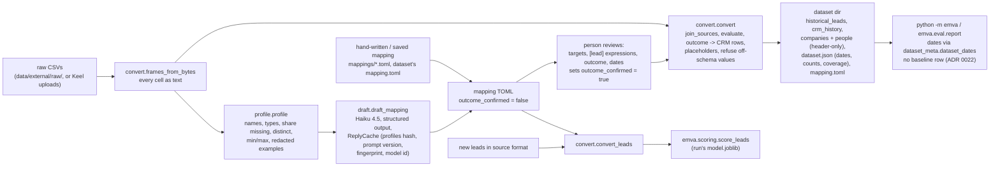
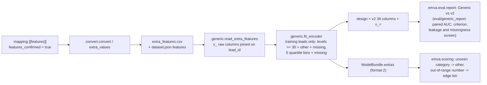

# Architecture

How data moves through EMVA, which module owns each step, where ground truth is allowed to flow, and
how the phases depend on each other. Vocabulary is defined in `docs/CONTEXT.md`; rulings in
`docs/adr/`. State as of `main` e98a586 (Phases 0, 1, 5.1, 5.2-5.8 merged), 2026-09-25, plus Phase 2
as on `phase2-features` (ready for review).

## 1. The scoring pipeline

`emva.pipeline.run(data, margin, context, test_from, labels, features)` is the whole pipeline. With
`labels=LEGACY, features=FeatureSet.LEGACY` it reproduces `baseline/emva_score.py::main` step for step and byte for byte.



| step | owner | notes |
|---|---|---|
| constants | `emva/constants.py` | `AS_OF` 2026-09-24 UTC, `TEST_FROM` 2026-05-01, `STALLED_DAYS`/`GHOSTED_DAYS` 90, `HORIZON_DAYS` 120, `CATS` (feature → reference level, also design column order), `LR_C` 0.5, `POINTS_TO_DOUBLE_ODDS` 20, `TOP_FRACTION` 0.2 |
| dataset dates | `emva/dataset_meta.py` | Phase 9, ADR 0020. `dataset_dates(data)`: `(as_of, test_from)` from `<data>/dataset.json` when present (refused loudly if malformed), else `AS_OF` / `TEST_FROM`; `pipeline.run` and `eval.report` read it, so a converted dataset labels, splits and reports on its own period. `read_dataset_meta` returns the whole file (counts, `coverage`) for the app |
| load | `emva/io.py::load` | `read_leads` + `add_crm_outcomes` + `enrich` (the submit-time half: answers, domain and name enrichment, no CRM history; reused by `emva.scoring`). Raises on a lead with two Won rows. Enrichment columns are NaN when the domain is not in `companies.csv` |
| clean | `emva/io.py::clean` | Bots and duplicates are dropped before labelling; 9,311 of 10,000 v1 leads remain |
| labels | `emva/labels.py` | Two definitions side by side; see section 2 |
| features | `emva/features.py` | `FeatureSet` switch (section 2). Legacy `add_features`: `text_cat` (regex + three copy-paste prefixes + `VAGUE` list), `seniority` (title regex), `channel` (UTM rules). v2 `add_features_v2`: `session_absent` / `session_missing`, `enrichment_missing`, `text_cat_v2`; `V2_DROPPED` (plan 2.6) |
| feature spec | `emva/feature_spec.py` | `FeatureSpec` (reference levels, featuriser, design function, fixed residual sd or None) per `FeatureSet`, like `LabelConfig`; `feature_spec(fs)` is the only place that switches on the feature set |
| boilerplate | `emva/boilerplate.py` | v2 copy-paste detector: 16 snippets, token-set Jaccard, `BOILERPLATE_SIMILARITY_THRESHOLD` 0.6 (plan 2.5; low recall on paraphrased v2 text, ADR 0011) |
| design | `emva/design.py` | Legacy `design()`: levels absent from the data make no column; a missing reference level is silently kept (baseline behaviour). v2 `fixed_design()`: exactly the columns declared in `constants.V2_LEVELS` (39), absent level = zero column, undeclared value raises (ADR 0009). `FeatureSpec.design` picks by feature set |
| fit | `emva/model.py` | `make_lr` is the unfitted estimator, reused by the coefficient bootstrap |
| value | `emva/value.py` | `DealValueModel`: ridge on log value; lognormal correction exp(sd²/2) with sd estimated from training residuals (plan 2.4), or the baseline's fixed sd (`eval.regression.BASELINE_DEAL_LOG_RESIDUAL_SD`) for `--feature-set legacy`. Deal-value design: `deal_value_design` (legacy, data-driven) or `fixed_deal_value_design` (v2, every level of `constants.DEAL_VALUE_LEVELS`, unknown level raises; `FeatureSpec.value_design`). `value_at_close` (plan 3.3) |
| value transform | `emva/value_transform.py` | `ValueTransform` (cap percentile, compression, floor, tiers) `.fit(training values)` -> `FittedValueTransform.apply`; the pipeline writes `value_at_submit` with it in horizon mode (Phase 3, ADR 0012 default; step order cap, compression, floor, tiers) |
| tROAS | `emva/troas.py` | `python -m emva.troas`: conversions per campaign per 30 days / week at submit and close stage vs Google (30 / 30 days) and Meta (50 / week) thresholds (verify) |
| orchestration | `emva/pipeline.py` | `PipelineResult` (X, masks, design, weights, summary, labels, messages); `scores()` adds horizon label columns only in horizon mode (ADR 0007) |
| CLI | `emva/__main__.py`, `emva/cli.py` | `cli.py` holds the label flags and `--feature-set`, shared with the report and `eval.collinearity` |
| persist | `emva/persist.py` | Phase 8, ADR 0018 (Proposed). `ModelBundle` (feature set, `LabelConfig`, margin, design and value columns, allowed levels, fitted LR, `DealValueModel`, `FittedValueTransform` or None, scorecard, raw lead schema, provenance); `save_bundle` / `load_bundle` (joblib; refuses another `format_version`, warns on library version drift). `python -m emva --out DIR` writes `DIR/model.joblib` |
| scoring | `emva/scoring.py` | Phase 8, ADR 0018. `score_leads(bundle, leads, data)` scores new leads through the training functions (needs `data/.../companies.csv`); `points_breakdown` (intercept + active design columns, sums to logit p); `submit_time_fields()` (`FieldSpec` per form input, allowed values from `constants`/`features`); `lead_from_form(fields)`. Unknown level raises `UnknownLevelError`; bots/duplicates flagged within the batch, not dropped |
| context | `emva/context/` | Phase 6 (ADR 0014), see section 7. `card.py` (the only lead facts the agent sees), `contract.py` (enum judgments + reason, JSON schema, `validate`), `agent.py` (SDK runtime), `cache.py` (reply cache), `features.py` (`ctx_<judgment>` fixed-schema dummies; legacy `context_logit` kept for baseline byte identity) |

`emva/pipeline.py` imports `emva.eval.metrics.summary`; `metrics.py` is kept apart from `report.py` to
avoid a pipeline ↔ report import cycle. Nothing in `emva/` outside `eval/` imports from `eval/` otherwise.

## 2. The two switches and what "legacy" means

"Legacy" always means *the baseline's behaviour, preserved exactly* so it can be compared against.

**Label mode** (`--label-mode`, `emva.labels.LabelMode`, default `horizon`, merged in Phase 1):

- `legacy`: Won = 1; Lost = 0; open stage idle ≥ 90 whole days = 0; still New and ≥ 90 days old = 0;
  otherwise unlabelled. All labelled rows train/test. `scores.csv` has only the baseline columns.
- `horizon`: `won_within_h` (Won at or before `created_at + H`) on mature leads; ghosted-at-H excluded
  (`--include-ghosted` makes them 0) and stalled censored (`--stalled-as-lost` makes them 0). Only mature
  rows train/test. `scores.csv` adds `won_within_h`, `label_source`, `matured_at`.
- `LabelConfig` rejects the horizon-only flags in legacy mode; `cli.label_config` rejects an explicit
  `--horizon-days` with legacy.

**Feature set** (`--feature-set`, `emva.features.FeatureSet`, default `v2`; Phase 2, on
`phase2-features` until merged):

- `legacy`: `add_features` as above (missing inputs fall into reference levels, `no_company`, three-prefix
  copy-paste rule), data-driven `design()`, fixed 0.45 residual sd (the constant lives in
  `emva/eval/regression.py` so the grep rule holds).
- `v2`: `add_features_v2`: company-name enrichment (`en_<column>`, domain then normalised-name match),
  `enrichment_missing` replaces `no_company`, `session_missing` indicator for absent telemetry with the
  seven behavioural features left at reference (ADR 0009), `band` keeps its own `missing` level,
  boilerplate detection by token-set Jaccard ≥ 0.6 (`emva/boilerplate.py`), `c_budget`, `c_timeline`,
  `ip_type`, `edits_1_4` dropped (plan 2.6), residual sd estimated from training residuals. The design is
  `fixed_design` over the declared `V2_LEVELS`: always the same 39 columns.
- `generic` (Phase 10, ADR 0024): the v2 design plus the `x_<name>=<level>` columns of a converted dataset's
  declared extras (`extra_features.csv`), encoded on the training leads only and frozen in the bundle. Needs a
  dataset whose `dataset.json` declares `features`; see section 10.
- `--label-mode legacy --feature-set legacy` must stay byte-identical to `baseline/`; `make baseline`
  runs exactly that.

## 3. The evaluation package (`emva/eval/`)

The only place that may read ground truth (ground rule 2), and even here only three modules do
(`ground_truth_reference.py`, `phase2_study.py` from Phase 2 and `ceiling.py` from Phase 4); the first
two run as scripts only, `ceiling.py` is imported only by the `hardening.py` entry point.

Phase 4 modules share one prepared frame (`rolling.EvalFrame`) and one split vocabulary
(`rolling.RollingSpec`): `hardening.py` -> {`rolling`, `subsampling`, `ceiling`, `calibration_decay`,
`regularisation`, `interactions`, `report`}; `calibration_decay` and `regularisation` reuse
`rolling`'s windows and fitting; `ceiling` reads only the declared truth columns.

| file | reads | purpose |
|---|---|---|
| `bootstrap.py` | arrays only | `auc_ci`, `paired_auc` (shared resamples, two-sided bootstrap p), `coef_bootstrap`; 1000 resamples, seed 0; single-class resamples redrawn |
| `metrics.py` | arrays only | `summary`, `top_share` (numpy argsort), `tie_averaged_top_share`, `ties_at_cut`, `bottom_share`, `calibration_by_decile`, `auc_by_month`, `value_scale` |
| `regression.py` | `baseline/weights.csv`, pipeline stdout | `EXPECTED_SUMMARY` (0.814 / 0.1006 / 0.571 / 0.795), canonical weights comparison, `reordered_rows` |
| `status_quo.py` | `status_quo_rules.json`, leads | Reconstructs the status-quo value (form base × country/channel multipliers × tier) |
| `report.py` | data CSVs, runs `baseline/emva_score.py` in a temp dir | The standard report; `FROZEN_HORIZON` fixes test definition (b); `frozen_test_labels` builds both test sets independent of the candidate's flags |
| `label_study.py` | data CSVs (via the pipeline) | Phase 1: size weights with coefficient CIs, flag combinations, horizon sensitivity |
| `ground_truth_reference.py` | **`ground_truth_labels.csv`, `ground_truth.md`** | Phase 1 reference numbers (39.4% true 201-1000 rate, R1 true 120-day effects). Run as a script only; a test asserts nothing imports it |
| `collinearity.py` | pipeline design | Plan 2.7: pairwise \|corr\| of design columns on the training rows; `python -m emva.eval.collinearity` exits 1 on any pair > 0.95 (strict). The report prints the same check as a PASS/FAIL section and exits 1 only with `--strict` (ADRs 0009, 0011) |
| `feature_selection.py` | data CSVs (via the pipeline) | Plan 2.6: coefficient-bootstrap CIs (≥ 200 refits) for `c_budget`, `c_timeline`, `ip_type`, `edits_1_4` on the full v2 candidate design; evidence for `features.V2_DROPPED` |
| `phase2_study.py` | data CSVs, **`ground_truth_labels.csv`** | Phase 2 evidence: name-match count and correctness, boilerplate precision/recall, lead-ads buckets, before/after weights and ties, collinearity table, paired v2-vs-legacy AUC, residual sd. Run as a script only |
| `value_report.py` | pipeline result, leads | Phase 3: value-scale table per transform (p1/p50/p90/p99/max, max/median, top-1% share, tie-averaged top-20% revenue vs the baseline's, value / revenue) per test set and over all scored leads, the plan 3.2 PASS/fail table, and click-ID coverage per paid channel (plan 3.5). Called from `report.py` |
| `rolling.py` | data CSVs (via the pipeline) | Phase 4.1: `EvalFrame` (one dataset prepared once: horizon + legacy labels, v2 and legacy designs, frozen masks), `RollingSpec` (headline: training mature at S, one-month test windows mature at AS_OF; relaxed and legacy variants), `headline` / `paired_headline` (mean AUC over sufficient splits, independent per-split bootstrap). ADR 0013 |
| `subsampling.py` | pipeline design | Phase 4.2/4.3: subsampling curve (same rows for every model per seed), `gbdt_design` + monotone constraint vector for `HistGradientBoostingClassifier`, customer-sized holdout CI width |
| `ceiling.py` | **`ground_truth_labels.csv`, `ground_truth_companies.csv` (v2) / `companies.csv` (v1)**, raw session columns | Phase 4.4: oracle feature sets (truth only, formula, + interactions, + persona) fitted with the formula model; used only by `hardening.py`, never by the pipeline |
| `calibration_decay.py` | pipeline design | Phase 4.5: fit through month M, Brier / slope / calibration-in-the-large on M+1..M+3, decile tables |
| `regularisation.py` | pipeline design | Phase 4.6: C sweep on both frozen test sets and the rolling headline; flatness check |
| `interactions.py` | pipeline features | Phase 5 hand-off: LinkedIn × band 51+ and senior × form D added to the v2 design; coefficient CIs and paired AUC |
| `hardening.py` | all of the above, runs `report.py` | Phase 4 entry point (`make report-full`, `python -m emva.eval.hardening`): every section on data/v2 (headline) and data/v1, cached per (section, dataset) under `runs/phase4/cache/`, written between markers into `reports/phase4.md` |

## 4. The data generator (`scripts/`)

`scripts/generate_data_v1.py` rewrites the lost `scripts/generate_data.py` from `data/v1/ground_truth.md`
plus a profile of the v1 files (ADR 0003). It never reads `data/v1` at runtime; everything not stated in
`ground_truth.md` is hard-coded from that profile. All parameters live on the `Config` dataclass.

Stages, one function each, run by `generate(cfg)`:

```
make_companies -> make_people (personas) -> make_leads (channel, form, answers, timestamps)
-> add_behaviour -> add_text -> hidden_log_odds (tier, contact decision, reply time, deal value)
-> draw_outcome -> add_duplicates -> make_crm -> make_vendor_people -> labels -> write (+ ground_truth.md)
```

**RNG streams.** `rng_for(cfg, stage) = np.random.default_rng([cfg.seed, zlib.crc32(stage.encode())])`.
Each stage has its own stream, so adding a draw in one stage never shifts another stage's draws.
Streams are per stage, not per row: an extra draw inside a stage shifts every later row of *that* stage.
The planted close model is additive logistic: intercept −3.12, the effects in `ground_truth.md`, noise
sd 0.5; a regression of logit(`p_close_true`) on the planted features recovers every coefficient
(residual sd 0.505 on v1).

**v2 (in progress, `phase5-generator-v2`).** The plan 5.2-5.8 options are `Config` fields tagged with
their task (paraphrase, typos, languages, boilerplate, enrichment dropout, consent missingness,
interactions, ghosting by tier, context-only persona, fast humans), all off by default. Each option
draws from its own `v2_*` stream (`v2_consent`, `v2_persona`, `v2_paraphrase`, `v2_ghosting`, ...), so
with every option off the output for seed 20260924 is byte-identical to v1 behaviour (pinned by sha256
in the tests). `scripts/generate_data_v2.py` = v1 defaults + `V2_SETTINGS`, writes `data/v2/`
including `ground_truth_companies.csv` and five extra label columns. Paraphrases come only from the
committed cache `scripts/paraphrase_cache.json` (written by `scripts/paraphrase_templates.py`); a
missing entry raises `MissingParaphraseError`. `persona_safe` imports `emva.features.text_cat`; the
dependency is one way (`emva/` never imports the generator).

Generator-side tooling: `scripts/ground_truth_report.py` (measures the `ground_truth.md` tables; reads
ground truth), `scripts/compare_to_v1.py` (fidelity tables, baseline model on both directories, seed
spread), and on the v2 branch `scripts/v2_checks.py` (mechanism measurements; reads ground truth).

## 5. Where ground truth may flow



Allowed: the generator and its measurement scripts; modules under `emva/eval/` that are run as scripts
and not imported by the pipeline; tests that check those modules. Forbidden: any read, import or
hard-coded number from ground truth in `emva/` outside `eval/`, including constants copied from
`ground_truth.md` (the 0.45 residual sd was exactly that). The context agent never sees CRM stages,
deal values or ground truth.

## 6. Phase dependencies

From `REBUILD_PLAN.md`, with state on 2026-09-25:



Phases 3, 4 and 5 can run in parallel once Phase 2 lands. Phase 6 waits for 2 and 5. Phase 7 waits for
everything. Phase 4's rolling-origin evaluation becomes the headline number (ADR 0006; definition ADR 0013).

## 7. Context agent (Phase 6, ADR 0014)



| module | role |
|---|---|
| `emva/context/card.py` | `LeadCard` with exactly four strings (`CARD_FIELDS`); no enrichment, spend, CRM, hiring, bucketed answers or telemetry (tested) |
| `emva/context/contract.py` | `JUDGMENTS` (five enums), `reason` <= 30 words, `RESPONSE_SCHEMA` for `output_config`, `validate` -> `ContractError` (parse error); `STATUSES` ok / parse_error / transport_error; `OUTPUT_COLUMNS` with the `(brief_hash, prompt_version, model_id)` stamp |
| `emva/env.py` | `find_dotenv` / `load_env_var`, shared by the agent and `scripts/paraphrase_templates.py`; the search stops at the repo root (a linked worktree falls back to the main checkout) |
| `emva/context/agent.py` | `make_client` (key and workspace via `emva.env`, `anthropic-workspace-id` header, SDK retries off), `judge` (one card; transport errors retried, 4xx configuration errors raise, parse errors recorded), `run_agent` (cache, <= 8 workers, `--dry-run` counts misses without a client) |
| `emva/context/cache.py` | `ReplyCache` (format 2): JSON, atomic writes (`*.tmp` gitignored), key adds `prompt_fingerprint` (system template + schema + max tokens), ok and parse-error replies cached, transport errors never; identical cards in a run share one request |
| `emva/context/features.py` | `CONTEXT_LEVELS` / `CONTEXT_CATS` (references yes / buyer / specific / none / partial); persona pooled via `PERSONA_GROUPS` into `ctx_persona_group` (buyer / non_buyer / unclear, ADR 0016); 13 columns from `design.fixed_design`; one stamp per file enforced |
| `emva/eval/context_harness.py` | evaluation side (reads ground truth): persona-stratified sample, oracle power curve, same-row cross-fitted comparison, R12 `coefficient_criterion` (weight CI excludes 0 and lies in the oracle CI), weight CIs, persona confusion, formula correlation, boilerplate recall |
| `scripts/run_context_agent.py` | 6.6 run on the committed `sample_ids.csv` (written only by `python -m emva.eval.context_harness sample`; the script reads no ground truth); appends counts to `data/v2/context/runs.jsonl`; `--dry-run` writes nothing |

A brief edit changes `brief_hash`, so every lead is a cache miss: `--dry-run` reports the count and the
cached brief hashes without calling; the real run then produces a new judgments file, and the context
weights are refit by the next `python -m emva --context` (weights are never carried across stamps).


## 8. Hosted app (`app/`, Phase 8)

Keel, the internal Streamlit tool (`streamlit run app/main.py`; `make app` locally, `scripts/serve.sh` in the
image). It reuses the pipeline; it never re-implements a label, feature, metric or score. Pure modules import
without Streamlit; UI modules are thin.



| module | owns |
|---|---|
| `app/storage.py` | Data root layout; `list_runs` marks a `running` run failed when its job process is gone (pid + command-line check) (`datasets/<name>/`, `runs/<run_id>/`, `registry.json`), `Dataset` / `Run`, slug names, the training-file allow-list (a `ground_truth*` name is refused by name, never opened), atomic JSON writes under an `fcntl` lock, the read-only bundled sample (`data/v1`, training files only); Phase 9: a dataset may also hold `mapping.toml` and `dataset.json` (`is_converted`, `list_mappings`), the store's own record is `keel_meta.json` (`init_root` renames a legacy `dataset.json` record; ADR 0022); Phase 10 (b): `extra_features.csv` is a training file (`Dataset.has_extras`), held only by a converted dataset (ADR 0024) |
| `app/ingest.py` | Map & convert (Phase 9): `MappingForm` (the editable, possibly incomplete mapping under review), `form_from_mapping` / `mapping_from_form` / `form_from_toml`, the review and outcome tables, saved and built-in (`mappings/*.toml`) mapping choices, `draft` (Claude Haiku via `emva.ingest.draft_mapping`, cache `DATA_DIR/ingest/draft_cache.json`; a missing key or API error becomes a message and the table is filled by hand), `convert_raw` (`emva.ingest.convert` + `mapping.toml` + an optional uploaded `status_quo_rules.json` + `validate_files`), coverage summary, `derived_counts` (the card's "Derived during conversion"); Phase 10 (b): the review table's `feature` / `kind` / `name` columns (`apply_review` builds `[[features]]`; a column may be a field and a feature), `derived_features_frame`, `features_signature` (keys the features confirmation), `confirm(m, features_confirmed)`, `extras_summary` |
| `app/validation.py` | `validate_files` -> `ValidationReport(errors, warnings, summary)` of `Issue(file, column, message, rows)`; required columns derived from `emva.scoring.submit_time_fields` and what `emva.io` / `emva.eval.status_quo` read; a converted dataset's `dataset.json` (`emva.dataset_meta.parse_dataset_meta`, its `as_of` for the snapshot warning, a warning naming the leads whose CRM times were reordered) and `mapping.toml` (a confirmed mapping); Phase 10 (b): `extra_features.csv` against `dataset.json` `features` (columns, unique `lead_id`, the same leads both ways, numeric extras numeric) and the summary's `extra_features`; never raises on user input |
| `app/training.py`, `app/job.py` | `TrainingConfig` (label mode, feature set), the CLI and report argv, `pre_training_summary`, `start_training` (spawns the job, output to `train.log`), `finish_run` (parses the printed summary); a vanished job becomes `failed` in `app.storage.list_runs` (`job_alive`). The job runs the CLI, then the report when the dataset has rules or is converted (`report_available`), then records the outcome itself, so a run completes with no browser open. Dates come from `emva.dataset_meta.dataset_dates` (ADR 0020); Phase 10 (b): `feature_set_options` (generic only with `extra_features.csv`), `TrainingSummary.extras` |
| `app/results.py` | Results-page frames from `scores.csv` / `weights.csv` (round-trip float parsing) + the dataset: `evaluate` (frozen mature or legacy test set; the report's baseline, model and status-quo `ScoredModel`s), `standard_table` (`emva.eval.report.headline_frame` / `paired_frame`), `calibration`, `auc_month` (bootstrap CI per month), `scorecard` (plain feature names), `value_distribution`, `training_base_rate`. `baseline_scores` returns no scores and a reason on a converted dataset or a failed script; `kpi_reference` picks status quo, else baseline, else nothing (ADR 0022); Phase 10 (b): `generic_comparison` / `GenericSection` (v2 and generic retrained on the same leads, `emva.eval.generic_report.compare` on the selected test set, collinearity, leakage screen; refused when the retrain does not reproduce `scores.csv`), `scorecard(run_dir, extras)` names `x_` columns and their references. Nothing is scraped from `report.txt` |
| `app/scoring.py` | Form sections, labels and defaults over `submit_time_fields` (session fields default to a typical visit, because a blank one sets `session_missing`), `values_from_lead`, `score_form`, `describe_transform`; source format for a converted dataset's run: `run_mapping` (via `app.storage.read_mapping`), `source_fields`, `frames_from_source_form` / `_uploads`, `score_source` (`emva.ingest.convert_leads` then `score_leads`), `source_lead_score`; Phase 10 (b): `source_fields(mapping, bundle)` gives a generic bundle's extras their training levels (+ `other`) or a number input (`number_text`), `extra_names` (the EMVA form's note on blank extras), `missing_unseen` / `blank_unseen` (fix round: the per-extra warning when a blank extra scores as its reference level) |
| `app/auth.py` | `expected_password` (`APP_PASSWORD`; unset or blank = refuse), `check_password` (`hmac.compare_digest`) |
| `app/main.py`, `app/ui.py`, `app/views/` | Entrypoint (gate, sidebar, `st.navigation`), cached loaders (`st.cache_data` for evaluation frames and, Phase 10 (b), `generic_section`; `st.cache_resource` for bundles), the three pages |
| `app/theme.py`, `app/components.py`, `app/charts.py`, `.streamlit/config.toml` | Identity: palette, fonts, the one stylesheet; escaped HTML components (KPI cards, pills, file cards, result card, tables); the shared Plotly template |

Ground truth: `grep -rn "ground_truth" app/` returns only `storage.FORBIDDEN_PREFIX`, the name check.

## 9. Dataset converter (`emva/ingest/`, Phase 9, ADRs 0020-0023)

Foreign CSVs (1-3 files per source) become a dataset directory the pipeline reads like data/v1. The LLM only
drafts the mapping (ADR 0021); everything after the person's confirmation is deterministic code.



| module | owns |
|---|---|
| `emva/ingest/mapping.py` | `DatasetMapping` (`Source`: a plain `.csv` file name, never ground truth; `LeadColumns`: only `created_at` required, a Won lead without `won_at` takes `close_at`; `Outcome`, `FieldMap`, `Review`, `Expr`), the TOML schema (module docstring), `TARGETS` (lead columns + `answers.<key>`), `OPS` (`date_from_parts`, `minus_days`, `product`, `sum`), `load_mapping` / `dump_mapping` (unknown keys refused, deterministic output), `check_confirmed` |
| `emva/ingest/profile.py` | `ColumnProfile`, `profile`, `infer_type`, `redact` (`<email>`, `<phone>`, `<ip>`), `is_person_column` / `looks_like_names` / `redact_as_names` (`<name>` only: a person token as the last token of the name, or 2-3 capitalised words as values); examples only for columns with <= 20 distinct values, at most 10 |
| `emva/ingest/draft.py` | `SYSTEM_PROMPT`, `RESPONSE_SCHEMA` (target enum `DRAFT_TARGETS`, reason, confidence), `check_reply` / `parse_reply` (`ContractError`), `draft_mapping` (always `outcome_confirmed = False`), `default_dates`, `draft_key` / `is_cached`; client from `emva.context.agent.make_client`, cache `emva.context.cache.ReplyCache` |
| `emva/ingest/convert.py` | `frames_from_bytes`, `join_sources`, `evaluate`, `convert` (five files + `dataset.json`: CRM rows New / Contacted / final stage strictly ordered in time, placeholders for unmapped email / form_variant / lead_id, values checked against `emva.scoring.submit_time_fields`, events after `as_of` refused), `coverage` (39 v2 design columns: data / constant / unfilled), `DERIVED_COUNTS` (the derived or adjusted values `dataset.json` counts; the CLI prints them all), `convert_leads` (new leads without outcome columns) |
| `emva/ingest/__main__.py` | `python -m emva.ingest draft|convert|score` |
| `emva/dataset_meta.py` | `dataset_dates`, `read_dataset_meta`, `parse_dataset_meta`, `has_dataset_meta` (section 1) |
| `app/ingest.py` | the Keel side (section 8): `MappingForm`, review / outcome tables, draft, `convert_raw` |

`emva/ingest/` reads no ground truth. From `emva/eval/` it imports only `evaluation_only.is_evaluation_only`, the
name check that refuses ground-truth files (draft CLI, `Source.file`, `frames_from_bytes`, score CLI) while keeping
the name itself inside `emva/eval/` (grep rule). The Phase 4 modules (`rolling`,
`hardening`, `calibration_decay`, ...) and `emva.troas` still use the constants and run on data/v1 and data/v2 only
(ADR 0020, consequences).

## 10. Generic feature set (`--feature-set generic`, Phase 10 (a) and (b), ADR 0024)

The v2 fixed design plus a converted dataset's declared extra columns. A mapping lists them in `[[features]]`
(`source` expression, `kind` numeric / categorical, `name`) and a person sets `features_confirmed = true` (they are
known at submit time); `convert` writes their raw values to `extra_features.csv` and declares them in
`dataset.json` `features`. `historical_leads.csv` stays the fixed schema.



| module | owns |
|---|---|
| `emva/generic.py` | `ExtraFeature`, `ExtraKind`, `FittedExtra` / `GenericEncoder` (`levels`, `design`, `columns`), `fit_encoder`, `numeric_edges`, `bin_labels`, `read_extra_features`, `EXTRA_FEATURES_FILE`, `EXTRA_PREFIX` (`x_`), `OTHER` |
| `emva/feature_spec.py` | `GENERIC_SPEC` (v2 spec with `extras = True`) |
| `emva/pipeline.py` | joins the extras, fits the encoder on the train mask, `PipelineResult.extras` |
| `emva/persist.py` | `ModelBundle.extras`, `FORMAT_VERSION = 2`; (b) `READABLE_FORMATS = {1, 2}`: a format-1 bundle loads with `extras = None`; (fix round) refused unless extras are set exactly for the generic feature set |
| `emva/scoring.py` | reads `x_<name>` columns with a generic bundle (absent = missing); a bundle without extras ignores `x_` columns, a generic one refuses an `x_` column it does not declare (fix round); a text field stays text in a column blank on every training lead (Phase 9 fix) |
| `emva/ingest/mapping.py` | `FeatureMap`, `[[features]]` / `features_confirmed` in the TOML schema, `check_confirmed` |
| `emva/ingest/convert.py` | `extra_values`, `extra_features.csv`, `dataset.json` `features`, `x_` columns in `convert_leads` |
| `emva/ingest/draft.py` | target `feature` + `feature_kind` in the reply schema (`mapping-draft-v2`), `feature_name`; drafts never confirm features |
| `emva/eval/generic_report.py` | `compare` (paired AUC generic − v2 per test set, the Phase 10 criterion), `leakage_screen` (folded single-feature training AUC, flag > 0.90; fix round: the missingness screen, share missing among closed vs open leads by `label_source`, flag at a difference >= `GENERIC_MISSINGNESS_FLAG` = 0.5), `flagged` |
| `app/storage.py`, `app/validation.py` | (b) `extra_features.csv` a training file, validated against `dataset.json` `features` and the leads |
| `app/ingest.py`, `app/views/upload.py` | (b) extras in the review table, the "Extra features are known when the lead is submitted" confirmation, the coverage card's extras, `generic` offered only with extras |
| `app/training.py` | (b) `feature_set_options`, the extras in the pre-training summary |
| `app/results.py`, `app/views/results.py` | (b) "Generic vs v2" (`generic_comparison`: `generic_report.compare`, collinearity, leakage and missingness screen) and the scorecard's `x_` rows |
| `app/scoring.py`, `app/views/score.py` | (b) source-format inputs for extras; EMVA form: extras blank, with a note; (fix round) `missing_unseen` / `blank_unseen`: a warning per blank extra that no training lead had missing (it scores as the reference level) |
