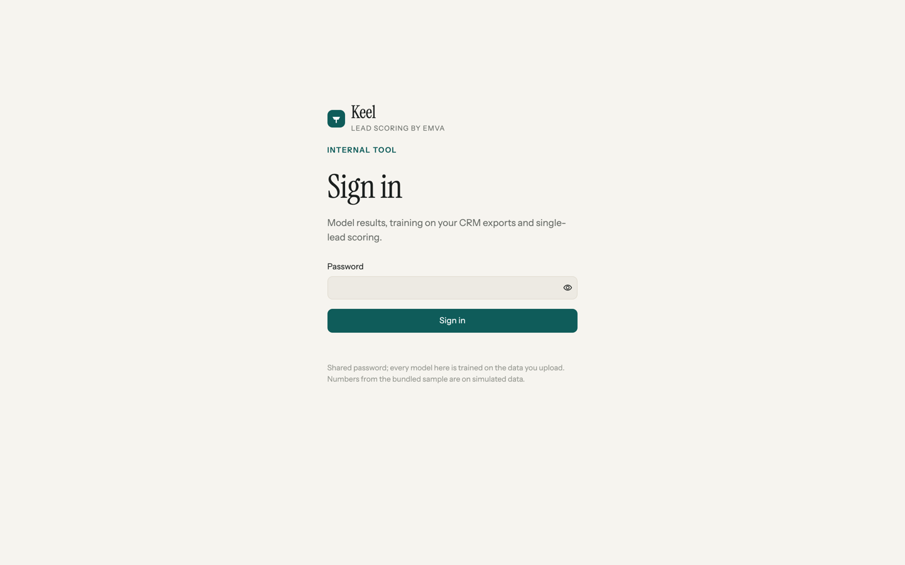
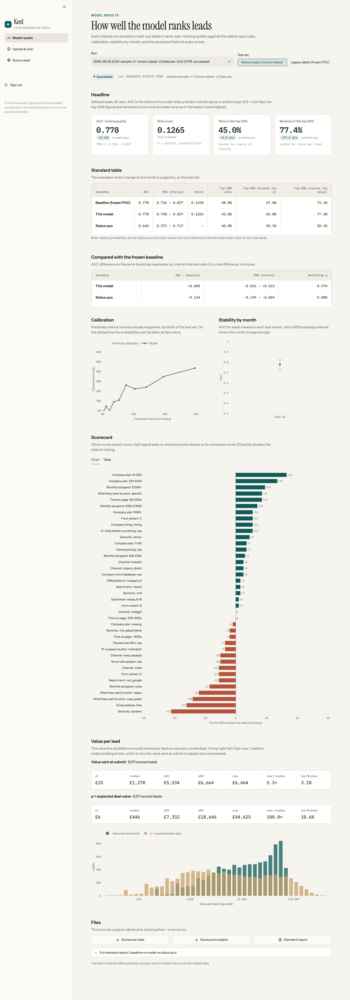
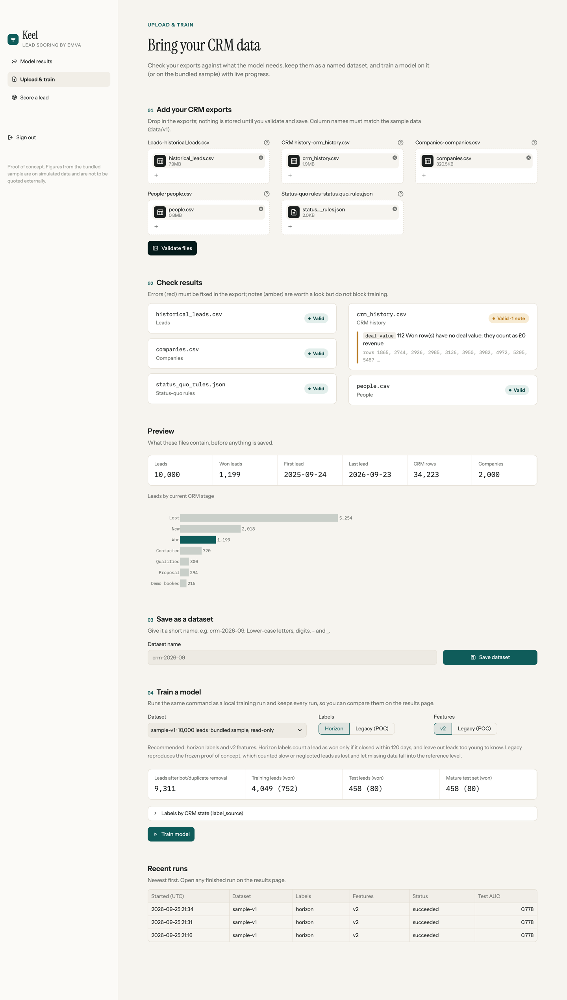
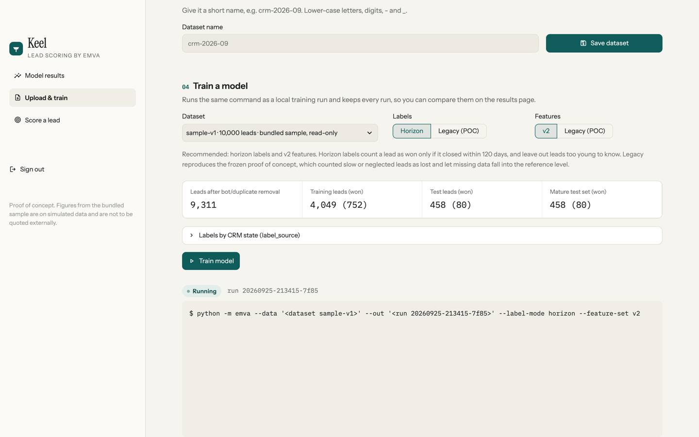
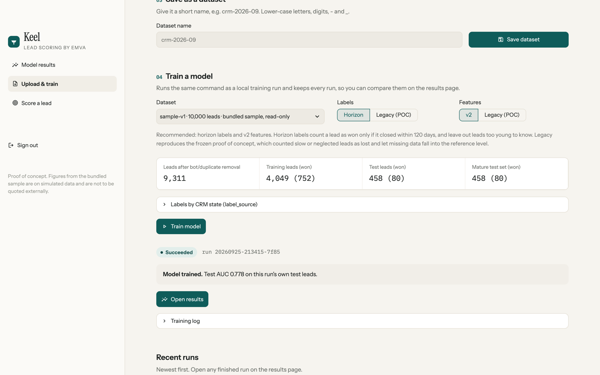
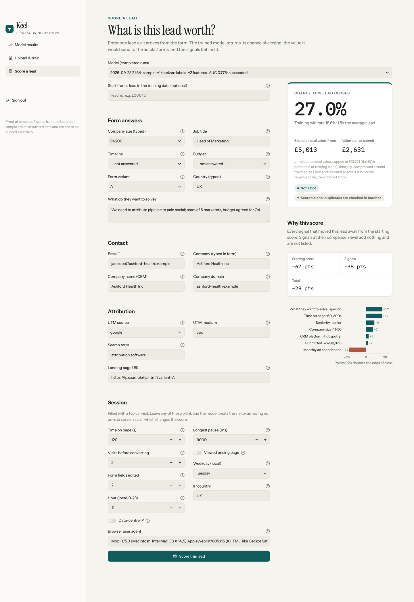

# Phase 8: Keel, the hosted internal tool (branch `app-ui`)

Keel is the Streamlit app an EMVA colleague uses to read model results, upload CRM exports and train, and
score a single lead. Entry point `streamlit run app/main.py` (`make app` locally on :8501, `scripts/serve.sh`
in the image). Module ownership is in `docs/ARCHITECTURE.md` section 8. All numbers in the screenshots come
from the bundled v1 sample: **on simulated data**, not for external use.

## Sign in



A shared password from `APP_PASSWORD`, compared with `hmac.compare_digest`; a wrong password waits 1 s. If the
variable is unset or blank the app shows "APP_PASSWORD is not set" and never opens. Login lives in the
Streamlit session: "Sign out" clears it, and reloading the browser tab asks again (sessions are per
websocket connection).

## Model results



- **Run picker** (registry, newest first: date, dataset, options, AUC, status) and a **test-set switch**: the
  frozen mature test set (horizon labels, the headline since Phase 1) or the legacy one (the POC's labels), the
  two definitions of `emva.eval.report.frozen_test_labels`.
- **KPI strip**: AUC with its 95% bootstrap CI (1,000 resamples, seed 0), Brier, share of wins and of recorded
  revenue in the top 20%, each with its delta against the status-quo rules.
- **Standard table** from `emva.eval.report.headline_frame` / `paired_frame`: the frozen baseline (its script is
  run on the run's dataset), this model and the status quo, then the paired AUC comparison against the baseline.
  Without `status_quo_rules.json` the status-quo row is omitted and the page says so. **Calibration by decile** (predicted vs observed, diagonal),
  **AUC by month** with bootstrap error bars for months of 30+ leads, the **scorecard** as a signed bar chart
  (accent = raises the score, warm red = lowers it) and as a sortable table with strength bars and odds
  multipliers, and the **value per lead** stats (p1 / median / p90 / p99 / max, max/median, top-1% share of
  `value_at_submit` and `value_formula`) with a log-scale histogram.
- Downloads of `scores.csv`, `weights.csv` and the run's standard report, which is also rendered in an expander.

Every frame is computed by `app/results.py` from the run's `scores.csv` / `weights.csv` (read with
`float_precision="round_trip"`, so the page uses exactly the floats the pipeline wrote) with `emva.eval` code
(`report.headline_frame` / `paired_frame` / `run_baseline` / `frozen_test_labels`, `metrics.calibration_by_decile`,
`metrics.auc_by_month`, `bootstrap.auc_ci`, `value_report.scale_stats`, `status_quo.status_quo_value`); nothing is
parsed out of `report.txt`, which is shown with the dataset's name in place of its server path. A value column
whose median is not positive gets a caption instead of stats.

## Upload & train



1. Five uploaders (leads, CRM history, companies, people, optional status-quo rules). A file dropped in the
   wrong slot is flagged; a file named `ground_truth*` is refused by name and never parsed.
2. **Validate** (`app/validation.py`) checks what the pipeline reads: required columns per file, ISO datetimes,
   numeric deal values, one JSON object of `answers` per row with form-option values, known CRM stages, at most
   one Won row per lead, unique company domains, referential integrity both ways, at least 200 leads. Errors
   (red) block saving; notes (amber) do not. Preview: rows, date range, won leads, leads by current CRM stage.
3. **Save** under a slug name (`DATA_DIR/datasets/<name>/`, written aside then renamed).
4. **Train**: dataset picker (stored datasets plus the read-only bundled sample), labels (horizon default,
   legacy = reproduces the frozen POC) and features (v2 default, legacy), and the pre-training summary computed
   by `emva.pipeline.build` + `emva.labels.split_masks` (leads after cleaning, training and test sizes with wins,
   the frozen mature test set, labels by `label_source`). "Train model" registers a run and returns at once;
   the log streams live (a fragment polls the log file every 1.5 s) behind a status pill.




**How training is invoked.** `app.training.start_training` spawns `python -m app.job`, which runs exactly the
local commands with the run's options, output appended to `runs/<run_id>/train.log`:

```sh
python -m emva --data <dataset> --out <run dir> --label-mode horizon --feature-set v2   # scores, weights, model.joblib
python -m emva.eval.report --data <dataset> --label-mode horizon --feature-set v2 > <run dir>/report.txt
```

The report runs only when the dataset has `status_quo_rules.json`; a failed report leaves the run
`succeeded` with the failure in the log. The job records the outcome in `registry.json` itself, so a run
finishes with no browser open. Listing runs checks every `running` run's job process by pid *and* command line
(`/proc/<pid>/cmdline` on Linux, `ps` elsewhere; the command must be `app.job` with that run id, since pids restart
low in a new container) and marks a vanished job `failed` ("interrupted"). The job gets a filtered environment:
PATH, HOME, LANG/LC_*, PYTHONPATH, TMPDIR, DATA_DIR and PYTHONUNBUFFERED only; never `APP_PASSWORD` or
`ANTHROPIC_*`. The training log names the dataset and run instead of server paths. On the full v1 sample: training ~4 s, report ~40 s.

## Score a lead



A model picker (completed runs with `model.joblib`) and a form generated from `emva.scoring.submit_time_fields()`,
grouped as Form answers / Contact / Attribution / Session, prefilled with a plausible lead whose company is the
first row of the dataset's `companies.csv`, or with a real lead from the training data by `lead_id`
(`scoring.values_from_lead`). Every session field is filled with a typical visit, because a blank
one makes v2 set `session_missing=yes`; the form says so. The result card shows P(close) with the training win
rate for context, the expected deal value if won, the value sent at submit with the fitted transform spelled out
(cap, compression, floor), a warning naming any blank session fields, and bot / duplicate flags (a lead scored alone is never a duplicate; bots are flagged
and still scored). Below it, the points breakdown: starting score, signals and total, and a signed bar per
active signal. `UnknownLevelError` and bad input become a plain message. Scoring goes through `app/scoring.py`
-> `emva.scoring.lead_from_form` / `score_leads` / `points_breakdown`; no feature is re-implemented.

**ulp caveat (ADR 0018).** A lead scored alone can differ from the batch run's score in the last bits (BLAS
kernels depend on the batch shape): up to 64 ulp (R17); measured 5 ulp on the v1 sample once `scores.csv` is read
with round-trip parsing (the default parser alone added ~110). `tests/test_app_scoring.py` compares historical leads
with that tolerance and a form lead with `score_leads` on the same row exactly.

## Design

Name and identity: **Keel** ("lead scoring by EMVA"), a small glyph plus the name set in Instrument Serif.
Warm paper background (#F6F4EF), white surfaces with hairline borders instead of shadows, one accent (deep teal
#0F5C5A) used for meaning only, muted warm red (#B5543C) for negatives, amber for warnings. Instrument Sans for
the interface, Instrument Serif for page titles, IBM Plex Mono for every number. 8 px spacing. Streamlit's menu,
footer, deploy button and default page nav are hidden; the sidebar is a custom wordmark + page links. CSS lives
in `app/theme.py::inject_css`, HTML components (KPI cards, pills, validation cards, result card, tables, empty
states) in `app/components.py`, the Plotly template in `app/charts.py`, the widget theme in
`.streamlit/config.toml`. Material icons only; no emojis.

## Limits

- One service, one process: training runs as a subprocess on the same machine (a 10k-lead run is seconds, the
  report under a minute). Concurrent trainings are allowed but not queued.
- One shared password; no per-user accounts, no audit of who trained or scored what. The registry records runs,
  not people.
- Labels use the pipeline's fixed snapshot date (`AS_OF` 2026-09-24) and test boundary (2026-05-01): data from
  another period trains, but its test sets can be empty (the results page says so).
- Uploaded datasets and runs are never deleted from the UI (delete on the volume if needed).
- Login does not survive a browser reload.

## Tests

`tests/test_app_storage.py` (20, including interrupted-run detection by dead pid and by a pid that is another
process), `test_app_validation.py` (18), `test_app_training.py` (12: pre-training summary vs the pipeline, one
end-to-end job on a 1,000-lead v1 subsample shared at session scope, the report's own row in `report.txt`, the
job's filtered environment, results without rules, value guard), `test_app_scoring.py` (7), `test_app_auth.py` (2),
`test_app_smoke.py` (8, Streamlit `AppTest`: unset password refuses, wrong password blocked, every page renders, a
lead is scored from the example and from a dataset lead, escaped error text, sign out). Plus `test_deploy_files.py`
(the `make docker` recipe never echoes the password, `.dockerignore` excludes `runs`, `serve.sh` refuses an
unwritable `DATA_DIR`) and `test_scoring.py` (`is_blank`, `FieldType`).

## Orchestrator decisions

- R17 (ADR 0018): single-lead scores may differ from the batch run by ≤ 64 ulp; whole-batch must be byte-equal.
- R18: page (a) shows the full standard table from `emva.eval.report` (baseline, model, status quo); without rules the status-quo row is omitted and said so.
- R19: the page is named "Upload & train" (it does both); README follows the UI. Channel is derived from UTM source/medium by the training feature code, so the form asks for UTM fields and shows the derived channel in the points breakdown.
- R20: Railway config-as-code is deprecated; service settings are applied on the service, `railway.toml` is the in-repo record. Secrets are entered by the user in the dashboard. `RAILWAY_RUN_UID=0` is required for the volume; `scripts/serve.sh` chowns `/data` and drops to uid 1000.
- R21: `python:3.11-slim` stays a floating tag as the spec asked; requirements are exact pins. Commit 907f3db was larger than the convention; noted, not rewritten.

R18-R21 and the app's trust model are summarised in `docs/adr/0019-hosted-app.md` (Proposed).
