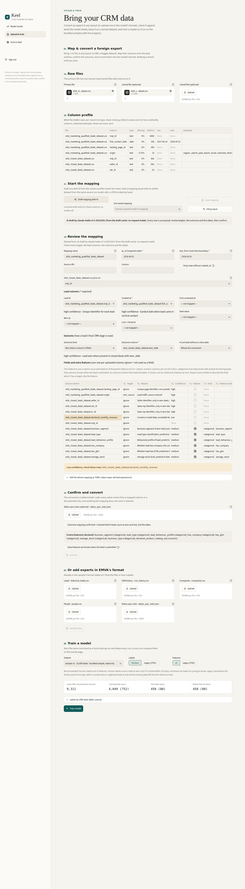

# Phase 10: generic feature set, (a) pipeline and (b) Keel (branch `phase10-generic-features`)

Phase 9 showed that the fixed design schema (ADR 0009: 39 columns from form answers, UTM tags, email, on-site session
telemetry and company enrichment) barely covers foreign sources. On public data, Olist fills 3 of 39 signals
(horizon test AUC 0.553 [0.530, 0.574]); CRM opportunities and hotel bookings fill 0 of 39 (AUC 0.500 exactly).
Phase 10 (a) builds the deferred **generic feature set**: the v2 design plus extra source columns that a mapping
declares and a person confirms as known at submit time. The encoding is fitted on the training leads only and frozen
in the model bundle. Part (b) brings it to Keel: declaring and confirming extras in Map & convert, validating
`extra_features.csv`, training with `generic`, the "Generic vs v2" results section and source-format scoring with
extras (section "Keel (part b)" below).

ADR 0024 (Proposed) records the decisions; it amends ADR 0009 (unknown levels raise: not for extras) and ADR 0017
(decision 2: no customer-specific columns: allowed as declared extras, outside the pooled part).

## Pre-registered acceptance criterion (ground rule 5)

Written and committed **before** any Kaggle dataset was converted with extras or trained with the generic feature
set. Nothing below (bins, minimum level count, the feature lists in `mappings/*.toml`, H, flags, dates) is changed
after seeing a test number. A dataset that fails, fails, and this report says so.

**Per Kaggle dataset (olist_funnel, crm_opportunities, hotel_bookings): PASS iff, on the horizon test set (b) of the
standard report, the paired bootstrap AUC difference generic − v2 (1000 resamples, seed 0, both models trained by
`emva.pipeline.run` on the same data, labels and split) has a 95% CI entirely above 0, AND the generic design passes
the collinearity check (no pair of design columns with |corr| > 0.95 on the training rows, plan 2.7).**

Fixed before the run:

- Encoding constants: `GENERIC_MIN_LEVEL_COUNT = 30`, `GENERIC_NUMERIC_BINS = 5` (`emva/constants.py`); reference
  levels and bin edges as in `emva/generic.py` (module docstring).
- Feature lists: `[[features]]` of `mappings/olist_funnel.toml` (1 extra), `mappings/crm_opportunities.toml`
  (9 extras over 3 sources), `mappings/hotel_bookings.toml` (23 extras), chosen from the orchestrator's leakage
  guard (decision D7 below) and the dataset documentation, not from model output.
- Labels and dates: the Phase 9 mappings' `as_of` / `test_from`, H = 120, default flags. Value transform default.
- The leakage screen (single-feature training AUC > 0.90) flags only; a flagged extra is not dropped and the verdict
  is computed with it.

## What was built

| module | role |
|---|---|
| `emva/generic.py` | The extras: `ExtraFeature` (name, kind, source), `read_extra_features` (`extra_features.csv` + `dataset.json` `features`, refused when absent), `fit_encoder` / `GenericEncoder` (categorical: levels with >= 30 training leads + `other` + `missing`, reference the most frequent kept level; numeric: 5 quantile bins with `inverted_cdf` edges, duplicate edges collapsed, an edge at the maximum moved down, + `missing`, reference the first bin) |
| `emva/feature_spec.py`, `emva/features.py`, `emva/cli.py` | `FeatureSet.GENERIC` / `GENERIC_SPEC` (v2 spec with `extras = True`); `--feature-set generic` on every entry point that offers the flag (`python -m emva`, `emva.eval.report`, `emva.eval.collinearity`) |
| `emva/pipeline.py` | With generic: joins the raw extras (`x_<name>`) on `lead_id`, fits the encoder on the pipeline's train mask, appends the `x_` design columns to the v2 design; `PipelineResult.extras` |
| `emva/persist.py` | `ModelBundle.extras` (the frozen encoder); `FORMAT_VERSION` 1 -> 2 |
| `emva/scoring.py` | A generic bundle reads `x_<name>` columns (absent = `missing`), unseen category -> `other`, out-of-range number -> edge bin; `x_` columns a bundle does not use are accepted and not read |
| `emva/ingest/mapping.py` | `[[features]]` rows (`FeatureMap`: expression source, kind, name, reason, confidence) and `features_confirmed`; `check_confirmed` refuses unconfirmed features; features are submit-time columns in `source_columns` |
| `emva/ingest/convert.py` | `extra_values`; `convert` writes `extra_features.csv` and `dataset.json` `features` only when the mapping declares features; `convert_leads` adds the `x_` columns |
| `emva/ingest/draft.py` | Reply schema: target `feature` plus `feature_kind` (`numeric` / `categorical` / `none`); `PROMPT_VERSION` `mapping-draft-v2`; drafted features always unconfirmed |
| `emva/eval/generic_report.py`, `emva/eval/report.py` | "Generic vs v2" section: a v2 model on the same rows and split, paired AUC difference on both test sets, the criterion's verdict, the leakage screen and (fix round, D25) the missingness screen |
| `mappings/*.toml` | Declared extras: Olist 1, CRM 9 (third source `sales_teams.csv`), hotel 23; `features_confirmed = true` after a review by hand |
| `app/storage.py`, `app/ingest.py` | Part (a): minimal pass-through so the app tests keep passing (see decision D11); part (b): the Keel support below |

## Orchestrator decisions

D1-D10 were given with the task; they are recorded here and in ADR 0024 (Proposed).

- **D1** Extras are declared in the mapping (`[[features]]`: `source`, `kind`, `name`, `reason`, `confidence`; design
  prefix `x_<name>`) with a top-level `features_confirmed`; convert refuses non-empty features without it. A mapping
  without `[[features]]` behaves exactly as in Phase 9 (the TOML round trip and the Phase 9 dump are tested). The LLM
  draft may propose extras (`feature` + kind; `PROMPT_VERSION` bumped) but is never confirmed. Derived expressions
  are allowed as sources.
- **D2** `convert` writes `extra_features.csv` (`lead_id` + one raw column per extra) and a `features` section in
  `dataset.json`; `historical_leads.csv` is unchanged (verified: all four training files byte-identical to the Phase 9
  conversion on the three real sources). The pipeline refuses the generic set without the file.
- **D3** Encoding fitted on the training leads only and frozen in the bundle. Categorical: `GENERIC_MIN_LEVEL_COUNT
  = 30`, `other`, `missing`, reference = most frequent kept level. Numeric: `GENERIC_NUMERIC_BINS = 5`, `missing`;
  **reference = the first bin** (the choice left open in the brief: deterministic and independent of the data's
  centre). Unseen category -> `other` (amends ADR 0009 for extras only); out-of-range number -> edge bin.
- **D4** `FeatureSet.GENERIC` = v2's 39 columns + the `x_` columns; default stays v2; deal-value model unchanged.
- **D5** Report section "generic vs v2" with paired AUC (1000 resamples, seed 0) on (b) and (a), the collinearity
  check on the generic design and a leakage screen (folded single-feature training AUC, > 0.90 flagged, never
  dropped).
- **D6** Pre-registered criterion (above), committed in 4df4e4a before any Kaggle number was computed.
- **D7** Leakage guard for the committed mappings (the lists in each mapping header). Hotel: the caveats on
  `required_car_parking_spaces` and `total_of_special_requests` (can change after booking) are kept as the dataset
  documentation describes them as booking attributes; `adr` also carries a caveat (the paper defines it from lodging
  transactions). CRM: pipeline + accounts + sales_teams (3 sources); `sales_agent` and `manager` stay redacted in
  profiles. Olist: `landing_page_id` only; `origin` is not double-encoded; no date-part operation was added.
- **D8** Tests: `tests/test_generic_features.py` (25 test functions, 29 cases) plus extensions of `test_ingest.py`, `test_scoring.py`,
  `test_persist.py`, `test_app_ingest.py`, `test_app_scoring.py`.
- **D9** Real-data runs (below), all on public data, nothing committed from `data/external/` or `runs/`.
- **D10** Docs: ADR 0024, this report, `docs/ARCHITECTURE.md` section 10, status rows in `CLAUDE.md` and
  `docs/CONTEXT.md`, the `--feature-set generic` flag in the CLAUDE.md CLI table.

Decisions taken during the work (for the orchestrator's review):

- **D11 (app, minimal; superseded in part b by D16, D19):** once the committed Olist mapping declares a feature, the app's `app_converted` fixture and
  Map & convert produce `extra_features.csv`, which `app.storage` refused as an unknown file, and the mapping form
  dropped `[[features]]` on its round trip. Minimal compatible change: `app/storage.py` lists `extra_features.csv`
  among `METADATA_FILES` (stored as given, not validated) and `app/ingest.MappingForm` carries `features` /
  `features_confirmed` through unchanged. A committed mapping's `features_confirmed = true` survives the form; the
  app has no control to confirm or reset it yet (part b). Two app test expectations (hand-built draft reply,
  CRM source fields) were updated for the new contract.
- **D12 (scoring):** `x_` columns a bundle does not use are accepted and not read (like the `historical_leads.csv`
  columns the models do not read), so a v2 run still scores the `convert_leads` output of a mapping with features.
  Any other unknown column is still refused. (Narrowed in the fix round by D30: a generic bundle refuses an `x_`
  column it does not declare.)
- **D13 (bins):** numeric edges use numpy's `inverted_cdf` quantiles (every edge an observed value; with the linear
  default a 0/5 column got a spurious edge at 1.0000000000000142), and an edge equal to the training maximum is moved
  to the largest value below it, so a skewed 0/1 column keeps two bins. Decided on unit fixtures before any Kaggle
  run.
- **D14 (draft names):** a drafted feature's name is its column name as a slug, prefixed with the source name when
  two files share the column. (Completed in the fix round by D32: a name still taken gets a numeric suffix.)

Decisions taken in part (b) (Keel), proposed for the orchestrator's review and recorded in ADR 0024 (decisions 9-14):

- **D15 (b) bundle compatibility:** `emva.persist.load_bundle` reads format 1 again (Phase 8-9 bundles, e.g. the runs
  on Railway) as a bundle with `extras = None`, which scores exactly as its v2 / legacy run did; `save_bundle` still
  writes format 2; any other version, and a "format 1" file carrying an `extras` field, is refused loudly
  (`READABLE_FORMATS = {1, 2}`). Tested with a bundle built in-test the way the Phase 9 `save_bundle` wrote it (same
  scores as its format-2 twin), and checked once by hand with a bundle written by the `main` checkout's code (max
  |p difference| 1e-16 over 9,311 v1 leads). No committed fixture. `scores.csv` / `weights.csv` of pre-Phase-10 runs
  are unchanged (generic adds no columns), so `app/results.py` reads them as before.
- **D16 (b) where `extra_features.csv` lives:** it is training data, so it moves from `METADATA_FILES` to
  `TRAINING_FILES` (counted in `Dataset.rows`; `Dataset.has_extras` reads the file on disk, so a dataset stored while
  it was metadata counts too). Only a converted dataset carries it: its columns are declared in `dataset.json`, so the
  EMVA-format upload has no slot for it and `app.validation` refuses it without that declaration (and a declaration
  without the file). Validation: `lead_id` plus the declared names in declaration order, `lead_id` filled and unique,
  the same leads as `historical_leads.csv` in both directions, numeric extras numbers or blank, read exactly as the
  pipeline reads it (only an empty cell is blank).
- **D17 (b) EMVA form on a generic run:** no inputs for extras; the page says that the model's N extras are scored as
  `missing` there and points to the source format, which has them. Reason: the EMVA form is the fixed schema, and an
  extra has no meaning outside its source's columns; the source format is where a person knows the value.
- **D18 (b) review table:** extras are a `feature` checkbox with `kind` and `name` columns on the field review table,
  not a target option, because a column can be a field and a feature at once (the committed Olist mapping maps
  `landing_page_id` to `utm_content` and declares it as the extra `landing_page`). A plain-column feature without a
  field row is listed with target `ignore` (or `(value map)` when its column has a value map); derived-expression
  features are read-only (edited as TOML). A row's reason / confidence describe the field when it has a target, else
  the feature; the check flag is set when either confidence is low. A blank name becomes the column's slug (prefixed
  with the source when taken).
- **D19 (b) the features confirmation:** a second required checkbox, "Extra features are known when the lead is
  submitted", shown only with declared features and keyed by a digest of the features (source, kind, name), so any
  change clears it. As with the outcome, the form never carries a loaded mapping's `features_confirmed` over: a person
  ticks both before every conversion (`app.ingest.confirm(m, features_confirmed=...)`).
- **D20 (b) "Generic vs v2" in Keel:** `app.results.generic_comparison` retrains v2 and generic with
  `emva.pipeline.run` on the same data, labels and split in the server process (cached per run and test set) and
  calls `emva.eval.generic_report.compare` on the selected test set; the collinearity check is the report's
  (`check_collinearity` of the generic design's training rows). It refuses when the retrained generic model does not
  reproduce the run's `scores.csv` on the test leads (the dataset changed). Keel shows the difference, its CI, the
  collinearity verdict and the leakage screen, but not the Phase 10 PASS/FAIL line: that criterion was pre-registered
  for the three Kaggle datasets, not as a rule for a customer's run.
- **D21 (b) long scorecards:** for a generic run with more than 25 signals, the chart and table show the 25 largest
  |points| and an expander lists every signal; `x_` columns are named "Extra · <name>" with their reference level
  from the bundle's encoder. Other runs are unchanged.
- **D22 (b) source-format inputs for extras:** with a generic bundle, a plain-column categorical extra offers its
  training levels plus `other` (any unlisted value scores as `other` anyway), unless a value map already fixes the
  options; a numeric extra is a number input written as CSV text (`29`, `2.5`). With a v2 bundle the extras' columns
  stay free text (the bundle ignores them).

Rulings of the fix round (two-axis review, below), recorded in ADR 0024 (decisions 15-18) where they change a rule:

- **D23 CRM missingness is disclosed, not fixed.** `account` is blank only on open deals, so the five account extras'
  `missing` means "not closed yet" (spec review S1). The mapping's feature list is not changed (post hoc); the
  mapping header, "Reading the results" and "Open items" say so, the (a) explanation is corrected, and new open leads
  with no account score as the reference level.
- **D24 Mapping header caveats.** Hotel `country` (PRT cancels at 57% vs 24%; the reviewer's reading of the
  check-in correction, not verified against the paper) and the CRM header no longer calls `product` ignored while it
  is a declared extra (header text only; feature lists unchanged).
- **D25 Missingness screen.** The leakage screen (report and Keel) gains, per extra, the share of cleaned leads with
  the extra missing among closed leads (`label_source` won / crm_lost) and among open ones (open / stalled /
  ghosted), computed at `as_of` whatever the label mode, and flags "missingness tracks outcome status — check for
  leakage" at an absolute difference >= `GENERIC_MISSINGNESS_FLAG = 0.5` (`emva/constants.py`). A flag only, never a
  drop; the threshold was fixed before the Kaggle reports were recomputed and is not tuned. The pre-registered
  verdicts are unchanged.
- **D26 EMVA form on a generic run** (amends D17's wording): the note says a lead scored there has every extra blank,
  scored as missing or as the reference level wherever the model never saw a missing value; one warning per extra
  whose training `missing` count is 0 (`app.scoring.missing_unseen`), and the same warning in the source format for
  an extra left blank (`blank_unseen`). With no training lead missing, the L2 weight of `missing` is exactly 0.
- **D27 Phase 9 bug fixed** (was an open item): `emva.scoring._as_training_schema` keeps `FieldType.STR` column
  fields as object when the bundle's lead schema typed them numeric (blank on every training lead), so the EMVA form
  scores on any converted run. Own commit (a210dc3) so it can be cherry-picked onto `main`.
- **D28** `emva.pipeline.run` refuses `extra_features.csv` unless it holds exactly the leads of
  `historical_leads.csv` (both directions; it already refused unknown leads), like `app.validation`.
- **D29** `load_bundle` refuses a bundle unless (feature set is generic) == (extras is not None).
- **D30** A generic bundle refuses `x_` columns it does not declare (a misspelt extra would silently score as
  missing); bundles without extras keep D12's tolerance.
- **D31** Numeric extras refuse non-finite values (`inf`, `-inf`, overflows such as `1e400`) when reading
  `extra_features.csv`, converting, validating an upload and scoring.
- **D32 Draft name clashes:** deterministic disambiguation rather than an error (a draft cannot be edited before it
  is saved): the D14 prefix, then, while a name is still taken, the first free suffix `_2`, `_3`, ... in reply order;
  the same column drafted twice as a feature is a `ContractError`.
- **D33 Docs and nits:** the Verification note on the red commits, the CLAUDE.md repo map (`emva/generic.py`,
  `generic_report`), ADRs 0009 and 0017 marked "amended by ADR 0024", the D11 note, the hotel footnote, and the code
  nits listed under "Review".

Live draft check (see "Live draft check" below; ADR 0025, Proposed):

- **D34 Key alias.** The cloud session environment does not pass `ANTHROPIC_API_KEY` through, so `emva.env.load_env_var`
  falls back to `EMVA_ANTHROPIC_API_KEY` (environment, then `.env`) when the real name is unset; the real name wins.
- **D35 The draft reply names its primary file.** `RESPONSE_SCHEMA` has `primary_file` and `joins` (file + join
  column) instead of `sources` with "the primary has an empty `join_on`"; the contract refuses a primary that is also
  joined and a file joined twice. `PROMPT_VERSION` `mapping-draft-v4`. Amends ADR 0021 item 2.
- **D36 Prompt guidance, then stop.** v3 added two paragraphs (the primary file holds every lead, never a won-only
  file; `created_at` is the earliest date known at arrival, never a post-outcome date). Prompt iteration stopped at
  v4, the first version whose three replies pass the contract; the remaining semantic errors (below) are left for
  the reviewer, as ADR 0021 intends, not prompted away one by one.
- **D37 The cache keeps every live reply.** `mappings/drafts/draft_cache.json` keeps the v2 and v3 replies (including
  the three contract failures) next to the v4 replies the drafts are built from: they are the evidence for this
  section, and keys include the prompt fingerprint, so they are never served for v4.

## Results (on public data)

Converted with the committed mappings, trained with `python -m emva --feature-set generic` (pipeline defaults: H =
120, the mapping's dates, default flags and value transform) and reported with `python -m emva.eval.report
--feature-set generic` (1000 resamples, seed 0). **Every number in this section is on public data** (real Kaggle
exports, not simulated, and not B2B enquiries in the hotel case). **Nothing was tuned** after the criterion was
committed: bins, minimum counts, feature lists, H and dates are as registered.

| dataset | extras | `x_` columns | (b) horizon: generic − v2 [95% CI] | (a) legacy: generic − v2 [95% CI] | collinearity (generic) | leakage flags (AUC) | missingness flags (fix round) | criterion |
|---|---|---|---|---|---|---|---|---|
| olist_funnel | 1 | 24 | +0.094 [+0.064, +0.123] | +0.086 [+0.057, +0.114] | PASS (max 0.716) | none | none (no open leads) | **PASS** |
| crm_opportunities | 9 | 89 | +0.016 [−0.015, +0.044] | −0.062 [−0.080, −0.044] | PASS (max 0.744) | none | **5**: the account extras (missing 0.000 closed vs 0.685 open) | **FAIL** |
| hotel_bookings[^hotel] | 23 | 302 | +0.430 [+0.427, +0.433] | +0.301 [+0.296, +0.306] | **FAIL** (0.969, `x_distribution_channel=GDS` ~ `x_agent=195`) | none (highest: lead_time 0.888) | none (no open leads) | **FAIL** |

[^hotel]: The hotel AUCs are mostly a label artefact, not foresight: a kept booking is Won at its arrival (R28) and
arrival = booking date + `lead_time`, so with H = 120 a booking made more than 120 days ahead can never be won
within H. `lead_time` nearly fixes the horizon label (see "Reading the results").

The missingness screen (D25) was added in the fix round, with its threshold fixed before these reports were
recomputed; it flags only. Recomputing the three generic runs and reports changed nothing but that table: every
`scores.csv` is byte-identical, and every AUC, CI, collinearity verdict and PASS / FAIL above is as before.

| dataset | test set | v2 AUC | generic AUC [95% CI] | generic Brier | generic top-20% wins |
|---|---|---|---|---|---|
| olist_funnel | (b) horizon, 3,829 (444 won) | 0.553 | 0.646 [0.618, 0.671] | 0.1020 | 0.338 |
| | (a) legacy, 3,829 (480 won) | 0.557 | 0.643 [0.616, 0.666] | 0.1100 | 0.335 |
| crm_opportunities | (b) horizon, 1,393 (788 won) | 0.500 | 0.516 [0.485, 0.544] | 0.2505 | 0.207 |
| | (a) legacy, 3,825 (1,844 won) | 0.500 | 0.438 [0.420, 0.456] | 0.2806 | 0.157 |
| hotel_bookings (bookings) | (b) horizon, 25,491 (12,873 won) | 0.500 | 0.930 [0.927, 0.933] | 0.1052 | 0.383 |
| | (a) legacy, 31,578 (20,972 won) | 0.500 | 0.801 [0.796, 0.806] | 0.2161 | 0.292 |

### Reading the results

- **olist_funnel: PASS.** One extra, `landing_page_id`, adds 24 columns (the 23 landing pages with at least 30
  training MQLs plus `other`; `missing` is the only other level and never occurs). Test AUC rises from 0.553 to
  0.646 on the mature test set, CI of the difference [+0.064, +0.123]. The single-feature training AUC of the
  landing page is 0.714, below the leakage flag. Licence: **CC BY-NC-SA 4.0, non-commercial**: these numbers are for
  this evaluation only, not for commercial use or marketing.
- **crm_opportunities: FAIL.** Nine extras (89 columns) carry almost no signal: every single-feature training AUC is
  0.507 to 0.538. On the horizon test set the gain is +0.016 with a CI that includes 0. On the legacy test set the
  generic model is worse than a constant score (AUC 0.438), and the reason is missingness, not the extras' values
  (corrected in the fix round; the part (a) text said the extras separated wins "slightly the other way"). In the
  raw `sales_pipeline.csv`, `account` is blank only on open deals (1,088 Engaging + 337 Prospecting; no Won or Lost
  deal lacks one), so the five account extras' `missing` means "not closed yet". Under the horizon labels no
  labelled training lead lacks an account: the `missing` columns have weight 0 and a no-account lead scores as the
  account extras' reference levels (sector retail, revenue <=497.11, employees <=1165, office_location United
  States, year_established <=1987), which happen to score above average. The legacy test set counts stalled Engaging
  deals as lost, so its 525 no-account leads are all lost, yet they get the higher mean p (0.678 vs 0.627): AUC
  0.438 with them, 0.522 without. A model trained with legacy labels learns it directly (each account extra's
  `missing` −33 points, test AUC 0.637; the AUC screen's 0.64 is not flagged, the missingness screen is). The feature
  list is not changed (that would be post hoc); the caveat is in the mapping header. **New open leads with no account
  score as the reference level** of the five account extras under the default horizon labels. The CRM data (a
  fictitious company, Apache 2.0) otherwise look close to random with respect to these attributes.
- **hotel_bookings: FAIL** (on the collinearity half of the criterion). The AUC gain is large (+0.430, CI [+0.427,
  +0.433]), but the generic design has one pair above the 0.95 limit: `x_distribution_channel=GDS` and `x_agent=195`
  (|corr| 0.969: nearly every GDS booking comes through agent 195). The criterion is not relaxed. **Warning on the
  AUC itself:** the 0.930 is mostly the label definition, not foresight about cancellations. A kept booking is Won at
  its arrival (R28), and arrival = booking date + `lead_time`; with H = 120 a booking made more than 120 days before
  arrival can never be "won within H", whatever the guest does. `lead_time` therefore nearly fixes the horizon label
  (single-feature training AUC 0.888, just under the 0.90 flag; weights −280 points for `>216` days and −183 for
  `(115, 216]`). On the legacy test set, whose label is "not cancelled" without a horizon, the generic AUC is 0.801,
  and `deposit_type=Non Refund` (−120 points) is the next strongest signal: a known quirk of this dataset (almost
  every non-refundable booking in it was cancelled). These are bookings, not enquiries. **`country` caveat** (fix
  round; the feature list is unchanged): PRT bookings (41% of all) cancel at 57% against 24% for every other
  country. The reviewer's reading, not verified against the dataset paper: nationality is reportedly entered as the
  home country at booking and corrected at check-in, so `country` may partly encode the outcome.
- **Leakage screen:** no extra on any dataset exceeds 0.90. The screen is a coarse guard: hotel `lead_time`
  (0.888) is mechanically tied to the horizon label as explained above without being post-outcome data.
- **Missingness screen** (fix round, D25; share of cleaned leads with the extra missing, closed vs open leads,
  flagged at a difference >= 0.50): CRM flags the five account extras (sector, revenue, employees, office_location,
  year_established: 0.000 closed vs 0.685 open, i.e. 1,088 of 1,589 open deals); every other CRM extra is 0.000 /
  0.000. Olist and hotel have no open leads (every lead is won or lost), so the open share is n/a and nothing can be
  flagged; hotel `company` is missing on 94% of bookings and `agent` on 14%, alike for every outcome the screen can
  see.

### Source-format scoring of new leads (on public data)

Five test-period rows per dataset, outcome columns removed, scored with `python -m emva.ingest score --mapping
mappings/<name>.toml --raw <rows> --run runs/<name>-generic --data data/external/<name>`. `convert_leads` carries
the extras as `x_<name>` columns; every p equals the batch run's `scores.csv` value exactly (relative difference 0).

| dataset | lead | inputs (abridged) | p_formula | value_at_submit | batch y |
|---|---|---|---|---|---|
| olist_funnel | a4341fce… | social | 0.0184 | 18,881 | 0 |
| | 5da9cf96… | unknown | 0.0893 | 50,309 | 0 |
| | c89fb04b… | organic_search | 0.0393 | 27,434 | 0 |
| | 10ccbc80… | social | 0.0172 | 17,811 | 0 |
| | 742ac6b5… | display | 0.0393 | 27,434 | 0 |
| crm_opportunities | TJ7PNIXL | GTXPro, no account | 0.6665 | 2,479 | (unlabelled) |
| | 44Q1W18Y | MG Special, Zoomit | 0.7018 | 2,571 | (unlabelled) |
| | AIU1UWJZ | GTXPro, Zotware | 0.6626 | 2,469 | 1 |
| | G62CPKZO | MG Advanced, Dontechi | 0.5977 | 2,292 | 0 |
| | J25NMK6Q | MG Special, Bluth Company | 0.6703 | 2,489 | 0 |
| hotel_bookings | row 68858 | City Hotel, lead_time 29 | 0.5395 | 213 | 0 |
| | row 67061 | City Hotel, lead_time 28 | 0.6663 | 245 | 0 |
| | row 33562 | Resort Hotel, lead_time 27 | 0.5572 | 217 | 1 |
| | row 68941 | City Hotel, lead_time 141 | 0.0115 | 25 (floor) | 0 |
| | row 68682 | City Hotel, lead_time 165 | 0.00002 | 25 (floor) | 0 |

The last two hotel rows show the label effect above: booked more than 120 days ahead, they cannot be won within H.
Amounts are in each source's own currency (the report's "GBP" formatting is fixed); Olist's values are inflated by
the 50,000,000 outlier noted in Phase 9. Every row is `is_bot = False`, `is_duplicate = False`.

<details>
<summary>Standard report: olist_funnel, generic feature set (on public data)</summary>

#### EMVA standard report

Data: `data/external/olist_funnel`. candidate = `emva` pipeline trained with `horizon H=120` labels and `generic` features. Every model is scored on the same rows under two test definitions. AUC CI: percentile bootstrap, 1000 resamples, seed 0. Top-20% capture ranks by p or by p×value.

Dates: as_of 2018-11-15T00:00:00+00:00, test_from 2018-03-01 (from dataset.json).

- Baseline omitted: this dataset carries its own dates in `dataset.json` (a converted dataset, ADR 0020). The frozen `baseline/emva_score.py` hard-codes the v1 snapshot date, test boundary and file format, so its scores would not be comparable (ADR 0022). The paired comparison against it and the check that the legacy labels equal the baseline's are omitted too.
- Status quo omitted: the dataset has no `status_quo_rules.json` (the rules the status quo is reconstructed from; converted datasets have none).

##### Label definitions

Counts over all 8000 scored leads, as wins / losses / unlabelled. `label_source` is the CRM state at 2018-11-15. legacy y = baseline rules. won_within_h = Won within 120 days of created_at (NaN if younger and not Won). horizon y = won_within_h with ghosted-at-H leads excluded and stalled leads censored (the default training and test label).

| label_source | leads | legacy y | won_within_h | horizon y |
|---|---|---|---|---|
| won | 842 | 842 / 0 / 0 | 726 / 116 / 0 | 726 / 116 / 0 |
| crm_lost | 7158 | 0 / 7158 / 0 | 0 / 7158 / 0 | 0 / 7158 / 0 |
| stalled | 0 | 0 / 0 / 0 | 0 / 0 / 0 | 0 / 0 / 0 |
| ghosted | 0 | 0 / 0 / 0 | 0 / 0 / 0 | 0 / 0 / 0 |
| open | 0 | 0 / 0 / 0 | 0 / 0 / 0 | 0 / 0 / 0 |
| all | 8000 | 842 / 7158 / 0 | 726 / 7274 / 0 | 726 / 7274 / 0 |

Mature = created_at + 120 days <= 2018-11-15T00:00:00+00:00: the latest mature lead was created 2018-05-31T00:00:00+00:00. Train = created before 2018-03-01 (all mature); test = created on or after 2018-03-01.

| definition | train (wins) | test (wins) |
|---|---|---|
| legacy | 4171 (362) | 3829 (480) |
| horizon H=120 | 4171 (282) | 3829 (444) |

Candidate trained with: `horizon H=120`.

##### (a) Legacy labels, legacy test set

3829 leads labelled by the baseline rules, created on or after 2018-03-01 (480 won). Label = legacy y.

###### Headline

| model | AUC [95% CI] | Brier | top-20% wins | top-20% revenue (by p) | top-20% revenue (by p×value) |
|---|---|---|---|---|---|
| candidate | 0.643 [0.616, 0.666] | 0.1100 | 0.335 | 0.850 | 0.854 |

###### Paired AUC comparison vs baseline

Omitted: there is no baseline row (see the note at the top).

###### Calibration by decile of p

| decile | n | candidate mean p | candidate observed |
|---|---|---|---|
| 1 | 383 | 0.018 | 0.055 |
| 2 | 383 | 0.024 | 0.076 |
| 3 | 383 | 0.038 | 0.117 |
| 4 | 383 | 0.039 | 0.055 |
| 5 | 383 | 0.039 | 0.065 |
| 6 | 382 | 0.041 | 0.113 |
| 7 | 383 | 0.076 | 0.141 |
| 8 | 383 | 0.095 | 0.211 |
| 9 | 383 | 0.134 | 0.185 |
| 10 | 383 | 0.147 | 0.235 |

###### AUC by test month

| month | n | wins | candidate |
|---|---|---|---|
| 2018-03 | 1174 | 167 | 0.584 |
| 2018-04 | 1352 | 183 | 0.672 |
| 2018-05 | 1303 | 130 | 0.661 |

###### Value scale

| model | scope | n | median | p99 | max | max/median | top-1% share |
|---|---|---|---|---|---|---|---|
| candidate | test set | 3829 | 36779 | 189647 | 189647 | 5.2× | 4.1% |
| candidate | all scored leads | 8000 | 33563 | 189647 | 189647 | 5.7× | 4.1% |

Value = p × expected deal value (models), rule-based bucket value in GBP (status quo). All scored leads = leads left after bot/duplicate removal.

###### Notes

- candidate: 10 rows tie at the top-20% cut when ranking wins; the table uses numpy's default argsort (as the baseline does), tie-averaged value is 0.335.
- candidate: 10 rows tie at the top-20% cut when ranking revenue by p; the table uses numpy's default argsort (as the baseline does), tie-averaged value is 0.850.
- candidate: 173 rows tie at the top-20% cut when ranking revenue by p×value; the table uses numpy's default argsort (as the baseline does), tie-averaged value is 0.854.

##### (b) Horizon labels, mature test set

3829 mature leads created on or after 2018-03-01 and up to 2018-05-31T00:00:00+00:00 that the default horizon definition labels (444 won). Label = won within 120 days; ghosted-at-H leads excluded, stalled leads censored.

###### Headline

| model | AUC [95% CI] | Brier | top-20% wins | top-20% revenue (by p) | top-20% revenue (by p×value) |
|---|---|---|---|---|---|
| candidate | 0.646 [0.618, 0.671] | 0.1020 | 0.338 | 0.182 | 0.182 |

###### Paired AUC comparison vs baseline

Omitted: there is no baseline row (see the note at the top).

###### Calibration by decile of p

| decile | n | candidate mean p | candidate observed |
|---|---|---|---|
| 1 | 383 | 0.018 | 0.052 |
| 2 | 383 | 0.024 | 0.070 |
| 3 | 383 | 0.038 | 0.102 |
| 4 | 383 | 0.039 | 0.050 |
| 5 | 383 | 0.039 | 0.047 |
| 6 | 382 | 0.041 | 0.113 |
| 7 | 383 | 0.076 | 0.128 |
| 8 | 383 | 0.095 | 0.206 |
| 9 | 383 | 0.134 | 0.172 |
| 10 | 383 | 0.147 | 0.219 |

###### AUC by test month

| month | n | wins | candidate |
|---|---|---|---|
| 2018-03 | 1174 | 149 | 0.598 |
| 2018-04 | 1352 | 174 | 0.667 |
| 2018-05 | 1303 | 121 | 0.665 |

###### Value scale

| model | scope | n | median | p99 | max | max/median | top-1% share |
|---|---|---|---|---|---|---|---|
| candidate | test set | 3829 | 36779 | 189647 | 189647 | 5.2× | 4.1% |
| candidate | all scored leads | 8000 | 33563 | 189647 | 189647 | 5.7× | 4.1% |

Value = p × expected deal value (models), rule-based bucket value in GBP (status quo). All scored leads = leads left after bot/duplicate removal.

###### Notes

- candidate: 10 rows tie at the top-20% cut when ranking wins; the table uses numpy's default argsort (as the baseline does), tie-averaged value is 0.338.
- candidate: 10 rows tie at the top-20% cut when ranking revenue by p; the table uses numpy's default argsort (as the baseline does), tie-averaged value is 0.182.
- candidate: 173 rows tie at the top-20% cut when ranking revenue by p×value; the table uses numpy's default argsort (as the baseline does), tie-averaged value is 0.182.

##### Bottom-decile ghosted share

Share of leads in the 10% of each population with the lowest p that are *ghosted* (`label_source`: mature and not contacted within 120 days) or *still New* at 2018-11-15 whatever their age (the definition behind the plan's baseline figure of 27%). The horizon test set (b) excludes ghosted leads, so the comparison uses populations that keep them.

| population | n | ghosted: overall | ghosted: candidate bottom decile | still New: overall | still New: candidate bottom decile |
|---|---|---|---|---|---|
| all leads labelled by legacy rules (train + test) | 8000 | 0.0% | 0.0% | 0.0% | 0.0% |
| (a) legacy test set | 3829 | 0.0% | 0.0% | 0.0% | 0.0% |
| all mature leads, every label_source | 8000 | 0.0% | 0.0% | 0.0% | 0.0% |
| mature leads created on or after 2018-03-01, every label_source | 3829 | 0.0% | 0.0% | 0.0% | 0.0% |

##### Value transforms (plan 3.2)

Candidate value = `value_formula` (p × E[deal value] × margin) through each transform, fitted on the candidate's 4171 training leads. Top-20% revenue = tie-averaged share of recorded won deal value in the top 20% by value; vs baseline = that share over the baseline's own (p×value, identity). value / revenue = total value over total recorded revenue. Every transform is monotone, so capture moves only through ties at the cut.

###### (a) Legacy labels, legacy test set

| value | p1 | p50 | p90 | p99 | max | max/median | top-1% share | top-20% revenue | ties at cut | value / revenue |
|---|---|---|---|---|---|---|---|---|---|---|
| candidate: identity | 12583 | 36779 | 73515 | 189647 | 189647 | 5.2× | 4.1% | 0.854 | 173 | 2.93 |
| candidate: cap p97 | 12583 | 36779 | 73515 | 189647 | 189647 | 5.2× | 4.1% | 0.854 | 173 | 2.93 |
| candidate: cap p97 + floor £25 | 12583 | 36779 | 73515 | 189647 | 189647 | 5.2× | 4.1% | 0.854 | 173 | 2.93 |
| candidate: cap p97 + sqrt | 25842 | 44181 | 62462 | 100324 | 100324 | 2.3× | 2.2% | 0.854 | 173 | 2.92 |
| candidate: cap p97 + log | 18881 | 43881 | 68799 | 112360 | 112360 | 2.6× | 2.5% | 0.854 | 173 | 2.90 |
| candidate: tiers 5 | 16111 | 33104 | 101485 | 101485 | 101485 | 3.1× | 2.2% | 0.717 | 912 | 2.96 |
| candidate: tiers 10 | not fitted: 10 tiers: the reference values leave 1 tier(s) empty (too few distinct values) | nan | nan | nan | nan | nan | nan | nan | nan | nan |
| candidate: cap p97 + log + floor £25 | 18881 | 43881 | 68799 | 112360 | 112360 | 2.6× | 2.5% | 0.854 | 173 | 2.90 |

###### (b) Horizon labels, mature test set

| value | p1 | p50 | p90 | p99 | max | max/median | top-1% share | top-20% revenue | ties at cut | value / revenue |
|---|---|---|---|---|---|---|---|---|---|---|
| candidate: identity | 12583 | 36779 | 73515 | 189647 | 189647 | 5.2× | 4.1% | 0.182 | 173 | 1058.70 |
| candidate: cap p97 | 12583 | 36779 | 73515 | 189647 | 189647 | 5.2× | 4.1% | 0.182 | 173 | 1058.70 |
| candidate: cap p97 + floor £25 | 12583 | 36779 | 73515 | 189647 | 189647 | 5.2× | 4.1% | 0.182 | 173 | 1058.70 |
| candidate: cap p97 + sqrt | 25842 | 44181 | 62462 | 100324 | 100324 | 2.3× | 2.2% | 0.182 | 173 | 1055.70 |
| candidate: cap p97 + log | 18881 | 43881 | 68799 | 112360 | 112360 | 2.6× | 2.5% | 0.182 | 173 | 1047.61 |
| candidate: tiers 5 | 16111 | 33104 | 101485 | 101485 | 101485 | 3.1× | 2.2% | 0.153 | 912 | 1070.61 |
| candidate: tiers 10 | not fitted: 10 tiers: the reference values leave 1 tier(s) empty (too few distinct values) | nan | nan | nan | nan | nan | nan | nan | nan | nan |
| candidate: cap p97 + log + floor £25 | 18881 | 43881 | 68799 | 112360 | 112360 | 2.6× | 2.5% | 0.182 | 173 | 1047.61 |

###### All scored leads

| value | p1 | p50 | p90 | p99 | max | max/median | top-1% share |
|---|---|---|---|---|---|---|---|
| candidate: identity | 12303 | 33563 | 73515 | 189647 | 189647 | 5.7× | 4.1% |
| candidate: cap p97 | 12303 | 33563 | 73515 | 189647 | 189647 | 5.7× | 4.1% |
| candidate: cap p97 + floor £25 | 12303 | 33563 | 73515 | 189647 | 189647 | 5.7× | 4.1% |
| candidate: cap p97 + sqrt | 25553 | 42205 | 62462 | 100324 | 100324 | 2.4× | 2.2% |
| candidate: cap p97 + log | 18521 | 41106 | 68799 | 112360 | 112360 | 2.7× | 2.5% |
| candidate: tiers 5 | 16111 | 33104 | 101485 | 101485 | 101485 | 3.1× | 2.2% |
| candidate: tiers 10 | not fitted: 10 tiers: the reference values leave 1 tier(s) empty (too few distinct values) | nan | nan | nan | nan | nan | nan |
| candidate: cap p97 + log + floor £25 | 18521 | 41106 | 68799 | 112360 | 112360 | 2.7× | 2.5% |

###### Acceptance (plan 3.2): ≥ 95% of the baseline's capture on every test set and max/median < 20× on every test set and on all scored leads

Not computed: the criterion is defined against the baseline, which this report omits.

##### Click-ID coverage (plan 3.5)

Scored leads per paid channel by the identifier an upload could match on (see `docs/platform_contract.md`): a click id (gclid, gbraid, wbraid, fbclid, li_fat_id, oppref), else the lead-form id, else nothing but hashed email / phone (Meta: plus the `fbp` browser cookie).

| channel | leads | click id | lead-form id | no id: fbp present | no id at all | email present | phone present |
|---|---|---|---|---|---|---|---|
| google | 1586 | 0.0% | 0.0% | 0.0% | 100.0% | 100.0% | 0.0% |
| meta | 1350 | 0.0% | 0.0% | 0.0% | 100.0% | 100.0% | 0.0% |
| linkedin | 0 | nan% | nan% | nan% | nan% | nan% | nan% |
| chatgpt | 0 | nan% | nan% | nan% | nan% | nan% | nan% |
| meta_leadads | 0 | nan% | nan% | nan% | nan% | nan% | nan% |
| landing-page paid (all but meta_leadads) | 2936 | 0.0% | 0.0% | 0.0% | 100.0% | 100.0% | 0.0% |
| all paid | 2936 | 0.0% | 0.0% | 0.0% | 100.0% | 100.0% | 0.0% |

##### Design collinearity (plan 2.7): PASS

Candidate design (`generic` features, 63 columns) on its 4171 training rows; fails when two columns have |corr| > 0.95. The report exits 1 on a failure only with `--strict`; `python -m emva.eval.collinearity` always does.

- PASS: max |corr| = 0.716 between channel=meta and x_landing_page=88740e65d5d6b056e0cda098e1ea6313
- Constant on the training rows (skipped): channel=meta_leadads, channel=linkedin, channel=chatgpt, form_variant=B, form_variant=C, form_variant=D, session_missing=yes, enrichment_missing=yes, band=11-50, band=51-200, band=201-1000, band=1000+, band=missing, email=free, text=copy_paste, text=vague, text=specific, seniority=student, seniority=senior, seniority=mid, seniority=not_asked/blank, spend=none, spend=£5k-£25k, spend=£25k-£100k, spend=£100k+, crm=hubspot_sf, hiring=hiring, time_on_page=60-300s, time_on_page=300-600s, time_on_page=>600s, hesitation_90s=yes, sessions_3plus=yes, viewed_pricing=yes, search_term=brand, business_hours=wkday_9-18, ip_country=mismatch, x_landing_page=missing

##### Generic vs v2 (Phase 10, ADR 0024)

Both models trained on the same rows and split with the same labels: `v2` (the fixed 39-column design) and `generic` (the same plus 24 `x_` columns from 1 declared extras, encoded on the 4171 training leads only). Paired bootstrap of AUC(generic) − AUC(v2) on shared resamples (1000 resamples, seed 0).

| test set | n | v2 AUC | generic AUC | generic − v2 | 95% CI | bootstrap p |
|---|---|---|---|---|---|---|
| (a) Legacy labels, legacy test set | 3829 | 0.557 | 0.643 | +0.086 | [+0.057, +0.114] | 0.000 |
| (b) Horizon labels, mature test set | 3829 | 0.553 | 0.646 | +0.094 | [+0.064, +0.123] | 0.000 |

Generic design collinearity: PASS: max |corr| = 0.716 between channel=meta and x_landing_page=88740e65d5d6b056e0cda098e1ea6313 (details in the collinearity section above).

**Phase 10 criterion (pre-registered): PASS.** PASS iff on the horizon test set (b) the 95% CI of generic − v2 lies entirely above 0 and the generic design passes the collinearity check.

###### Leakage screen

Single-feature training AUC of each extra's encoded levels (each level scored by its training win rate), folded as |AUC − 0.5| + 0.5. Above 0.90: flagged "check for leakage" (a flag only; nothing is dropped). Missingness screen: the share of cleaned leads with the extra missing among closed leads (label source won / crm_lost) and among open ones (open / stalled / ghosted), at as_of whatever the label mode; a difference of at least 0.50: flagged "missingness tracks outcome status — check for leakage" (a flag only).

| extra | kind | levels | design columns | training AUC | flag | missing: closed | missing: open | missingness flag |
|---|---|---|---|---|---|---|---|---|
| landing_page | categorical | 25 | 24 | 0.714 |  | 0.000 | n/a |  |

Flagged: none.

##### Baseline script output

- Baseline omitted: this dataset carries its own dates in `dataset.json` (a converted dataset, ADR 0020). The frozen `baseline/emva_score.py` hard-codes the v1 snapshot date, test boundary and file format, so its scores would not be comparable (ADR 0022). The paired comparison against it and the check that the legacy labels equal the baseline's are omitted too.

</details>

<details>
<summary>Standard report: crm_opportunities, generic feature set (on public data)</summary>

#### EMVA standard report

Data: `data/external/crm_opportunities`. candidate = `emva` pipeline trained with `horizon H=120` labels and `generic` features. Every model is scored on the same rows under two test definitions. AUC CI: percentile bootstrap, 1000 resamples, seed 0. Top-20% capture ranks by p or by p×value.

Dates: as_of 2018-01-01T00:00:00+00:00, test_from 2017-07-01 (from dataset.json).

- Baseline omitted: this dataset carries its own dates in `dataset.json` (a converted dataset, ADR 0020). The frozen `baseline/emva_score.py` hard-codes the v1 snapshot date, test boundary and file format, so its scores would not be comparable (ADR 0022). The paired comparison against it and the check that the legacy labels equal the baseline's are omitted too.
- Status quo omitted: the dataset has no `status_quo_rules.json` (the rules the status quo is reconstructed from; converted datasets have none).

##### Label definitions

Counts over all 8300 scored leads, as wins / losses / unlabelled. `label_source` is the CRM state at 2018-01-01. legacy y = baseline rules. won_within_h = Won within 120 days of created_at (NaN if younger and not Won). horizon y = won_within_h with ghosted-at-H leads excluded and stalled leads censored (the default training and test label).

| label_source | leads | legacy y | won_within_h | horizon y |
|---|---|---|---|---|
| won | 4238 | 4238 / 0 / 0 | 4092 / 146 / 0 | 4092 / 146 / 0 |
| crm_lost | 2473 | 0 / 2473 / 0 | 0 / 1822 / 651 | 0 / 1822 / 651 |
| stalled | 1479 | 0 / 1479 / 0 | 0 / 1385 / 94 | 0 / 0 / 1479 |
| ghosted | 0 | 0 / 0 / 0 | 0 / 0 / 0 | 0 / 0 / 0 |
| open | 110 | 0 / 0 / 110 | 0 / 0 / 110 | 0 / 0 / 110 |
| all | 8300 | 4238 / 3952 / 110 | 4092 / 3353 / 855 | 4092 / 1968 / 2240 |

Mature = created_at + 120 days <= 2018-01-01T00:00:00+00:00: the latest mature lead was created 2017-09-03T00:00:00+00:00. Train = created before 2017-07-01 (all mature); test = created on or after 2017-07-01.

| definition | train (wins) | test (wins) |
|---|---|---|
| legacy | 4365 (2394) | 3825 (1844) |
| horizon H=120 | 3649 (2286) | 1393 (788) |

Candidate trained with: `horizon H=120`.

##### (a) Legacy labels, legacy test set

3825 leads labelled by the baseline rules, created on or after 2017-07-01 (1844 won). Label = legacy y.

###### Headline

| model | AUC [95% CI] | Brier | top-20% wins | top-20% revenue (by p) | top-20% revenue (by p×value) |
|---|---|---|---|---|---|
| candidate | 0.438 [0.420, 0.456] | 0.2806 | 0.157 | 0.160 | 0.160 |

###### Paired AUC comparison vs baseline

Omitted: there is no baseline row (see the note at the top).

###### Calibration by decile of p

| decile | n | candidate mean p | candidate observed |
|---|---|---|---|
| 1 | 383 | 0.542 | 0.527 |
| 2 | 382 | 0.580 | 0.510 |
| 3 | 383 | 0.600 | 0.512 |
| 4 | 382 | 0.614 | 0.547 |
| 5 | 383 | 0.627 | 0.580 |
| 6 | 382 | 0.642 | 0.516 |
| 7 | 382 | 0.657 | 0.432 |
| 8 | 383 | 0.671 | 0.439 |
| 9 | 382 | 0.689 | 0.416 |
| 10 | 383 | 0.722 | 0.342 |

###### AUC by test month

| month | n | wins | candidate |
|---|---|---|---|
| 2017-07 | 1198 | 441 | 0.402 |
| 2017-08 | 793 | 341 | 0.421 |
| 2017-09 | 779 | 425 | 0.415 |
| 2017-10 | 708 | 400 | 0.548 |
| 2017-11 | 244 | 157 | 0.531 |
| 2017-12 | 103 | 80 | 0.538 |

###### Value scale

| model | scope | n | median | p99 | max | max/median | top-1% share |
|---|---|---|---|---|---|---|---|
| candidate | test set | 3825 | 2400 | 2814 | 3001 | 1.3× | 1.2% |
| candidate | all scored leads | 8300 | 2395 | 2810 | 3001 | 1.3× | 1.2% |

Value = p × expected deal value (models), rule-based bucket value in GBP (status quo). All scored leads = leads left after bot/duplicate removal.

###### Notes

- No ties at the top-20% cut.

##### (b) Horizon labels, mature test set

1393 mature leads created on or after 2017-07-01 and up to 2017-09-03T00:00:00+00:00 that the default horizon definition labels (788 won). Label = won within 120 days; ghosted-at-H leads excluded, stalled leads censored.

###### Headline

| model | AUC [95% CI] | Brier | top-20% wins | top-20% revenue (by p) | top-20% revenue (by p×value) |
|---|---|---|---|---|---|
| candidate | 0.516 [0.485, 0.544] | 0.2505 | 0.207 | 0.211 | 0.211 |

###### Paired AUC comparison vs baseline

Omitted: there is no baseline row (see the note at the top).

###### Calibration by decile of p

| decile | n | candidate mean p | candidate observed |
|---|---|---|---|
| 1 | 140 | 0.539 | 0.529 |
| 2 | 139 | 0.576 | 0.612 |
| 3 | 139 | 0.596 | 0.532 |
| 4 | 139 | 0.608 | 0.518 |
| 5 | 140 | 0.620 | 0.550 |
| 6 | 139 | 0.634 | 0.619 |
| 7 | 139 | 0.649 | 0.583 |
| 8 | 139 | 0.664 | 0.547 |
| 9 | 139 | 0.681 | 0.576 |
| 10 | 140 | 0.716 | 0.593 |

###### AUC by test month

| month | n | wins | candidate |
|---|---|---|---|
| 2017-07 | 796 | 432 | 0.502 |
| 2017-08 | 539 | 312 | 0.527 |
| 2017-09 | 58 | 44 | 0.625 |

###### Value scale

| model | scope | n | median | p99 | max | max/median | top-1% share |
|---|---|---|---|---|---|---|---|
| candidate | test set | 1393 | 2372 | 2806 | 2939 | 1.2× | 1.1% |
| candidate | all scored leads | 8300 | 2395 | 2810 | 3001 | 1.3× | 1.2% |

Value = p × expected deal value (models), rule-based bucket value in GBP (status quo). All scored leads = leads left after bot/duplicate removal.

###### Notes

- No ties at the top-20% cut.

##### Bottom-decile ghosted share

Share of leads in the 10% of each population with the lowest p that are *ghosted* (`label_source`: mature and not contacted within 120 days) or *still New* at 2018-01-01 whatever their age (the definition behind the plan's baseline figure of 27%). The horizon test set (b) excludes ghosted leads, so the comparison uses populations that keep them.

| population | n | ghosted: overall | ghosted: candidate bottom decile | still New: overall | still New: candidate bottom decile |
|---|---|---|---|---|---|
| all leads labelled by legacy rules (train + test) | 8190 | 0.0% | 0.0% | 0.0% | 0.0% |
| (a) legacy test set | 3825 | 0.0% | 0.0% | 0.0% | 0.0% |
| all mature leads, every label_source | 6427 | 0.0% | 0.0% | 0.0% | 0.0% |
| mature leads created on or after 2017-07-01, every label_source | 2062 | 0.0% | 0.0% | 0.0% | 0.0% |

##### Value transforms (plan 3.2)

Candidate value = `value_formula` (p × E[deal value] × margin) through each transform, fitted on the candidate's 3649 training leads. Top-20% revenue = tie-averaged share of recorded won deal value in the top 20% by value; vs baseline = that share over the baseline's own (p×value, identity). value / revenue = total value over total recorded revenue. Every transform is monotone, so capture moves only through ties at the cut.

###### (a) Legacy labels, legacy test set

| value | p1 | p50 | p90 | p99 | max | max/median | top-1% share | top-20% revenue | ties at cut | value / revenue |
|---|---|---|---|---|---|---|---|---|---|---|
| candidate: identity | 1938 | 2400 | 2646 | 2814 | 3001 | 1.3× | 1.2% | 0.160 | 1 | 2.11 |
| candidate: cap p97 | 1938 | 2400 | 2646 | 2720 | 2720 | 1.1× | 1.1% | 0.160 | 1 | 2.11 |
| candidate: cap p97 + floor £25 | 1938 | 2400 | 2646 | 2720 | 2720 | 1.1× | 1.1% | 0.160 | 1 | 2.11 |
| candidate: cap p97 + sqrt | 2144 | 2385 | 2505 | 2540 | 2540 | 1.1× | 1.1% | 0.160 | 1 | 2.10 |
| candidate: cap p97 + log | 2045 | 2393 | 2566 | 2615 | 2615 | 1.1× | 1.1% | 0.160 | 1 | 2.10 |
| candidate: tiers 5 | 2110 | 2364 | 2629 | 2629 | 2629 | 1.1× | 1.1% | 0.162 | 1021 | 2.11 |
| candidate: tiers 10 | 2042 | 2386 | 2692 | 2692 | 2692 | 1.1× | 1.1% | 0.157 | 451 | 2.11 |
| candidate: cap p97 + log + floor £25 | 2045 | 2393 | 2566 | 2615 | 2615 | 1.1× | 1.1% | 0.160 | 1 | 2.10 |

###### (b) Horizon labels, mature test set

| value | p1 | p50 | p90 | p99 | max | max/median | top-1% share | top-20% revenue | ties at cut | value / revenue |
|---|---|---|---|---|---|---|---|---|---|---|
| candidate: identity | 1919 | 2372 | 2616 | 2806 | 2939 | 1.2× | 1.1% | 0.211 | 1 | 1.84 |
| candidate: cap p97 | 1919 | 2372 | 2616 | 2720 | 2720 | 1.1× | 1.1% | 0.211 | 1 | 1.84 |
| candidate: cap p97 + floor £25 | 1919 | 2372 | 2616 | 2720 | 2720 | 1.1× | 1.1% | 0.211 | 1 | 1.84 |
| candidate: cap p97 + sqrt | 2133 | 2372 | 2490 | 2540 | 2540 | 1.1× | 1.0% | 0.211 | 1 | 1.84 |
| candidate: cap p97 + log | 2030 | 2373 | 2545 | 2615 | 2615 | 1.1× | 1.0% | 0.211 | 1 | 1.84 |
| candidate: tiers 5 | 2110 | 2364 | 2629 | 2629 | 2629 | 1.1× | 1.0% | 0.206 | 315 | 1.84 |
| candidate: tiers 10 | 2042 | 2386 | 2692 | 2692 | 2692 | 1.1× | 1.1% | 0.204 | 158 | 1.84 |
| candidate: cap p97 + log + floor £25 | 2030 | 2373 | 2545 | 2615 | 2615 | 1.1× | 1.0% | 0.211 | 1 | 1.84 |

###### All scored leads

| value | p1 | p50 | p90 | p99 | max | max/median | top-1% share |
|---|---|---|---|---|---|---|---|
| candidate: identity | 1947 | 2395 | 2645 | 2810 | 3001 | 1.3× | 1.2% |
| candidate: cap p97 | 1947 | 2395 | 2645 | 2720 | 2720 | 1.1× | 1.1% |
| candidate: cap p97 + floor £25 | 1947 | 2395 | 2645 | 2720 | 2720 | 1.1× | 1.1% |
| candidate: cap p97 + sqrt | 2149 | 2383 | 2504 | 2540 | 2540 | 1.1× | 1.1% |
| candidate: cap p97 + log | 2052 | 2390 | 2565 | 2615 | 2615 | 1.1× | 1.1% |
| candidate: tiers 5 | 2110 | 2364 | 2629 | 2629 | 2629 | 1.1× | 1.1% |
| candidate: tiers 10 | 2042 | 2386 | 2692 | 2692 | 2692 | 1.1× | 1.1% |
| candidate: cap p97 + log + floor £25 | 2052 | 2390 | 2565 | 2615 | 2615 | 1.1× | 1.1% |

###### Acceptance (plan 3.2): ≥ 95% of the baseline's capture on every test set and max/median < 20× on every test set and on all scored leads

Not computed: the criterion is defined against the baseline, which this report omits.

##### Click-ID coverage (plan 3.5)

Scored leads per paid channel by the identifier an upload could match on (see `docs/platform_contract.md`): a click id (gclid, gbraid, wbraid, fbclid, li_fat_id, oppref), else the lead-form id, else nothing but hashed email / phone (Meta: plus the `fbp` browser cookie).

| channel | leads | click id | lead-form id | no id: fbp present | no id at all | email present | phone present |
|---|---|---|---|---|---|---|---|
| google | 0 | nan% | nan% | nan% | nan% | nan% | nan% |
| meta | 0 | nan% | nan% | nan% | nan% | nan% | nan% |
| linkedin | 0 | nan% | nan% | nan% | nan% | nan% | nan% |
| chatgpt | 0 | nan% | nan% | nan% | nan% | nan% | nan% |
| meta_leadads | 0 | nan% | nan% | nan% | nan% | nan% | nan% |
| landing-page paid (all but meta_leadads) | 0 | nan% | nan% | nan% | nan% | nan% | nan% |
| all paid | 0 | nan% | nan% | nan% | nan% | nan% | nan% |

##### Design collinearity (plan 2.7): PASS

Candidate design (`generic` features, 128 columns) on its 3649 training rows; fails when two columns have |corr| > 0.95. The report exits 1 on a failure only with `--strict`; `python -m emva.eval.collinearity` always does.

- PASS: max |corr| = 0.744 between x_revenue=>3922.42 and x_employees=>8801
- Constant on the training rows (skipped): channel=meta, channel=meta_leadads, channel=linkedin, channel=chatgpt, channel=organic_direct, form_variant=B, form_variant=C, form_variant=D, session_missing=yes, enrichment_missing=yes, band=11-50, band=51-200, band=201-1000, band=1000+, band=missing, email=free, text=copy_paste, text=vague, text=specific, seniority=student, seniority=senior, seniority=mid, seniority=not_asked/blank, spend=none, spend=£5k-£25k, spend=£25k-£100k, spend=£100k+, crm=hubspot_sf, hiring=hiring, time_on_page=60-300s, time_on_page=300-600s, time_on_page=>600s, hesitation_90s=yes, sessions_3plus=yes, viewed_pricing=yes, search_term=brand, search_term=not_google, business_hours=wkday_9-18, ip_country=mismatch, x_product=missing, x_sales_agent=other, x_sales_agent=missing, x_sector=other, x_sector=missing, x_revenue=missing, x_employees=missing, x_office_location=missing, x_year_established=missing, x_regional_office=other, x_regional_office=missing, x_manager=other, x_manager=missing

##### Generic vs v2 (Phase 10, ADR 0024)

Both models trained on the same rows and split with the same labels: `v2` (the fixed 39-column design) and `generic` (the same plus 89 `x_` columns from 9 declared extras, encoded on the 3649 training leads only). Paired bootstrap of AUC(generic) − AUC(v2) on shared resamples (1000 resamples, seed 0).

| test set | n | v2 AUC | generic AUC | generic − v2 | 95% CI | bootstrap p |
|---|---|---|---|---|---|---|
| (a) Legacy labels, legacy test set | 3825 | 0.500 | 0.438 | -0.062 | [-0.080, -0.044] | 0.000 |
| (b) Horizon labels, mature test set | 1393 | 0.500 | 0.516 | +0.016 | [-0.015, +0.044] | 0.318 |

Generic design collinearity: PASS: max |corr| = 0.744 between x_revenue=>3922.42 and x_employees=>8801 (details in the collinearity section above).

**Phase 10 criterion (pre-registered): FAIL.** PASS iff on the horizon test set (b) the 95% CI of generic − v2 lies entirely above 0 and the generic design passes the collinearity check.

###### Leakage screen

Single-feature training AUC of each extra's encoded levels (each level scored by its training win rate), folded as |AUC − 0.5| + 0.5. Above 0.90: flagged "check for leakage" (a flag only; nothing is dropped). Missingness screen: the share of cleaned leads with the extra missing among closed leads (label source won / crm_lost) and among open ones (open / stalled / ghosted), at as_of whatever the label mode; a difference of at least 0.50: flagged "missingness tracks outcome status — check for leakage" (a flag only).

| extra | kind | levels | design columns | training AUC | flag | missing: closed | missing: open | missingness flag |
|---|---|---|---|---|---|---|---|---|
| product | categorical | 8 | 7 | 0.518 |  | 0.000 | 0.000 |  |
| sales_agent | categorical | 32 | 31 | 0.538 |  | 0.000 | 0.000 |  |
| sector | categorical | 12 | 11 | 0.516 |  | 0.000 | 0.685 | missingness tracks outcome status — check for leakage |
| revenue | numeric | 6 | 5 | 0.519 |  | 0.000 | 0.685 | missingness tracks outcome status — check for leakage |
| employees | numeric | 6 | 5 | 0.520 |  | 0.000 | 0.685 | missingness tracks outcome status — check for leakage |
| office_location | categorical | 15 | 14 | 0.513 |  | 0.000 | 0.685 | missingness tracks outcome status — check for leakage |
| year_established | numeric | 6 | 5 | 0.519 |  | 0.000 | 0.685 | missingness tracks outcome status — check for leakage |
| regional_office | categorical | 5 | 4 | 0.507 |  | 0.000 | 0.000 |  |
| manager | categorical | 8 | 7 | 0.510 |  | 0.000 | 0.000 |  |

Flagged: sector, revenue, employees, office_location, year_established.

##### Baseline script output

- Baseline omitted: this dataset carries its own dates in `dataset.json` (a converted dataset, ADR 0020). The frozen `baseline/emva_score.py` hard-codes the v1 snapshot date, test boundary and file format, so its scores would not be comparable (ADR 0022). The paired comparison against it and the check that the legacy labels equal the baseline's are omitted too.

</details>

<details>
<summary>Standard report: hotel_bookings, generic feature set (on public data)</summary>

#### EMVA standard report

Data: `data/external/hotel_bookings`. candidate = `emva` pipeline trained with `horizon H=120` labels and `generic` features. Every model is scored on the same rows under two test definitions. AUC CI: percentile bootstrap, 1000 resamples, seed 0. Top-20% capture ranks by p or by p×value.

Dates: as_of 2017-09-01T00:00:00+00:00, test_from 2016-12-01 (from dataset.json).

- Baseline omitted: this dataset carries its own dates in `dataset.json` (a converted dataset, ADR 0020). The frozen `baseline/emva_score.py` hard-codes the v1 snapshot date, test boundary and file format, so its scores would not be comparable (ADR 0022). The paired comparison against it and the check that the legacy labels equal the baseline's are omitted too.
- Status quo omitted: the dataset has no `status_quo_rules.json` (the rules the status quo is reconstructed from; converted datasets have none).

##### Label definitions

Counts over all 119390 scored leads, as wins / losses / unlabelled. `label_source` is the CRM state at 2017-09-01. legacy y = baseline rules. won_within_h = Won within 120 days of created_at (NaN if younger and not Won). horizon y = won_within_h with ghosted-at-H leads excluded and stalled leads censored (the default training and test label).

| label_source | leads | legacy y | won_within_h | horizon y |
|---|---|---|---|---|
| won | 75166 | 75166 / 0 / 0 | 55722 / 19444 / 0 | 55722 / 19444 / 0 |
| crm_lost | 44224 | 0 / 44224 / 0 | 0 / 42616 / 1608 | 0 / 42616 / 1608 |
| stalled | 0 | 0 / 0 / 0 | 0 / 0 / 0 | 0 / 0 / 0 |
| ghosted | 0 | 0 / 0 / 0 | 0 / 0 / 0 | 0 / 0 / 0 |
| open | 0 | 0 / 0 / 0 | 0 / 0 / 0 | 0 / 0 / 0 |
| all | 119390 | 75166 / 44224 / 0 | 55722 / 62060 / 1608 | 55722 / 62060 / 1608 |

Mature = created_at + 120 days <= 2017-09-01T00:00:00+00:00: the latest mature lead was created 2017-05-04T00:00:00+00:00. Train = created before 2016-12-01 (all mature); test = created on or after 2016-12-01.

| definition | train (wins) | test (wins) |
|---|---|---|
| legacy | 87812 (54194) | 31578 (20972) |
| horizon H=120 | 87812 (38370) | 25491 (12873) |

Candidate trained with: `horizon H=120`.

##### (a) Legacy labels, legacy test set

31578 leads labelled by the baseline rules, created on or after 2016-12-01 (20972 won). Label = legacy y.

###### Headline

| model | AUC [95% CI] | Brier | top-20% wins | top-20% revenue (by p) | top-20% revenue (by p×value) |
|---|---|---|---|---|---|
| candidate | 0.801 [0.796, 0.806] | 0.2161 | 0.292 | 0.198 | 0.198 |

###### Paired AUC comparison vs baseline

Omitted: there is no baseline row (see the note at the top).

###### Calibration by decile of p

| decile | n | candidate mean p | candidate observed |
|---|---|---|---|
| 1 | 3158 | 0.003 | 0.191 |
| 2 | 3158 | 0.013 | 0.442 |
| 3 | 3158 | 0.133 | 0.655 |
| 4 | 3157 | 0.454 | 0.411 |
| 5 | 3158 | 0.652 | 0.586 |
| 6 | 3158 | 0.762 | 0.710 |
| 7 | 3157 | 0.835 | 0.796 |
| 8 | 3158 | 0.905 | 0.912 |
| 9 | 3158 | 0.951 | 0.953 |
| 10 | 3158 | 0.988 | 0.985 |

###### AUC by test month

| month | n | wins | candidate |
|---|---|---|---|
| 2016-12 | 5013 | 2809 | 0.834 |
| 2017-01 | 7869 | 5187 | 0.803 |
| 2017-02 | 5772 | 3745 | 0.802 |
| 2017-03 | 3609 | 2539 | 0.769 |
| 2017-04 | 2736 | 1884 | 0.794 |
| 2017-05 | 2883 | 2048 | 0.802 |
| 2017-06 | 1626 | 1168 | 0.804 |
| 2017-07 | 1340 | 978 | 0.809 |
| 2017-08 | 730 | 614 | 0.761 |

###### Value scale

| model | scope | n | median | p99 | max | max/median | top-1% share |
|---|---|---|---|---|---|---|---|
| candidate | test set | 31578 | 250 | 346 | 347 | 1.4× | 1.7% |
| candidate | all scored leads | 119390 | 190 | 346 | 347 | 1.8× | 2.1% |

Value = p × expected deal value (models), rule-based bucket value in GBP (status quo). All scored leads = leads left after bot/duplicate removal.

###### Notes

- No ties at the top-20% cut.

##### (b) Horizon labels, mature test set

25491 mature leads created on or after 2016-12-01 and up to 2017-05-04T00:00:00+00:00 that the default horizon definition labels (12873 won). Label = won within 120 days; ghosted-at-H leads excluded, stalled leads censored.

###### Headline

| model | AUC [95% CI] | Brier | top-20% wins | top-20% revenue (by p) | top-20% revenue (by p×value) |
|---|---|---|---|---|---|
| candidate | 0.930 [0.927, 0.933] | 0.1052 | 0.383 | 0.282 | 0.282 |

###### Paired AUC comparison vs baseline

Omitted: there is no baseline row (see the note at the top).

###### Calibration by decile of p

| decile | n | candidate mean p | candidate observed |
|---|---|---|---|
| 1 | 2550 | 0.002 | 0.007 |
| 2 | 2549 | 0.009 | 0.020 |
| 3 | 2549 | 0.032 | 0.058 |
| 4 | 2549 | 0.268 | 0.229 |
| 5 | 2549 | 0.536 | 0.455 |
| 6 | 2549 | 0.717 | 0.678 |
| 7 | 2549 | 0.808 | 0.774 |
| 8 | 2549 | 0.886 | 0.898 |
| 9 | 2549 | 0.944 | 0.944 |
| 10 | 2549 | 0.986 | 0.988 |

###### AUC by test month

| month | n | wins | candidate |
|---|---|---|---|
| 2016-12 | 5013 | 2055 | 0.943 |
| 2017-01 | 7869 | 3797 | 0.946 |
| 2017-02 | 5772 | 2857 | 0.937 |
| 2017-03 | 3609 | 2094 | 0.910 |
| 2017-04 | 2736 | 1741 | 0.867 |
| 2017-05 | 492 | 329 | 0.792 |

###### Value scale

| model | scope | n | median | p99 | max | max/median | top-1% share |
|---|---|---|---|---|---|---|---|
| candidate | test set | 25491 | 223 | 346 | 347 | 1.6× | 1.9% |
| candidate | all scored leads | 119390 | 190 | 346 | 347 | 1.8× | 2.1% |

Value = p × expected deal value (models), rule-based bucket value in GBP (status quo). All scored leads = leads left after bot/duplicate removal.

###### Notes

- candidate: 6 rows tie at the top-20% cut when ranking wins; the table uses numpy's default argsort (as the baseline does), tie-averaged value is 0.383.
- candidate: 6 rows tie at the top-20% cut when ranking revenue by p; the table uses numpy's default argsort (as the baseline does), tie-averaged value is 0.282.
- candidate: 6 rows tie at the top-20% cut when ranking revenue by p×value; the table uses numpy's default argsort (as the baseline does), tie-averaged value is 0.282.

##### Bottom-decile ghosted share

Share of leads in the 10% of each population with the lowest p that are *ghosted* (`label_source`: mature and not contacted within 120 days) or *still New* at 2017-09-01 whatever their age (the definition behind the plan's baseline figure of 27%). The horizon test set (b) excludes ghosted leads, so the comparison uses populations that keep them.

| population | n | ghosted: overall | ghosted: candidate bottom decile | still New: overall | still New: candidate bottom decile |
|---|---|---|---|---|---|
| all leads labelled by legacy rules (train + test) | 119390 | 0.0% | 0.0% | 0.0% | 0.0% |
| (a) legacy test set | 31578 | 0.0% | 0.0% | 0.0% | 0.0% |
| all mature leads, every label_source | 113303 | 0.0% | 0.0% | 0.0% | 0.0% |
| mature leads created on or after 2016-12-01, every label_source | 25491 | 0.0% | 0.0% | 0.0% | 0.0% |

##### Value transforms (plan 3.2)

Candidate value = `value_formula` (p × E[deal value] × margin) through each transform, fitted on the candidate's 87812 training leads. Top-20% revenue = tie-averaged share of recorded won deal value in the top 20% by value; vs baseline = that share over the baseline's own (p×value, identity). value / revenue = total value over total recorded revenue. Every transform is monotone, so capture moves only through ties at the cut.

###### (a) Legacy labels, legacy test set

| value | p1 | p50 | p90 | p99 | max | max/median | top-1% share | top-20% revenue | ties at cut | value / revenue |
|---|---|---|---|---|---|---|---|---|---|---|
| candidate: identity | 0 | 250 | 337 | 346 | 347 | 1.4× | 1.7% | 0.198 | 1 | 0.78 |
| candidate: cap p97 | 0 | 250 | 337 | 343 | 343 | 1.4× | 1.7% | 0.198 | 1 | 0.78 |
| candidate: cap p97 + floor £25 | 25 | 250 | 337 | 343 | 343 | 1.4× | 1.7% | 0.198 | 1 | 0.80 |
| candidate: cap p97 + sqrt | 2 | 247 | 287 | 289 | 289 | 1.2× | 1.5% | 0.198 | 1 | 0.76 |
| candidate: cap p97 + log | 0 | 258 | 310 | 313 | 313 | 1.2× | 1.6% | 0.198 | 1 | 0.77 |
| candidate: tiers 5 | 0 | 280 | 332 | 332 | 332 | 1.2× | 1.7% | 0.208 | 8314 | 0.77 |
| candidate: tiers 10 | 0 | 262 | 340 | 340 | 340 | 1.3× | 1.7% | 0.203 | 4105 | 0.77 |
| candidate: cap p97 + log + floor £25 | 25 | 258 | 310 | 313 | 313 | 1.2× | 1.6% | 0.198 | 1 | 0.79 |

###### (b) Horizon labels, mature test set

| value | p1 | p50 | p90 | p99 | max | max/median | top-1% share | top-20% revenue | ties at cut | value / revenue |
|---|---|---|---|---|---|---|---|---|---|---|
| candidate: identity | 0 | 223 | 336 | 346 | 347 | 1.6× | 1.9% | 0.282 | 6 | 1.17 |
| candidate: cap p97 | 0 | 223 | 336 | 343 | 343 | 1.5× | 1.9% | 0.282 | 6 | 1.17 |
| candidate: cap p97 + floor £25 | 25 | 223 | 336 | 343 | 343 | 1.5× | 1.8% | 0.282 | 6 | 1.21 |
| candidate: cap p97 + sqrt | 1 | 233 | 286 | 289 | 289 | 1.2× | 1.6% | 0.282 | 6 | 1.17 |
| candidate: cap p97 + log | 0 | 240 | 309 | 313 | 313 | 1.3× | 1.7% | 0.282 | 6 | 1.17 |
| candidate: tiers 5 | 0 | 141 | 332 | 332 | 332 | 2.3× | 1.8% | 0.297 | 6014 | 1.17 |
| candidate: tiers 10 | 0 | 199 | 340 | 340 | 340 | 1.7× | 1.9% | 0.290 | 3008 | 1.17 |
| candidate: cap p97 + log + floor £25 | 25 | 240 | 309 | 313 | 313 | 1.3× | 1.7% | 0.282 | 6 | 1.20 |

###### All scored leads

| value | p1 | p50 | p90 | p99 | max | max/median | top-1% share |
|---|---|---|---|---|---|---|---|
| candidate: identity | 0 | 190 | 334 | 346 | 347 | 1.8× | 2.1% |
| candidate: cap p97 | 0 | 190 | 334 | 343 | 343 | 1.8× | 2.1% |
| candidate: cap p97 + floor £25 | 25 | 190 | 334 | 343 | 343 | 1.8× | 2.0% |
| candidate: cap p97 + sqrt | 0 | 215 | 285 | 289 | 289 | 1.3× | 1.8% |
| candidate: cap p97 + log | 0 | 214 | 308 | 313 | 313 | 1.5× | 1.9% |
| candidate: tiers 5 | 0 | 141 | 332 | 332 | 332 | 2.3× | 2.0% |
| candidate: tiers 10 | 0 | 199 | 340 | 340 | 340 | 1.7× | 2.1% |
| candidate: cap p97 + log + floor £25 | 25 | 214 | 308 | 313 | 313 | 1.5× | 1.8% |

###### Acceptance (plan 3.2): ≥ 95% of the baseline's capture on every test set and max/median < 20× on every test set and on all scored leads

Not computed: the criterion is defined against the baseline, which this report omits.

##### Click-ID coverage (plan 3.5)

Scored leads per paid channel by the identifier an upload could match on (see `docs/platform_contract.md`): a click id (gclid, gbraid, wbraid, fbclid, li_fat_id, oppref), else the lead-form id, else nothing but hashed email / phone (Meta: plus the `fbp` browser cookie).

| channel | leads | click id | lead-form id | no id: fbp present | no id at all | email present | phone present |
|---|---|---|---|---|---|---|---|
| google | 0 | nan% | nan% | nan% | nan% | nan% | nan% |
| meta | 0 | nan% | nan% | nan% | nan% | nan% | nan% |
| linkedin | 0 | nan% | nan% | nan% | nan% | nan% | nan% |
| chatgpt | 0 | nan% | nan% | nan% | nan% | nan% | nan% |
| meta_leadads | 0 | nan% | nan% | nan% | nan% | nan% | nan% |
| landing-page paid (all but meta_leadads) | 0 | nan% | nan% | nan% | nan% | nan% | nan% |
| all paid | 0 | nan% | nan% | nan% | nan% | nan% | nan% |

##### Design collinearity (plan 2.7): FAIL

Candidate design (`generic` features, 341 columns) on its 87812 training rows; fails when two columns have |corr| > 0.95. The report exits 1 on a failure only with `--strict`; `python -m emva.eval.collinearity` always does.

- FAIL (1 pairs with |corr| > 0.95): max |corr| = 0.969 between x_distribution_channel=GDS and x_agent=195
  - x_distribution_channel=GDS ~ x_agent=195: +0.969
- Constant on the training rows (skipped): channel=meta, channel=meta_leadads, channel=linkedin, channel=chatgpt, channel=organic_direct, form_variant=B, form_variant=C, form_variant=D, session_missing=yes, enrichment_missing=yes, band=11-50, band=51-200, band=201-1000, band=1000+, band=missing, email=free, text=copy_paste, text=vague, text=specific, seniority=student, seniority=senior, seniority=mid, seniority=not_asked/blank, spend=none, spend=£5k-£25k, spend=£25k-£100k, spend=£100k+, crm=hubspot_sf, hiring=hiring, time_on_page=60-300s, time_on_page=300-600s, time_on_page=>600s, hesitation_90s=yes, sessions_3plus=yes, viewed_pricing=yes, search_term=brand, search_term=not_google, business_hours=wkday_9-18, ip_country=mismatch, x_hotel=other, x_hotel=missing, x_lead_time=missing, x_arrival_month=other, x_arrival_month=missing, x_weekend_nights=missing, x_week_nights=missing, x_adults=missing, x_babies=missing, x_meal=other, x_meal=missing, x_market_segment=missing, x_distribution_channel=missing, x_repeated_guest=other, x_repeated_guest=missing, x_previous_cancellations=missing, x_previous_bookings_kept=missing, x_reserved_room_type=missing, x_deposit_type=other, x_deposit_type=missing, x_customer_type=other, x_customer_type=missing, x_adr=missing, x_parking_spaces=missing, x_special_requests=missing

##### Generic vs v2 (Phase 10, ADR 0024)

Both models trained on the same rows and split with the same labels: `v2` (the fixed 39-column design) and `generic` (the same plus 302 `x_` columns from 23 declared extras, encoded on the 87812 training leads only). Paired bootstrap of AUC(generic) − AUC(v2) on shared resamples (1000 resamples, seed 0).

| test set | n | v2 AUC | generic AUC | generic − v2 | 95% CI | bootstrap p |
|---|---|---|---|---|---|---|
| (a) Legacy labels, legacy test set | 31578 | 0.500 | 0.801 | +0.301 | [+0.296, +0.306] | 0.000 |
| (b) Horizon labels, mature test set | 25491 | 0.500 | 0.930 | +0.430 | [+0.427, +0.433] | 0.000 |

Generic design collinearity: FAIL (1 pairs with |corr| > 0.95): max |corr| = 0.969 between x_distribution_channel=GDS and x_agent=195 (details in the collinearity section above).

**Phase 10 criterion (pre-registered): FAIL.** PASS iff on the horizon test set (b) the 95% CI of generic − v2 lies entirely above 0 and the generic design passes the collinearity check.

###### Leakage screen

Single-feature training AUC of each extra's encoded levels (each level scored by its training win rate), folded as |AUC − 0.5| + 0.5. Above 0.90: flagged "check for leakage" (a flag only; nothing is dropped). Missingness screen: the share of cleaned leads with the extra missing among closed leads (label source won / crm_lost) and among open ones (open / stalled / ghosted), at as_of whatever the label mode; a difference of at least 0.50: flagged "missingness tracks outcome status — check for leakage" (a flag only).

| extra | kind | levels | design columns | training AUC | flag | missing: closed | missing: open | missingness flag |
|---|---|---|---|---|---|---|---|---|
| hotel | categorical | 4 | 3 | 0.538 |  | 0.000 | n/a |  |
| lead_time | numeric | 6 | 5 | 0.888 |  | 0.000 | n/a |  |
| arrival_month | categorical | 14 | 13 | 0.613 |  | 0.000 | n/a |  |
| weekend_nights | numeric | 5 | 4 | 0.541 |  | 0.000 | n/a |  |
| week_nights | numeric | 5 | 4 | 0.597 |  | 0.000 | n/a |  |
| adults | numeric | 3 | 2 | 0.504 |  | 0.000 | n/a |  |
| children | numeric | 3 | 2 | 0.504 |  | 0.000 | n/a |  |
| babies | numeric | 3 | 2 | 0.503 |  | 0.000 | n/a |  |
| meal | categorical | 7 | 6 | 0.539 |  | 0.000 | n/a |  |
| country | categorical | 61 | 60 | 0.628 |  | 0.004 | n/a |  |
| market_segment | categorical | 9 | 8 | 0.683 |  | 0.000 | n/a |  |
| distribution_channel | categorical | 6 | 5 | 0.580 |  | 0.000 | n/a |  |
| repeated_guest | categorical | 4 | 3 | 0.517 |  | 0.000 | n/a |  |
| previous_cancellations | numeric | 3 | 2 | 0.556 |  | 0.000 | n/a |  |
| previous_bookings_kept | numeric | 3 | 2 | 0.521 |  | 0.000 | n/a |  |
| reserved_room_type | categorical | 10 | 9 | 0.535 |  | 0.000 | n/a |  |
| deposit_type | categorical | 5 | 4 | 0.624 |  | 0.000 | n/a |  |
| agent | categorical | 129 | 128 | 0.716 |  | 0.137 | n/a |  |
| company | categorical | 26 | 25 | 0.541 |  | 0.943 | n/a |  |
| customer_type | categorical | 6 | 5 | 0.530 |  | 0.000 | n/a |  |
| adr | numeric | 6 | 5 | 0.556 |  | 0.000 | n/a |  |
| parking_spaces | numeric | 3 | 2 | 0.546 |  | 0.000 | n/a |  |
| special_requests | numeric | 4 | 3 | 0.585 |  | 0.000 | n/a |  |

Flagged: none.

##### Baseline script output

- Baseline omitted: this dataset carries its own dates in `dataset.json` (a converted dataset, ADR 0020). The frozen `baseline/emva_score.py` hard-codes the v1 snapshot date, test boundary and file format, so its scores would not be comparable (ADR 0022). The paired comparison against it and the check that the legacy labels equal the baseline's are omitted too.

</details>

## Keel (part b)

What changed, by module (details in `docs/ARCHITECTURE.md` sections 8 and 10):

| module | change |
|---|---|
| `emva/persist.py` | Format-1 bundles load as `extras = None` (D15) |
| `app/storage.py` | `extra_features.csv` is a training file; `Dataset.has_extras` (D16) |
| `app/validation.py` | `extra_features.csv` against `dataset.json` `features` and the leads (D16); the summary lists the extras |
| `app/ingest.py` | Review table `feature` / `kind` / `name` columns, `apply_review` builds `[[features]]`, `derived_features_frame`, `features_signature`, `confirm(..., features_confirmed)`, `extras_summary` (D18, D19) |
| `app/views/upload.py` | The table, the second confirmation, the coverage card's extras card, the file card, the `generic` option (only with extras) and the extras in the pre-training summary |
| `app/training.py` | `feature_set_options`, `TrainingSummary.extras` (read with `emva.generic.read_extra_features`) |
| `app/results.py`, `app/ui.py`, `app/views/results.py` | `generic_comparison` / `GenericSection`, cached `ui.generic_section`, the "Generic vs v2" section and leakage screen; scorecard names and references for `x_` columns, top 25 (D20, D21) |
| `app/scoring.py`, `app/views/score.py` | `source_fields(mapping, bundle)` with extras' levels / number inputs, `number_text`, `extra_names`; the EMVA-form note (D17, D22) |

Screenshots, taken with Playwright against a local Keel (`streamlit run app/main.py`, scratch `DATA_DIR`, a random
`APP_PASSWORD`) on the real Olist export (`data/external/raw/olist`, not committed), converted with the committed
`mappings/olist_funnel.toml`. Every number is **on public data** (CC BY-NC-SA 4.0, non-commercial; not for quoting).

- `reports/phase10/01-review-table-extras.png`: the review table after loading the built-in mapping. `landing_page_id`
  is a field (`utm_content`) and the categorical extra `landing_page` at once; the closed-deal columns are ignored
  with the mapping's leakage reasons.
- `reports/phase10/02-both-confirmations.png`: the declared extra and both confirmations ticked; Convert is enabled
  only with both.
- `reports/phase10/03-coverage-extras.png`: the coverage card: 3 of 39 signals, and the extras card, 1 extra (0
  numeric, 1 categorical), design columns fixed at training.
- `reports/phase10/04-train-generic.png`: the training panel on the saved dataset: Features offers v2, Generic (v2 +
  extras) and Legacy; the summary with generic: 4,171 training leads (282 won), 3,829 test leads (444 won), 1 extra.
- `reports/phase10/05-results-generic-vs-v2.png`: the run's "Generic vs v2" on the mature test set: v2 AUC 0.553,
  generic 0.646 (v2 + 24 extra columns), difference +0.094 [95% CI +0.064, +0.123], bootstrap p 0.000, 3,829 test
  leads; collinearity PASS (max |corr| 0.716); leakage screen: `landing_page` 25 levels, 24 design columns, training
  AUC 0.714, not flagged. The same numbers as the standard report above.
- `reports/phase10/06-results-scorecard-extras.png`: the scorecard, the 25 strongest of 63 signals (24 from the
  extra), the rest in the "All 63 signals" expander.
- `reports/phase10/07-score-source-format-extras.png`: one new lead in the source format (origin `organic_search`,
  `landing_page_id` chosen from the training levels, first contact 2018-04-02): P(close) 14.6%. The amounts are in
  the source's currency (BRL) although the card formats them as £, and Olist's values are inflated by the outlier
  noted in Phase 9.

Found in passing in part (b) (Phase 9 behaviour) and fixed in the fix round (D27, commit a210dc3): on any run
trained on a converted dataset the EMVA form failed with its default session values ("Check the form."), because
columns blank on every training lead are typed float in the bundle's lead schema and the default landing URL could
not be coerced.

## Live draft check

The first run of the LLM mapping draft against the real API (pending since Phase 9). Model
`claude-haiku-4-5-20251001` through `emva.context.agent.make_client` (workspace header), key from
`EMVA_ANTHROPIC_API_KEY` (D34). Raw data re-downloaded with kagglehub (scratch venv; gitignored, not committed). The
CRM directory holds five CSVs and a mapping takes at most three, so `products.csv` and `data_dictionary.csv` were moved
into a subdirectory (`unused/`, not globbed) and the draft saw the same three files as the hand mapping.

```sh
python -m emva.ingest draft --raw data/external/raw/<name> --out mappings/drafts/<name>.draft.toml \
    --cache mappings/drafts/draft_cache.json
```

Committed: `mappings/drafts/{olist,crm_opportunities,hotel_bookings}.draft.toml` (built from the v4 replies,
`outcome_confirmed = false`, `features_confirmed = false`) and `mappings/drafts/draft_cache.json` (every live reply,
D37). The hand-written `mappings/*.toml` are unchanged and remain the mappings the Phase 9 / 10 results use.

### Contract results by prompt version

| prompt | Olist | CRM | hotel |
|---|---|---|---|
| v2 (as merged) | ok, but primary = the closed-deals file (every lead won) | **ContractError**: no `lead.created_at` (`engage_date` drafted as `contacted_at`) | **ContractError**: no `lead.created_at` (no single date column) |
| v3 (+ primary file / created_at guidance, D36) | **ContractError**: primary listed first but given `join_on = mql_id`, so no source had an empty `join_on` | ok | ok, but `created_at` = `reservation_status_date` (post-outcome) |
| v4 (explicit `primary_file`, D35) | ok | ok | ok, `created_at` = `reservation_status_date`, confidence low |

Each failure was logged ("mapping draft broke the contract"), cached as a parse error, raised as `ContractError` on
the next call and not retried, as designed. The fixes are in code with tests (ead9dd1): the prompt guidance and the
`primary_file` / `joins` schema (`test_a_draft_names_its_primary_file_and_joins_each_other_file_once`). No reply was
edited; the drafts are exactly what `draft_mapping` builds from the cached v4 replies.

### Cache hit

The second run of each command was made with `ANTHROPIC_API_KEY`, `EMVA_ANTHROPIC_API_KEY` and
`ANTHROPIC_WORKSPACE_ID` removed from the environment and `HTTPS_PROXY` / `HTTP_PROXY` pointed at a closed port
(`127.0.0.1:9`), so any request, and even building a client, would have failed. All three runs wrote their draft, and
the cache and the three TOMLs were byte-identical (sha256) before and after. Control: a profile not in the cache, run
the same way, fails with `make_client`'s missing-key `SystemExit`. `tests/test_ingest.py` now checks that the
committed cache holds one `ok` v4 reply per dataset and that the committed drafts stay unconfirmed.

### Redaction on the real run

The exact user messages were re-rendered (`render_profiles` of the same profiles; each one's hash matches its cache
key, so it is byte-for-byte the text sent) to scratch files and grepped:

| check | Olist | CRM | hotel |
|---|---|---|---|
| emails (`x@y.z`) | 0 | 0 | 0 |
| IPv4 addresses | 0 | 0 | 0 |
| phone-like digit runs | 0 (4 hits, all ISO dates) | 0 (4, all dates) | 0 (2, dates) |
| CRM person names (41 distinct `sales_agent` / `manager` values; full names and every name token as a word) | 0 | 0 | 0 |

`sales_agent` (both files) and `manager` appear only as `<name>` (R39). One over-redaction, by design (ADR 0021:
errs towards redacting, since a phone column parsed as a number would otherwise leak): the maxima of CRM `revenue`
(11,698.03) and Olist `declared_monthly_revenue` (50,000,000) reached the model as `<phone>`. Not changed.

### Draft vs hand mapping

**Olist** (`olist.draft.toml` vs `olist_funnel.toml`)

| part | draft | hand | |
|---|---|---|---|
| sources | MQL primary, closed deals joined on `mql_id` | same | match |
| lead_id / created_at / won_at | `mql_id` / `first_contact_date` / `won_date` (high) | same | match |
| contacted_at | not drafted | `first_contact_date` | reviewer adds (one column, one target) |
| deal_value | not drafted (`declared_monthly_revenue` drafted as a feature) | `declared_monthly_revenue` (low) | differs |
| outcome | presence of `won_date` (high) | same, `lost_without_close = "as_of"` | match; the draft's default `error` would refuse every lost lead until the reviewer sets `as_of` (not in the reply schema) |
| `origin` | copied to `utm_source` verbatim (high) | value map onto `utm_source` / `utm_medium` | differs |
| `landing_page_id` | feature, categorical (medium) | `utm_content` field and feature `landing_page` | feature matches |
| extras | 8: `landing_page_id` + 7 closed-deal columns (`lead_type` high; `business_segment`, `business_type`, `lead_behaviour_profile`, `declared_monthly_revenue`, `declared_product_catalog_size` medium; `average_stock` low) | 1: `landing_page` | **differs: the 7 closed-deal extras leak the label** |

The seven closed-deal columns exist only for won leads, so as extras they encode the outcome. The v3/v4 prompt says
so in words and the model still proposed them (at medium or high confidence). This is the most serious difference in
the three drafts; the review (and, after training, the missingness screen, D25) must catch it.

**CRM** (`crm_opportunities.draft.toml` vs `crm_opportunities.toml`)

| part | draft | hand | |
|---|---|---|---|
| sources | pipeline primary; accounts on `account`, sales teams on `sales_agent` | same | match |
| lead_id / created_at / close_at / deal_value | `opportunity_id` / `engage_date` / `close_date` / `close_value` (high) | same | match |
| won_at | not drafted | `close_date` | equivalent (a blank `won_at` dates a Won lead at `close_at`) |
| contacted_at | not drafted | `engage_date` | reviewer adds |
| outcome | stage `deal_stage`: Prospecting New, Engaging Contacted, Won, Lost (high) | same map | match |
| `drop_rows_without_created_at` | false (not in the reply schema) | true | convert refuses the 500 Prospecting rows until the reviewer sets it |
| `account` | not listed (the reply names it only as the accounts join column; the contract does not require every column) | `opp.account` -> `company_name` | reviewer adds |
| `office_location` | feature only (low) | `answers.country` field and feature | field differs |
| extras | 7: `product`, `sector`, `revenue`, `employees`, `year_established` (medium), `office_location`, `regional_office` (low) | 9: the same 7 + `sales_agent`, `manager` | draft ignores the two person-name columns |
| dates | test_from 2017-10-01 (80% of the engage span) | 2017-07-01 (last ~20% of the mature span) | expected: dates are the reviewer's (ADR 0020) |

The closest of the three. The draft's choice to ignore `sales_agent` / `manager` is the more conservative one (see
the data-protection open item); the hand mapping keeps them as categories.

**Hotel** (`hotel_bookings.draft.toml` vs `hotel_bookings.toml`)

| part | draft | hand | |
|---|---|---|---|
| created_at | `reservation_status_date` (low: "earliest date known for booking creation") | arrival date (from parts) minus `lead_time` | **differs: the draft's date is the check-out or cancellation date, known only after the outcome** |
| contacted_at / won_at / close_at / deal_value | not drafted | derived expressions; `close_at` = `reservation_status_date` | derived expressions are never drafted (ADR 0021 item 3) |
| outcome | won_flag `is_canceled`: 0 won, 1 lost (high) | same | match |
| extras | 21 (all high): the hand list minus `agent`, `company`, arrival month, plus `days_in_waiting_list` | 23 | 20 in common, kinds all agree; names are the column slugs (hand uses shorter names, e.g. `week_nights`) |
| `days_in_waiting_list` | feature | ignore (known only after booking) | differs |
| `booking_changes`, `assigned_room_type`, `reservation_status` | ignore (leak) | ignore | match |
| `country` / `is_repeated_guest` fields | features only | `answers.country` field; value map | fields differ |
| dates | as_of 2017-09-15, test_from 2017-02-01 (from `reservation_status_date`) | 2017-09-01, 2016-12-01 | follow from the wrong created_at |

The hotel source has no single creation-date column, and a draft cannot propose a derived expression, so the
contract's "`created_at` is required" forces the model to pick some column. Under v2 it refused (no `created_at`);
under v3 and v4 it picked the post-outcome status date despite the prompt saying not to. The outcome and the feature
list are good; the dates must be rewritten by the reviewer.

### Summary

- Outcome and stage map: all three match the hand mappings exactly.
- Sources and joins: all three match (after D35).
- Extras: CRM 7 of 9 (conservative on person names), hotel 20 of 23 plus one leaky extra, Olist 1 of 1 plus seven
  leaky extras.
- Confidences did not separate right from wrong: the leaky Olist extras were medium or high, the hotel extras all
  high; only the hotel `created_at` was marked low. The review cannot rely on the confidence column alone.
- Settings outside the reply schema (`lost_without_close`, `drop_rows_without_created_at`, dates) always need the
  reviewer; convert refuses rather than guesses when they are wrong.

### Keel

Keel run locally (`streamlit run app/main.py`, `APP_PASSWORD` generated in the shell and never printed, `DATA_DIR` a
fresh scratch directory, so its draft cache started empty), driven with Playwright (Chromium from
`/opt/pw-browsers`). The two raw Olist files were uploaded as primary and joined file.

- First press of "Draft mapping with AI": a real request, about 10 s; the page said "AI draft by
  claude-haiku-4-5-20251001". `DATA_DIR/ingest/draft_cache.json` then held exactly one entry.
- Second press: about 2.6 s, caption "A cached draft exists for these columns: no model call", origin "AI draft by
  claude-haiku-4-5-20251001 (from the draft cache: no request made)"; the cache file byte-identical (sha256).
- Screenshot `phase10/08-live-draft.png`: taken after a later cached press in a fresh app session on the same
  `DATA_DIR` (Streamlit scrolls inside its own container, so the first capture missed the review table); the cache
  was unchanged by that press too.



Keel's profile text is not byte-identical to the CLI's (profile hash `4db35578...` vs `84e17110...`: the upload
path profiles the uploaded frames), so Keel made its own request and got a somewhat different reply. It has the
same sources, `lead_id`, `created_at`, outcome and 8 extras (the same won-only closed-deal columns, D25 applies), but
it leaves `won_at` unmapped and marks `declared_monthly_revenue` `ignore` at low confidence, so its derived `as_of`
is 2018-06-01 instead of 2018-11-15. Temperature 0 on a slightly different input is no guarantee of the same draft,
which is one more reason every draft is reviewed. Keel's cache lives under `DATA_DIR` and is not committed.

## Review

Two-axis review of parts (a) and (b), then one fix round (rulings D23-D33 above).

**Spec axis** (does it do what the plan item and rulings say?):

| finding | fix round |
|---|---|
| S1 CRM `account` blank only on open deals: the account extras' `missing` means "not closed yet"; the (a) explanation was wrong; Keel's legacy + generic training learns it (−33 points), the AUC screen does not see it | disclosed (D23: mapping header, "Reading the results", Open items; feature list unchanged); missingness screen added to the report and Keel (D25) and recomputed on the three datasets: it flags exactly the five CRM account extras |
| S2 EMVA form note "every extra set to missing" was misleading where the model never saw a missing value | reworded, per-extra warnings on both lead formats (D26) |
| S3 Phase 9 bug: the EMVA form fails on every run trained on a converted dataset | fixed in its own commit a210dc3 (D27), regression test on a converted fixture |
| N1 hotel `country` (PRT cancels at 57% vs 24%) | caveat in the mapping header and above (D24) |
| N2 CRM header called `product` ignored while it is a declared extra | header text fixed (D24) |
| N3 drafted feature names could still clash | numeric suffix (D32) |
| N4 a misspelt `x_` column scored as missing without a word | refused by a generic bundle (D30) |
| N5 the pipeline accepted leads missing from `extra_features.csv` | refused (D28) |
| N6 `inf` / `1e400` accepted as numeric extras | refused everywhere (D31) |

**Standards axis** (does it follow CLAUDE.md and the repo conventions?):

| finding | fix round |
|---|---|
| S1 the report named only 66af85c as not green | corrected under "Verification" |
| S2 the pipeline's one-directional lead check (= spec N5) | D28 |
| S3 `load_bundle` accepted extras without the generic feature set and vice versa | D29 |
| S4 CLAUDE.md repo map missed `emva/generic.py` and `generic_report` | added (the two lines authorised) |
| nits: `app/storage.py` repeated `EXTRA_FEATURES_FILE`; dead `rows = []` and a redundant `else: continue` in `app/ingest.py`; a stranded `__all__` entry in `emva/ingest/mapping.py`; `"horizon"` literal in `app/views/results.py`; `fit_encoder`'s unused `min_count` / `bins` parameters; the `FittedExtra` docstring's reference-first claim (false for an all-missing numeric); long lines in `emva/generic.py`, `emva/ingest/mapping.py`, `emva/persist.py`; ADR 0009 / 0017 status lines; `docs/ARCHITECTURE.md` section 2; the hotel footnote; the D11 note | all fixed (the docstring now states the real order; levels unchanged, so designs and bundles are unchanged) |

**Stays open:** the CRM missingness itself (disclosed, not fixed: changing the feature list now would be post hoc);
extras on the EMVA form (D17, D26); the other items under "Open items".

## Verification

- Tests: **811 passed, 1 skipped** after the fix round (`make test`, then compileall) (804 passed + 1 skipped at the
  end of part (b); 780 passed + 1 skipped after part (a); 751 passed + 1 skipped at the start of the phase). Commits
  66af85c, ec3b8cf and 20621dc are not green on their own
  (`tests/test_ingest.py::test_committed_mapping_converts_its_fixture` validated the converted files without
  `dataset.json`, which the new rule needs next to `extra_features.csv`); fixed in 8aa73e4. Every fix-round commit
  ran its affected test files green before it was made.
- Fix round: the three Kaggle generic runs and reports were recomputed (`runs/<name>-generic/`): `scores.csv`
  byte-identical to before, and the reports differ only in the leakage screen's new missingness columns, text and
  "Flagged" line (CRM); the embedded reports above are the recomputed ones.
- `make baseline`: PASS. AUC 0.814, Brier 0.1006, top-20% wins 0.571, revenue 0.795, weights and scores
  byte-identical between the baseline and emva runs (on simulated data).
- `python -m emva.eval.report --data data/v1` and `--data data/v2`: byte-identical to the reports saved before the
  phase (`cmp`), so v1 / v2 / legacy outputs are unchanged.
- Conversion of the three real sources: `historical_leads.csv`, `crm_history.csv`, `companies.csv` and
  `people.csv` byte-identical to the Phase 9 conversion (the CRM's third source changes nothing but the extras).
- Grep rule: `grep -rnI "0.45\|ground_truth" emva/` returns only `emva/eval/` lines.

## Open items

- **CRM `account` missingness** (D23): the five account extras' `missing` means "not closed yet" (blank only on open
  deals). Disclosed, not fixed: the feature list stays as registered. Under horizon labels a no-account lead scores
  as the reference levels; a legacy-label generic model on this dataset learns "missing = lost" (the missingness
  screen flags it). A future mapping revision could drop the account extras or derive a "has account" flag, as a new
  pre-registered run.
- **Keel, extras on the EMVA form:** not offered (D17, D26: blank extras are explained and warned about); revisit if
  customers score generic runs by form.
- The EMVA-form failure on converted runs (Phase 9 bug) is fixed (D27, a210dc3) and is no longer open; it could be
  cherry-picked onto `main` ahead of this branch.
- The hotel collinearity failure (`distribution_channel=GDS` ~ `agent=195`) and the horizon label's mechanical tie
  to `lead_time` are properties of that dataset under R28; neither is fixed here (no tuning after the numbers).
- A date-part operation (weekday / month of a date) would allow Olist sign-up timing as an extra; not added.
- Live API draft run: done (see "Live draft check"). Follow-ups it found: a draft cannot express a derived
  `created_at` (hotel), won-only columns are still proposed as extras (Olist), and `lost_without_close` /
  `drop_rows_without_created_at` are outside the reply schema. Each is caught at review or refused by convert.
- `sales_agent` / `manager` are person names used as categories; fine as model features, but a real customer's
  export would need a data-protection review before training on staff names.
