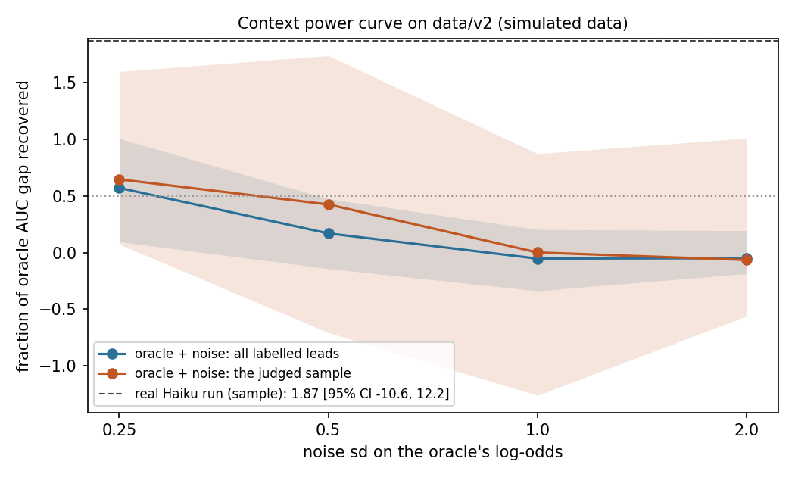

# Phase 6: context agent v2

Branch `phase6-context-agent` from `origin/main` c349833. Plan items 6.1 to 6.6. All numbers are **on
simulated data** (`data/v2`, generator v2 as merged at 01c56f4).

## Summary

- The agent now returns five enum judgments and a short reason (no 0-1 score), from a four-field lead card
  (free text, typed company, job title, email domain), through the Anthropic SDK with structured output,
  the workspace header, a cache keyed by (card, brief, prompt version, model) and a stamp on every row.
- Real run: 1,000 v2 leads through `claude-haiku-4-5-20251001`: **1,000 API requests, 0 parse errors,
  0 transport errors**. A rerun makes 0 requests and reproduces the CSV byte for byte (tested).
- Haiku reads the planted persona well: 262 of 300 planted persona leads (87%) are judged a non-buyer
  persona, competitor 76/80 and job seeker 65/70 exactly; agency pitching is mostly called `vendor`.
  Boilerplate recall on paraphrased text is **0.88** (67/76), against 0.026 for the Phase 2 Jaccard
  detector on the same rows (R6).
- The context features are close to orthogonal to the formula: combined context score vs formula logit
  r = 0.13; largest single column |r| = 0.33.
- **The planted persona is worth very little AUC.** Even the generator's own true probability gains only
  0.0037 AUC from the persona term over all labelled leads (0.0095 on the persona-enriched sample); the
  cross-fitted oracle gap on the sample is 0.0037 [-0.0050, 0.0114], not distinguishable from zero. Under
  ruling R12 that criterion is recorded as **unmeasurable** at this effect size (not passed), and acceptance
  moves to the coefficient level.
- **R12 coefficient criterion: PASS.** With persona pooled at the feature level (R13), the weight of
  `ctx_persona_group=non_buyer` next to the formula is **-0.606 [-1.067, -0.179]**, against the oracle
  persona weight **-0.612 [-1.021, -0.209]** on the same 1,000 rows. Caveat: inside the full combined model
  (all 13 context columns) the same column is -0.383 [-0.887, 0.156], not significant; the other judgments
  share part of its signal.

## Orchestrator decisions (review of Phase 6)

- **R12 (ADR 0016).** The AUC-gap criterion ("recover more than half of the planted gap") is recorded as
  unmeasurable at the planted effect size (oracle gap +0.0037 [-0.005, +0.011]); it is not restated as
  passed. The acceptance for context features from now on is coefficient-level: the context feature's
  weight must have a 95% CI excluding zero and lie within the oracle weight's CI on the same rows.
- **R13 (ADR 0016).** Persona is pooled at the feature level in `emva/context/features.py`:
  `ctx_persona_group` in {buyer, non_buyer (vendor, student, job_seeker, competitor, nonprofit,
  agency_pitching), unclear}, reference buyer. The contract enum stays fine-grained (no prompt or contract
  version bump, no new API calls). **The pooling rule was chosen after seeing the per-level results of this
  run.** It is applied to the unchanged cached judgments and is now fixed in code, so the next customer run
  is pre-registered. The per-level weights stay below as secondary, marked underpowered.
- **R12 scope (ruling on the caveat below).** R12 is judged one context feature at a time next to the
  formula, as done here. The full-model weight (-0.383 [-0.887, 0.156]) is reported as secondary: the other
  judgments share part of the persona signal.
- **R14.** `agency_pitching` stays in the contract; Haiku's vendor/agency confusion (38 of 67 agency leads
  called `vendor`) is documented, and both pool to non_buyer under R13.
- **R15.** Sample design (300 persona / 700 other, labelled leads only, seed 0) accepted; cross-fitting is
  the primary comparison, the time split secondary.
- ADR 0014 (context contract) is Accepted. `matplotlib` stays pinned in `requirements.txt`. The `.env`
  loader is shared in `emva/env.py` (agent and `scripts/paraphrase_templates.py`).

## Acceptance

| criterion | result | evidence | pass/fail |
|---|---|---|---|
| **R12 (acceptance): pooled persona weight has a 95% CI excluding 0 and lies inside the oracle weight's CI, same rows** | `ctx_persona_group=non_buyer` in formula + `ctx_persona_group`: **-0.606 [-1.067, -0.179]**; oracle persona indicator: **-0.612 [-1.021, -0.209]**. Formula + `ctx_persona_group` AUC +0.0049 [-0.0048, 0.0143] (p 0.30). In the full 13-column combined model the column is -0.383 [-0.887, 0.156] | "R12 acceptance" table below; `emva.eval.context_harness.coefficient_criterion` | **PASS** |
| Combined model recovers > 1/2 of the planted context-only gap (plan) | fraction recovered 1.87 [95% CI -10.6, 12.2]; formula + context AUC +0.0070 [-0.0051, 0.0195] (p 0.25); oracle gap +0.0037 [-0.0050, 0.0114] (p 0.38); model-free ceiling 0.0037 (all labelled) / 0.0095 (sample) | 6.5 and 6.6 below | **unmeasurable** (R12; not passed) |
| `persona` weights individually significant (plan, per contract level) | 0 of 7 unpooled levels significant (e.g. competitor -0.35 [-0.97, 0.20]) | secondary table below | superseded by R12/R13 (underpowered at n = 1,000) |
| Correlation of context features with the formula score reported and < 0.5 | combined context score r = 0.136; max single-column \|r\| = 0.333 (`is_real_business=no`) | correlation table below | PASS |
| Same brief + model reproduces scores exactly from cache; brief edit gives a new `brief_hash` and a documented retrain | rerun after the R13 change: 1,000 hits, 0 requests, identical CSV; temp brief: new hash, all misses reported by `--dry-run` with no client | `tests/test_context.py::test_committed_cache_reproduces_the_committed_judgments_without_the_api`, `::test_brief_edit_is_a_new_hash_and_dry_run_reports_misses_without_calling`, `::test_dry_run_cli_reports_the_retrain_without_calling`; ADR 0014 | PASS |

The first submission of this report failed the two plan criteria (AUC gap, per-level persona weights);
the orchestrator's rulings R12 and R13 replaced them. Nothing was re-run against the API; the pooled
feature is computed from the same cached judgments. Formula + context AUC moved from +0.0042 to +0.0070
because the design changed from 18 to 13 columns (unpooled to pooled persona).

## What was built

| item | where | notes |
|---|---|---|
| 6.1 contract | `emva/context/contract.py` | `JUDGMENTS` (five enums), `reason` <= 30 words, `RESPONSE_SCHEMA` sent as `output_config` JSON schema (enums enforced server-side), `validate` raises `ContractError` = parse error |
| 6.2 lead card | `emva/context/card.py` | `LeadCard(what_to_solve, company_typed, job_title, email_domain)`; test asserts no enrichment, spend, CRM, hiring, bucketed answers, telemetry, stage or outcome reaches the text |
| 6.3 features | `emva/context/features.py` | `ctx_<judgment>` with declared levels; persona pooled into `ctx_persona_group` (buyer / non_buyer / unclear, `PERSONA_GROUPS`, R13); references yes / buyer / specific / none / partial; 13 fixed columns via `design.fixed_design` (ADR 0009); one stamp per file enforced; the legacy `context_score` file still works (baseline byte identity) |
| 6.4 runtime | `emva/context/agent.py`, `emva/context/cache.py` | SDK client with `anthropic-workspace-id` (refuses to run without it), SDK retries off; `io.clean` before any call; transport errors (connection, timeout, 408/409/429/5xx) retried 1-2-4-8 s and logged; 400/401/403/404 raise; parse errors recorded and cached, never retried; `(brief_hash, prompt_version, model_id)` + `card_hash` on every row; <= 8 workers; `--dry-run` |
| pipeline hook | `emva/pipeline.py` | `--context` now goes through `context_features`, which returns the judgment dummies or the legacy `context_logit`; formula vs formula+context on the same rows as in Phase 0 |
| 6.5 harness | `emva/eval/context_harness.py` | sample, cross-fitting, oracle power curve, gap ratio with shared resamples, R12 `coefficient_criterion`, weight CIs (pooled and unpooled), confusion, correlation, boilerplate recall, true-probability ceiling |
| 6.6 run | `scripts/run_context_agent.py`, `data/v2/context/` | `sample_ids.csv`, `cache.json` (committed), `context_judgments.csv`, `runs.jsonl` (counts per run) |

Prompt (`PROMPT_VERSION = "judgments-v1"`): the system prompt defines each judgment and its values in
plain words and appends the committed brief (`baseline/business_brief.md`, `brief_hash 38a38ed6d57fda66`).
It does not mention the generator or its persona sentences. Temperature 0, `max_tokens` 400.

## Sample (6.6)

Seeded (`numpy.random.default_rng(0)`), stratified on the planted persona, drawn from the **4,230 cleaned
v2 leads with a horizon label** (mature, not censored; the rows any model can be fit or scored on):
**300 of the 364 labelled persona leads and 700 of the 3,866 others**. Persona share 30% (vs 8.6% among
labelled leads); 184 wins. 300 is above the plan's floor of 150 and gives roughly 75 leads per planted
persona. Ids: `data/v2/context/sample_ids.csv`. Bots and duplicates are excluded by construction (the
pool is `io.clean` output) and `select_leads` drops any again before calling.

## Protocol

Both models are always fit on identical rows. Primary: on the 1,000 sample rows, 5 stratified folds
(seed 0) shared by every model (formula, formula + context, formula + oracle); AUC on pooled out-of-fold
predictions; paired differences and the gap ratio from 1,000 shared bootstrap resamples (seed 0). Weight
CIs: 1,000 bootstrap refits of formula + context on all 1,000 rows. Secondary: the pipeline's time split
(`python -m emva --data data/v2 --context data/v2/context/context_judgments.csv`), which leaves 108 test
rows. The oracle feature is `-1.0 x persona` (+ noise for the power curve), appended to the formula design.

Reproduce: `python -m emva.eval.context_harness evaluate --data data/v2 --plot reports/phase6_power_curve.png`
(~50 s, no API calls).

## Results



The curve is flat and noisy because the gap it normalises by is tiny: at sd 0.25 the oracle keeps ~60% of
a 0.0025 to 0.0037 AUC gap, and at sd >= 1 it keeps nothing on average. The real run's point estimate
(1.87) sits above the curve but its CI spans far beyond the plot; this is why R12 moves acceptance to
the coefficient level.

### 6.5 Power curve (oracle persona feature + noise)

**all labelled leads**: AUC(formula) 0.7947, AUC(formula + true persona) 0.7972, gap 0.0025 (cross-fitted, 5 folds, 20 noise draws per sd). Ceiling from the generator's true probability: AUC 0.8395 with the persona term, 0.8358 without, gap 0.0037.

| noise_sd | auc_mean | frac_mean | frac_p05 | frac_p95 |
|---|---|---|---|---|
| 0.250 | 0.796 | 0.571 | 0.095 | 1.007 |
| 0.500 | 0.795 | 0.169 | -0.142 | 0.474 |
| 1.000 | 0.795 | -0.054 | -0.338 | 0.203 |
| 2.000 | 0.795 | -0.050 | -0.186 | 0.193 |

**the judged sample**: AUC(formula) 0.7796, AUC(formula + true persona) 0.7833, gap 0.0037 (cross-fitted, 5 folds, 20 noise draws per sd). Ceiling from the generator's true probability: AUC 0.8467 with the persona term, 0.8372 without, gap 0.0095.

| noise_sd | auc_mean | frac_mean | frac_p05 | frac_p95 |
|---|---|---|---|---|
| 0.250 | 0.782 | 0.647 | 0.073 | 1.599 |
| 0.500 | 0.781 | 0.425 | -0.708 | 1.740 |
| 1.000 | 0.780 | 0.001 | -1.262 | 0.873 |
| 2.000 | 0.779 | -0.066 | -0.562 | 1.010 |

### R12 acceptance: pooled persona weight vs oracle weight (same rows)

| model (formula + ...) | weight of the persona column [95% CI] |
|---|---|
| `ctx_persona_group` (buyer / non_buyer / unclear): `ctx_persona_group=non_buyer` | -0.606 [-1.067, -0.179] |
| true persona indicator (oracle) | -0.612 [-1.021, -0.209] |

CI excludes zero: True; point inside the oracle CI: True. **R12: PASS.** Formula + `ctx_persona_group` AUC 0.7845, diff vs formula 0.0049 [-0.0048, 0.0143], p 0.302. The same column in the full combined model (all 13 context columns): -0.383 [-0.887, 0.156].

### 6.6 Real run: formula vs formula + context (same rows, cross-fitted)

Rows: 1000 labelled sample leads with an ok judgment (184 wins, 300 with a planted persona). Status counts over the whole file: {'ok': 1000}.

| model | AUC (out of fold) | diff vs formula [95% CI] | p |
|---|---|---|---|
| formula | 0.7796 | | |
| formula + context | 0.7866 | 0.0070 [-0.0051, 0.0195] | 0.250 |
| formula + true persona (oracle) | 0.7833 | 0.0037 [-0.0050, 0.0114] | 0.382 |

**Fraction of the oracle gap recovered: 1.869 [-10.590, 12.246]** (shared bootstrap resamples).

Oracle persona weight on the same rows: -0.612 [-1.021, -0.209].

#### Context weights (formula + all 13 context columns fit on all rows; 1,000 bootstrap refits)

| feature | n | weight | lo | hi | significant |
|---|---|---|---|---|---|
| ctx_is_real_business=no | 102 | -0.131 | -0.859 | 0.550 | False |
| ctx_is_real_business=unclear | 469 | -0.086 | -0.552 | 0.306 | False |
| ctx_persona_group=non_buyer | 320 | -0.383 | -0.887 | 0.156 | False |
| ctx_persona_group=unclear | 193 | 0.399 | -0.167 | 0.997 | False |
| ctx_problem_specificity=vague | 408 | 0.272 | -0.121 | 0.695 | False |
| ctx_problem_specificity=boilerplate | 115 | 0.166 | -0.427 | 0.744 | False |
| ctx_problem_specificity=unrelated | 13 | -0.196 | -0.379 | -0.060 | True |
| ctx_urgency=now | 54 | 0.525 | 0.007 | 1.029 | True |
| ctx_urgency=this_quarter | 189 | 0.552 | 0.030 | 1.117 | True |
| ctx_urgency=researching | 118 | -0.087 | -0.634 | 0.404 | False |
| ctx_brief_fit=strong | 147 | 0.232 | -0.212 | 0.718 | False |
| ctx_brief_fit=weak | 180 | -0.154 | -0.598 | 0.316 | False |
| ctx_brief_fit=none | 432 | -0.180 | -0.751 | 0.312 | False |

#### Secondary, underpowered: unpooled judgments (persona at its eight contract levels)

| feature | n | weight | lo | hi | significant |
|---|---|---|---|---|---|
| ctx_is_real_business=no | 102 | -0.164 | -0.832 | 0.467 | False |
| ctx_is_real_business=unclear | 469 | -0.105 | -0.556 | 0.279 | False |
| ctx_persona=vendor | 60 | -0.076 | -0.677 | 0.536 | False |
| ctx_persona=student | 29 | -0.034 | -0.735 | 0.589 | False |
| ctx_persona=job_seeker | 65 | -0.137 | -0.790 | 0.451 | False |
| ctx_persona=competitor | 76 | -0.354 | -0.965 | 0.201 | False |
| ctx_persona=nonprofit | 55 | -0.142 | -0.723 | 0.510 | False |
| ctx_persona=agency_pitching | 35 | -0.283 | -0.950 | 0.420 | False |
| ctx_persona=unclear | 193 | 0.491 | -0.034 | 1.067 | False |
| ctx_problem_specificity=vague | 408 | 0.277 | -0.129 | 0.717 | False |
| ctx_problem_specificity=boilerplate | 115 | 0.178 | -0.409 | 0.767 | False |
| ctx_problem_specificity=unrelated | 13 | -0.197 | -0.381 | -0.058 | True |
| ctx_urgency=now | 54 | 0.538 | 0.037 | 1.052 | True |
| ctx_urgency=this_quarter | 189 | 0.560 | 0.036 | 1.135 | True |
| ctx_urgency=researching | 118 | -0.060 | -0.601 | 0.439 | False |
| ctx_brief_fit=strong | 147 | 0.243 | -0.191 | 0.740 | False |
| ctx_brief_fit=weak | 180 | -0.164 | -0.616 | 0.295 | False |
| ctx_brief_fit=none | 432 | -0.306 | -0.799 | 0.126 | False |

#### Persona judged vs planted (evaluation only)

| judged persona | agency_pitching | competitor | job_seeker | none | nonprofit |
|---|---|---|---|---|---|
| agency_pitching | 25 | 0 | 0 | 10 | 0 |
| buyer | 3 | 2 | 4 | 453 | 25 |
| competitor | 0 | 76 | 0 | 0 | 0 |
| job_seeker | 0 | 0 | 65 | 0 | 0 |
| nonprofit | 0 | 0 | 0 | 1 | 54 |
| student | 0 | 2 | 0 | 26 | 1 |
| unclear | 1 | 0 | 1 | 189 | 2 |
| vendor | 38 | 0 | 0 | 21 | 1 |

#### Correlation of each context feature with the formula logit

Formula fit on all pre-2026-05-01 labelled leads. Combined context score (context columns x their weights) vs formula logit: r = 0.136. Largest |r| of a single column: 0.333.

| feature | r |
|---|---|
| ctx_is_real_business=no | -0.333 |
| ctx_is_real_business=unclear | -0.220 |
| ctx_persona_group=non_buyer | -0.035 |
| ctx_persona_group=unclear | -0.315 |
| ctx_problem_specificity=vague | -0.119 |
| ctx_problem_specificity=boilerplate | -0.135 |
| ctx_problem_specificity=unrelated | -0.136 |
| ctx_urgency=now | 0.126 |
| ctx_urgency=this_quarter | 0.245 |
| ctx_urgency=researching | 0.054 |
| ctx_brief_fit=strong | 0.236 |
| ctx_brief_fit=weak | 0.057 |
| ctx_brief_fit=none | -0.165 |

#### Boilerplate detection (R6) against the generator's copy_paste flag, ok sample rows

| detector | flagged | true | tp | recall | precision |
|---|---|---|---|---|---|
| LLM problem_specificity=boilerplate | 115 | 76 | 67 | 0.882 | 0.583 |
| Jaccard >= 0.6 (text=copy_paste, Phase 2) | 2 | 76 | 2 | 0.026 | 1.000 |
| LLM boilerplate or unrelated | 128 | 76 | 67 | 0.882 | 0.523 |

#### Time split (`python -m emva --data data/v2 --context ...`, 108 test rows)

| model | auc | brier | top20_wins | top20_revenue |
|---|---|---|---|---|
| formula | 0.8100 | 0.1000 | 0.5830 | 0.7660 |
| context_only | 0.5760 | 0.1223 | 0.2500 | 0.7050 |
| formula+context | 0.8030 | 0.1019 | 0.5830 | 0.7660 |

### Reading the weights

- In the full combined model only `urgency=now` (+0.53), `urgency=this_quarter` (+0.55) and
  `problem_specificity=unrelated` (-0.20, 13 rows) have CIs excluding 0. `ctx_persona_group=non_buyer` is
  -0.38 [-0.89, 0.16] there: next to eleven other context columns (several correlated with persona, e.g.
  `brief_fit=none`) and under L2 (C = 0.5), part of its signal is shared. On its own next to the formula it
  matches the oracle (R12 row).
- `ctx_persona_group=unclear` gets +0.40: it marks mostly blank or near-empty leads (r = -0.32 with the
  formula logit), which the formula already penalises, so the context weight partly undoes that penalty.
- Unpooled, the persona signal is spread over six non-buyer levels with 29 to 76 rows each; per-level CIs
  are about +/-0.6 wide (secondary table).
- On the time split (108 test rows) no difference is informative.

## API usage and cost

| run | leads | cache hits | API requests | ok | parse errors | transport errors |
|---|---|---|---|---|---|---|
| probe (`--probe 20`), inspected before the full run | 20 | 0 | 20 | 20 | 0 | 0 |
| full sample | 1,000 | 20 | 980 | 1,000 | 0 | 0 |
| rerun (reproducibility) | 1,000 | 1,000 | 0 | 1,000 | 0 | 0 |
| rerun after R12/R13 | 1,000 | 1,000 | 0 | 1,000 | 0 | 0 |
| **total** | | | **1,000** (budget 1,300) | | **0** | **0** |

From `data/v2/context/runs.jsonl`. No retries were needed. Cost estimate (token usage was not logged):
~650 input tokens (system prompt with brief ~2,460 characters, plus a ~200-character card) and ~70 output
tokens per call at Haiku 4.5's $1 / $5 per MTok, about **$1** in total. No test calls the API (the client is
mocked or forbidden by a factory that raises).

## Deviations

1. **Evaluation protocol.** The comparison on the sample is cross-fitted (5 shared folds), not the
   pipeline's time split, because a 1,000-lead sample leaves 108 time-split test rows. Both models still
   see identical rows. The time split is reported as secondary.
2. **Sample restricted to labelled leads and persona-enriched to 30%.** Unlabelled leads contribute nothing
   to either model; proportional allocation would give ~86 persona leads, under the plan's 150.
3. **Gap computed here.** `origin/phase4-eval-hardening` did not exist when this finished, so the oracle gap
   is this harness's own (cross-fitted, same rows), plus a model-free ceiling from `p_close_true`.
4. **matplotlib** added to `requirements.txt`, pinned 3.10.9 (kept by the orchestrator), imported lazily
   inside `plot_power_curve` for the PNG; installed into the shared `.venv`.
5. **Env loader** (resolved at review): `emva/env.py` holds `find_dotenv` / `load_env_var`, imported by
   `emva/context/agent.py` and `scripts/paraphrase_templates.py`. Unlike the script, the agent refuses to
   run without `ANTHROPIC_WORKSPACE_ID`.
6. **Legacy context format kept.** `context_features` still accepts `lead_id,context_score` so
   `tests/test_integration.py::test_context_mode_matches_baseline_script` (baseline byte identity) passes.
   The Phase 0 `requests`-based agent code is gone.
7. **Parse errors are cached** (they are what the model said); only transport errors are left uncached.
8. **Pooling chosen after the results** (now R13): the pooled persona feature was first shown as an
   exploratory line after the per-level CIs were seen; the orchestrator made it the design (fixed in code,
   same cached judgments, no new calls).
9. **ADR number 0014** as instructed (0012 and 0013 are presumably Phases 3 and 4).
10. **Brief**: `baseline/business_brief.md` is the committed brief (frozen, not edited).

## Open questions for the orchestrator

None open. Criterion power, persona encoding and agency vs vendor are answered by R12 to R15; the
combined-model persona weight by the R12 scope ruling (one feature at a time, full model secondary).

## Merge with Phase 3 (origin/main f0406a4)

Merged into this branch; conflicts only in the pipeline docstring and the docs' status/index rows (both
kept). After the merge a from-cache rerun (1,000 hits, 0 API requests) and `python -m emva.eval.context_harness
evaluate` give output identical to the pre-merge run: every number in this report is unchanged, including the
R12 row and the time-split table. Phase 3's `value_at_submit` is computed from `value_formula` only; there
is no hook that takes it from the combined model in `--context` mode (only `value_combined` uses
`p_combined`). Left as is, per instruction.

## Standard report (`make report DATA=data/v2`)

Phase 6 does not change the formula candidate (context features enter only with `--context`); pasted for
ground rule 3.

### EMVA standard report

Data: `data/v2`. baseline = frozen `baseline/emva_score.py`; candidate = `emva` pipeline trained with `horizon H=120` labels and `v2` features; status quo = `status_quo_rules.json` reconstructed. Every model is scored on the same rows under two test definitions. AUC CI: percentile bootstrap, 1000 resamples, seed 0. Top-20% capture ranks by p (status quo: by its value) or by p×value.

#### Label definitions

Counts over all 9209 scored leads, as wins / losses / unlabelled. `label_source` is the CRM state at 2026-09-24. legacy y = baseline rules. won_within_h = Won within 120 days of created_at (NaN if younger and not Won). horizon y = won_within_h with ghosted-at-H leads excluded and stalled leads censored (the default training and test label).

| label_source | leads | legacy y | won_within_h | horizon y |
|---|---|---|---|---|
| won | 1128 | 1128 / 0 / 0 | 1037 / 91 / 0 | 1037 / 91 / 0 |
| crm_lost | 4498 | 0 / 4498 / 0 | 0 / 3254 / 1244 | 0 / 3254 / 1244 |
| stalled | 786 | 0 / 786 / 0 | 0 / 715 / 71 | 0 / 0 / 786 |
| ghosted | 1256 | 0 / 1256 / 0 | 0 / 1256 / 0 | 0 / 0 / 1256 |
| open | 1541 | 0 / 150 / 1391 | 0 / 73 / 1468 | 0 / 73 / 1468 |
| all | 9209 | 1128 / 6690 / 1391 | 1037 / 5389 / 2783 | 1037 / 3418 / 4754 |

Mature = created_at + 120 days <= 2026-09-24T00:00:00+00:00: the latest mature lead was created 2026-05-26T23:04:04+00:00. Train = created before 2026-05-01 (all mature); test = created on or after 2026-05-01.

| definition | train (wins) | test (wins) |
|---|---|---|
| legacy | 5509 (825) | 2309 (303) |
| horizon H=120 | 3789 (734) | 441 (78) |

Candidate trained with: `horizon H=120`.

#### (a) Legacy labels, legacy test set

2309 leads labelled by the baseline rules, created on or after 2026-05-01 (303 won). Label = legacy y.

##### Headline

| model | AUC [95% CI] | Brier | top-20% wins | top-20% revenue (by p) | top-20% revenue (by p×value) |
|---|---|---|---|---|---|
| baseline | 0.789 [0.763, 0.815] | 0.0983 | 0.525 | 0.673 | 0.719 |
| candidate | 0.806 [0.781, 0.830] | 0.0985 | 0.558 | 0.708 | 0.778 |
| status quo | 0.637 [0.600, 0.673] | n/a | 0.393 | 0.427 | 0.427 |

##### Paired AUC comparison vs baseline

| model | AUC − baseline | 95% CI | bootstrap p |
|---|---|---|---|
| candidate | +0.017 | [+0.006, +0.026] | 0.006 |
| status quo | -0.152 | [-0.185, -0.120] | 0.000 |

##### Calibration by decile of p

| decile | n | baseline mean p | baseline observed | candidate mean p | candidate observed |
|---|---|---|---|---|---|
| 1 | 231 | 0.013 | 0.000 | 0.016 | 0.004 |
| 2 | 231 | 0.024 | 0.026 | 0.032 | 0.004 |
| 3 | 231 | 0.038 | 0.048 | 0.049 | 0.043 |
| 4 | 231 | 0.058 | 0.039 | 0.072 | 0.035 |
| 5 | 231 | 0.080 | 0.074 | 0.100 | 0.078 |
| 6 | 230 | 0.108 | 0.113 | 0.136 | 0.100 |
| 7 | 231 | 0.145 | 0.147 | 0.180 | 0.156 |
| 8 | 231 | 0.197 | 0.177 | 0.240 | 0.160 |
| 9 | 231 | 0.283 | 0.251 | 0.347 | 0.312 |
| 10 | 231 | 0.466 | 0.437 | 0.543 | 0.420 |

Status quo has no probability, so it has no Brier score or calibration.

##### AUC by test month

| month | n | wins | baseline | candidate | status quo |
|---|---|---|---|---|---|
| 2026-05 | 739 | 89 | 0.788 | 0.800 | 0.660 |
| 2026-06 | 642 | 94 | 0.781 | 0.794 | 0.627 |
| 2026-07 | 486 | 76 | 0.803 | 0.822 | 0.623 |
| 2026-08 | 357 | 36 | 0.750 | 0.790 | 0.608 |
| 2026-09 | 85 | 8 | 0.937 | 0.945 | 0.689 |

##### Value scale

| model | scope | n | median | p99 | max | max/median | top-1% share |
|---|---|---|---|---|---|---|---|
| baseline | test set | 2309 | 447 | 14236 | 33007 | 73.9× | 11.1% |
| baseline | all scored leads | 9209 | 498 | 16919 | 36283 | 72.8× | 11.3% |
| candidate | test set | 2309 | 548 | 17096 | 35656 | 65.1× | 10.3% |
| candidate | all scored leads | 9209 | 599 | 20432 | 40539 | 67.6× | 10.4% |
| status quo | test set | 2309 | 96 | 1200 | 1872 | 19.5× | 6.5% |
| status quo | all scored leads | 9209 | 96 | 1200 | 1872 | 19.5× | 6.8% |

Value = p × expected deal value (models), rule-based bucket value in GBP (status quo). All scored leads = leads left after bot/duplicate removal.

##### Notes

- status quo: 215 rows tie at the top-20% cut when ranking wins; the table uses numpy's default argsort (as the baseline does), tie-averaged value is 0.384.
- status quo: 215 rows tie at the top-20% cut when ranking revenue by p; the table uses numpy's default argsort (as the baseline does), tie-averaged value is 0.420.
- status quo: 215 rows tie at the top-20% cut when ranking revenue by p×value; the table uses numpy's default argsort (as the baseline does), tie-averaged value is 0.420.

#### (b) Horizon labels, mature test set

441 mature leads created on or after 2026-05-01 and up to 2026-05-26T23:04:04+00:00 that the default horizon definition labels (78 won). Label = won within 120 days; ghosted-at-H leads excluded, stalled leads censored.

##### Headline

| model | AUC [95% CI] | Brier | top-20% wins | top-20% revenue (by p) | top-20% revenue (by p×value) |
|---|---|---|---|---|---|
| baseline | 0.776 [0.721, 0.829] | 0.1250 | 0.526 | 0.632 | 0.663 |
| candidate | 0.794 [0.742, 0.844] | 0.1222 | 0.513 | 0.627 | 0.741 |
| status quo | 0.654 [0.575, 0.728] | n/a | 0.449 | 0.512 | 0.512 |

##### Paired AUC comparison vs baseline

| model | AUC − baseline | 95% CI | bootstrap p |
|---|---|---|---|
| candidate | +0.018 | [-0.003, +0.037] | 0.090 |
| status quo | -0.122 | [-0.190, -0.051] | 0.000 |

##### Calibration by decile of p

| decile | n | baseline mean p | baseline observed | candidate mean p | candidate observed |
|---|---|---|---|---|---|
| 1 | 45 | 0.012 | 0.000 | 0.014 | 0.022 |
| 2 | 44 | 0.025 | 0.023 | 0.031 | 0.023 |
| 3 | 44 | 0.040 | 0.091 | 0.053 | 0.023 |
| 4 | 44 | 0.064 | 0.114 | 0.080 | 0.114 |
| 5 | 44 | 0.090 | 0.114 | 0.113 | 0.068 |
| 6 | 44 | 0.130 | 0.182 | 0.153 | 0.182 |
| 7 | 44 | 0.175 | 0.159 | 0.201 | 0.205 |
| 8 | 44 | 0.236 | 0.159 | 0.272 | 0.227 |
| 9 | 44 | 0.311 | 0.409 | 0.372 | 0.364 |
| 10 | 44 | 0.524 | 0.523 | 0.603 | 0.545 |

Status quo has no probability, so it has no Brier score or calibration.

##### AUC by test month

| month | n | wins | baseline | candidate | status quo |
|---|---|---|---|---|---|
| 2026-05 | 441 | 78 | 0.776 | 0.794 | 0.654 |

##### Value scale

| model | scope | n | median | p99 | max | max/median | top-1% share |
|---|---|---|---|---|---|---|---|
| baseline | test set | 441 | 561 | 16858 | 33007 | 58.8× | 10.7% |
| baseline | all scored leads | 9209 | 498 | 16919 | 36283 | 72.8× | 11.3% |
| candidate | test set | 441 | 644 | 20446 | 35656 | 55.4× | 10.1% |
| candidate | all scored leads | 9209 | 599 | 20432 | 40539 | 67.6× | 10.4% |
| status quo | test set | 441 | 125 | 1440 | 1872 | 15.0× | 5.8% |
| status quo | all scored leads | 9209 | 96 | 1200 | 1872 | 19.5× | 6.8% |

Value = p × expected deal value (models), rule-based bucket value in GBP (status quo). All scored leads = leads left after bot/duplicate removal.

##### Notes

- status quo: 47 rows tie at the top-20% cut when ranking wins; the table uses numpy's default argsort (as the baseline does), tie-averaged value is 0.454.
- status quo: 47 rows tie at the top-20% cut when ranking revenue by p; the table uses numpy's default argsort (as the baseline does), tie-averaged value is 0.526.
- status quo: 47 rows tie at the top-20% cut when ranking revenue by p×value; the table uses numpy's default argsort (as the baseline does), tie-averaged value is 0.526.

#### Bottom-decile ghosted share

Share of leads in the 10% of each population with the lowest p that are *ghosted* (`label_source`: mature and not contacted within 120 days) or *still New* at 2026-09-24 whatever their age (the definition behind the plan's baseline figure of 27%). The horizon test set (b) excludes ghosted leads, so the comparison uses populations that keep them.

| population | n | ghosted: overall | ghosted: baseline bottom decile | ghosted: candidate bottom decile | still New: overall | still New: baseline bottom decile | still New: candidate bottom decile |
|---|---|---|---|---|---|---|---|
| all leads labelled by legacy rules (train + test) | 7818 | 16.1% | 21.9% | 20.1% | 18.0% | 24.3% | 22.7% |
| (a) legacy test set | 2309 | 5.6% | 8.3% | 7.0% | 12.1% | 16.5% | 15.7% |
| all mature leads, every label_source | 6201 | 20.3% | 27.4% | 24.8% | 20.3% | 27.4% | 24.8% |
| mature leads created on or after 2026-05-01, every label_source | 640 | 20.3% | 25.0% | 20.3% | 20.3% | 25.0% | 20.3% |

#### Design collinearity (plan 2.7): PASS

Candidate design (`v2` features, 39 columns) on its 3789 training rows; fails when two columns have |corr| > 0.95. The report exits 1 on a failure only with `--strict`; `python -m emva.eval.collinearity` always does.

- PASS: max |corr| = 0.824 between enrichment_missing=yes and band=missing

#### Baseline script output

- Revenue = recorded deal value of won test leads (blank = 0). The baseline script's own summary, which fills blank deal values with its predicted value, printed:

```
  model   auc  brier  top20_wins  top20_revenue
formula 0.789 0.0983       0.525          0.722
```
