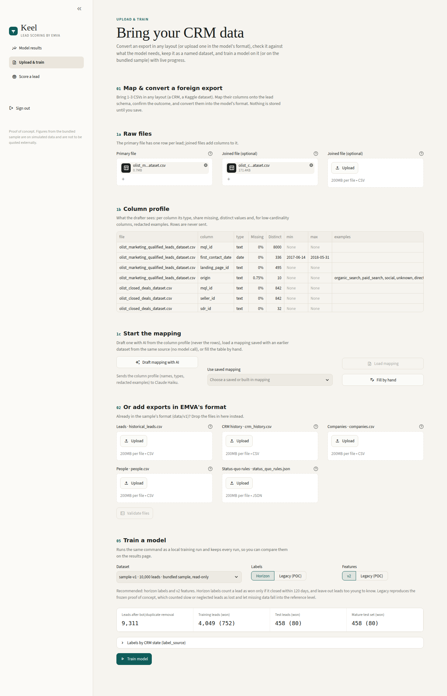
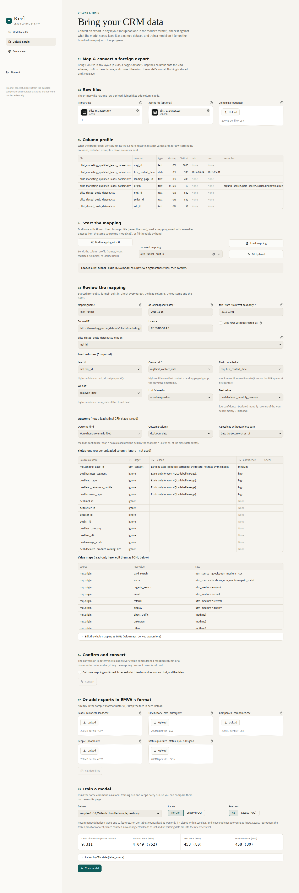
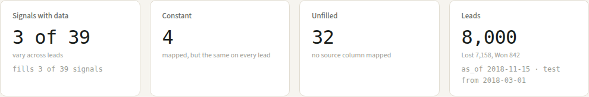
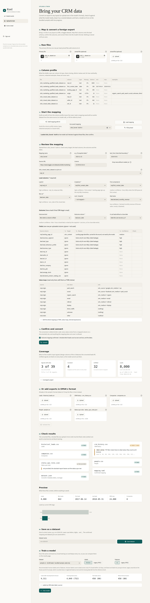
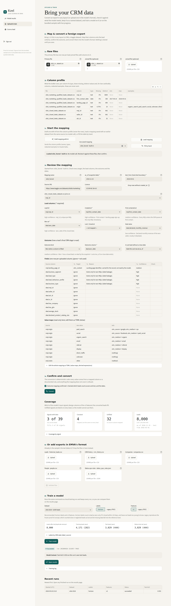
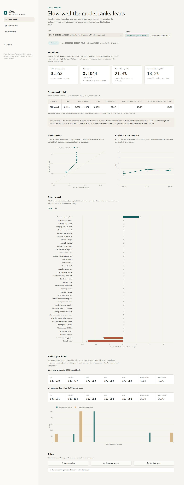
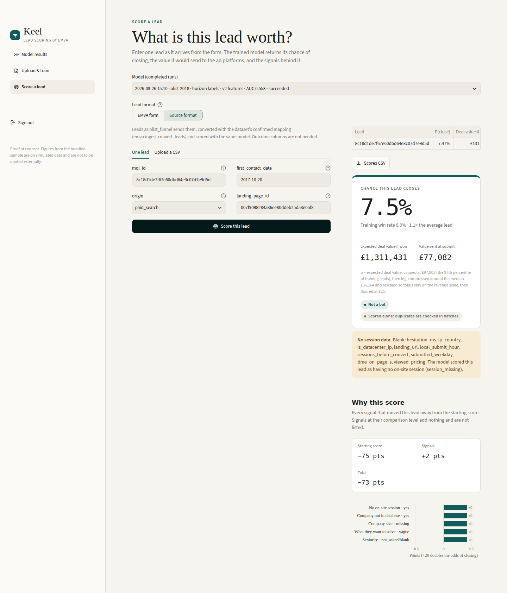

# Phase 9: generic dataset converter, per-dataset dates, Keel "Map & convert" (branch `claude/epic-edison-onl83z`)

Phase 9 lets EMVA train on data that was not produced by our generator. A TOML **mapping** per data source says
how 1-3 foreign CSVs become EMVA's five training files. Claude Haiku can draft the mapping from column profiles, a
person reviews and confirms it, and deterministic code does the conversion. Each converted dataset carries its own
snapshot date and test boundary in `dataset.json` (ADR 0020). The standard report and the Keel results page run on
it without the frozen baseline (ADR 0022). Keel gets a "Map & convert" section on Upload & train and a
source-format mode on the Score page.

We tried it on three public Kaggle datasets. **Every number from them in this report is on public data**: real
exports, not simulated. They say how well the fixed schema covers these sources, not how well EMVA scores
real B2B enquiries. The hotel dataset holds **bookings, not enquiries**. The v1/v2 numbers quoted under
Verification are on simulated data, as before.

ADRs: 0020 (per-dataset dates), 0021 (the LLM drafts mappings only), 0022 (results without a baseline). All three
are Proposed.

## What was built

| module | role |
|---|---|
| `emva/ingest/mapping.py` | `DatasetMapping` and the TOML schema (`load_mapping` / `dump_mapping`; unknown keys refused). It covers sources and joins, `[lead]` expressions (column references plus a closed set of ops: `date_from_parts`, `minus_days`, `product`, `sum`), the `[outcome]` (`stage` / `won_flag` / `presence`), `[[fields]]` (a target or a value map), reviewer notes, `as_of` / `test_from`, and `outcome_confirmed` |
| `emva/ingest/profile.py` | Column profiles: name, type, share missing, distinct count, min/max, and up to 10 redacted examples for columns with at most 20 distinct values. Emails, phone-like digit runs and IPs become `<email>`, `<phone>`, `<ip>`, and person-name columns get only `<name>`. The profile is the only thing an LLM ever sees |
| `emva/ingest/draft.py` | A Haiku draft from the profiles: structured output, a cached reply, and a result that is always `outcome_confirmed = false` (ADR 0021) |
| `emva/ingest/convert.py` | Deterministic conversion. It writes `historical_leads.csv` (v1 header), `crm_history.csv`, header-only `companies.csv` / `people.csv`, and `dataset.json` (dates, counts and the 39-column `coverage` table). `convert_leads` does the same for new leads without outcome columns |
| `emva/ingest/__main__.py` | `python -m emva.ingest draft|convert|score` |
| `emva/dataset_meta.py` | Reads the dates: `dataset_dates(data)` returns `dataset.json`'s `as_of` / `test_from`, else the constants. A malformed file is refused (ADR 0020) |
| `emva/pipeline.py`, `emva/eval/report.py`, `emva/eval/value_report.py` | Use the per-dataset dates. The report runs without a baseline or status quo on converted data, and an unfittable value transform gets a row in the report instead of raising an exception |
| `app/ingest.py`, `app/views/upload.py` | Map & convert state (no Streamlit) and the upload-page section |
| `app/scoring.py`, `app/views/score.py` | Source-format scoring of a run trained on a converted dataset |
| `app/storage.py`, `app/validation.py`, `app/results.py`, `app/training.py`, `app/job.py` | Store `mapping.toml` and `dataset.json` with a dataset (the store record moves to `keel_meta.json`), validate them, show results without a baseline, and run the standard report on converted datasets |
| `mappings/*.toml` | Three mappings, written and reviewed by hand. Each file's header explains every decision |

### Command line

```sh
# 1. draft (needs ANTHROPIC_API_KEY + ANTHROPIC_WORKSPACE_ID in .env, unless the reply is cached)
python -m emva.ingest draft --raw data/external/raw/olist --out mappings/olist_funnel.toml --name olist_funnel \
    [--cache FILE] [--as-of DATE] [--test-from DATE]
# 2. a person reviews the TOML, fixes it, and sets outcome_confirmed = true
# 3. convert (refuses a draft); prints the coverage summary
python -m emva.ingest convert --mapping mappings/olist_funnel.toml --raw data/external/raw/olist --out data/external/olist_funnel
# 4. train and report as for any dataset (dates come from dataset.json)
python -m emva --data data/external/olist_funnel --out runs/olist_funnel
python -m emva.eval.report --data data/external/olist_funnel > runs/olist_funnel/report.md
# 5. score new leads given in the source format
python -m emva.ingest score --mapping mappings/olist_funnel.toml --raw new_mqls.csv --run runs/olist_funnel [--out FILE]
```

The draft cache defaults to `.draft_cache.json` next to `--out`. Commit it with the mapping so the draft can be
reproduced without the API. `data/external/` (raw downloads and converted datasets) and `runs/` are gitignored.

### Keel

On **Upload & train**, section 01 "Map & convert a foreign export":

1. **1a Raw files.** Upload a primary file (one row per lead) and up to two joined files.
2. **1b Column profile.** This table is exactly what the drafter would see. Rows are never sent.
3. **1c Start the mapping.** Pick one of three starts: "Draft mapping with AI" (Haiku, cached in
   `DATA_DIR/ingest/draft_cache.json`), "Use saved mapping" (the `mapping.toml` of an earlier dataset, or a built-in
   one from `mappings/`, with no model call), or "Fill by hand" (every column set to ignore).
4. **1d Review the mapping.** Set the name, `as_of`, `test_from`, source URL, licence and join columns. Then map
   the lead columns (created_at is required; won_at is optional, a win without one is dated at close_at), choose the outcome kind and column, and fill the outcome
   value table. The fields table shows each row's reason and confidence, with low-confidence rows marked for checking.
   Value maps are read-only here. The whole mapping can be edited as TOML, which is where value maps and derived
   expressions are changed.
5. **1e Confirm and convert.** Tick "Outcome mapping confirmed" and press Convert. The page then shows the coverage
   cards (signals with data / constant / unfilled, leads, dates) and a per-signal coverage table.
6. **03 Check results**, **Preview** and **04 Save as a dataset.** These are the same validation and store as an
   EMVA-format upload. `mapping.toml` and `dataset.json` are saved with the dataset.
7. **05 Train a model.** Train as before. The job runs the CLI and then the standard report, which has no baseline
   on a converted dataset.

On **Score a lead**, a run trained on a converted dataset offers **Lead format: EMVA form / Source format**. Source
format builds a form from the mapping's submit-time source columns (One lead) or takes a CSV of source rows
(Upload a CSV). The rows go through `emva.ingest.convert_leads` and `emva.scoring.score_leads`. Outcome columns are
not needed.

## Datasets (on public data)

We downloaded the three datasets from Kaggle into `data/external/raw/`, converted them with the committed mappings,
trained them with the pipeline defaults (horizon H = 120, v2 features) and ran the standard report. **Nothing was
tuned.** H, the flags, the features and the dates are the mapping's first choice, set before any model was fitted.

Amounts (`deal_value`, value per lead) are in each source's own currency. The report and Keel label them GBP / £
because their formatting is fixed.

### Headline (on public data)

| dataset | leads (won) | test definition | train (wins) | test (wins) | AUC [95% CI] | Brier | top-20% wins | top-20% revenue (by p×value) |
|---|---|---|---|---|---|---|---|---|
| olist_funnel | 8,000 (842) | legacy | 4,171 (362) | 3,829 (480) | 0.557 [0.536, 0.578] | 0.1125 | 0.221 (tie-avg 0.223) | 0.143 (tie-avg 0.136) |
| | | horizon, mature | 4,171 (282) | 3,829 (444) | **0.553 [0.530, 0.574]** | 0.1044 | 0.214 (tie-avg 0.218) | 0.182 (tie-avg 0.174) |
| crm_opportunities | 8,300 (4,238) | legacy | 4,365 (2,394) | 3,825 (1,844) | 0.500 [0.500, 0.500] | 0.2705 | 0.174 (tie-avg 0.200) | 0.176 (tie-avg 0.200) |
| | | horizon, mature | 3,649 (2,286) | 1,393 (788) | **0.500 [0.500, 0.500]** | 0.2494 | 0.185 (tie-avg 0.200) | 0.198 (tie-avg 0.200) |
| hotel_bookings (bookings) | 119,390 (75,166) | legacy | 87,812 (54,194) | 31,578 (20,972) | 0.500 [0.500, 0.500] | 0.2747 | 0.170 (tie-avg 0.200) | 0.080 (tie-avg 0.200) |
| | | horizon, mature | 87,812 (38,370) | 25,491 (12,873) | **0.500 [0.500, 0.500]** | 0.2546 | 0.226 (tie-avg 0.200) | 0.102 (tie-avg 0.200) |

Each report has a single candidate row. There is no baseline (ADR 0022) and no status quo, because none of these
datasets has `status_quo_rules.json`. The top-20% figures by p equal those by p×value on every dataset. With
AUC 0.500, every test lead ties at the cut, so the tie-averaged 0.200 is the only meaningful capture figure.

### Coverage of the 39 v2 design columns (on public data)

Status from `dataset.json` `coverage`: `data` means the column varies across leads, `constant` means inputs are
mapped but the column is the same on every lead, and `unfilled` means no input is mapped. In brackets: leads with a
1 / leads.

| | Olist | CRM | hotel |
|---|---|---|---|
| data | **3** | 0 | 0 |
| constant | 4 | 13 | 1 |
| unfilled | 32 | 26 | 38 |

<details>
<summary>Per-column coverage (39 rows)</summary>

| design column | Olist | CRM | hotel |
|---|---|---|---|
| `channel=meta` | data (1,350/8,000) | unfilled | unfilled |
| `channel=meta_leadads` | constant (0/8,000) | unfilled | unfilled |
| `channel=linkedin` | constant (0/8,000) | unfilled | unfilled |
| `channel=chatgpt` | constant (0/8,000) | unfilled | unfilled |
| `channel=organic_direct` | data (5,064/8,000) | unfilled | unfilled |
| `form_variant=B` | unfilled | unfilled | unfilled |
| `form_variant=C` | unfilled | unfilled | unfilled |
| `form_variant=D` | unfilled | unfilled | unfilled |
| `session_missing=yes` | unfilled | unfilled | unfilled |
| `enrichment_missing=yes` | unfilled | constant (8,300/8,300) | unfilled |
| `band=11-50` | unfilled | constant (0/8,300) | unfilled |
| `band=51-200` | unfilled | constant (0/8,300) | unfilled |
| `band=201-1000` | unfilled | constant (0/8,300) | unfilled |
| `band=1000+` | unfilled | constant (0/8,300) | unfilled |
| `band=missing` | unfilled | constant (8,300/8,300) | unfilled |
| `email=free` | unfilled | unfilled | unfilled |
| `text=copy_paste` | unfilled | unfilled | unfilled |
| `text=vague` | unfilled | unfilled | unfilled |
| `text=specific` | unfilled | unfilled | unfilled |
| `seniority=student` | unfilled | unfilled | unfilled |
| `seniority=senior` | unfilled | unfilled | unfilled |
| `seniority=mid` | unfilled | unfilled | unfilled |
| `seniority=not_asked/blank` | unfilled | unfilled | unfilled |
| `spend=none` | unfilled | constant (0/8,300) | unfilled |
| `spend=£5k-£25k` | unfilled | constant (0/8,300) | unfilled |
| `spend=£25k-£100k` | unfilled | constant (0/8,300) | unfilled |
| `spend=£100k+` | unfilled | constant (0/8,300) | unfilled |
| `crm=hubspot_sf` | unfilled | constant (0/8,300) | unfilled |
| `hiring=hiring` | unfilled | constant (0/8,300) | unfilled |
| `time_on_page=60-300s` | unfilled | unfilled | unfilled |
| `time_on_page=300-600s` | unfilled | unfilled | unfilled |
| `time_on_page=>600s` | unfilled | unfilled | unfilled |
| `hesitation_90s=yes` | unfilled | unfilled | unfilled |
| `sessions_3plus=yes` | unfilled | unfilled | unfilled |
| `viewed_pricing=yes` | unfilled | unfilled | unfilled |
| `search_term=brand` | constant (0/8,000) | unfilled | unfilled |
| `search_term=not_google` | data (6,414/8,000) | unfilled | unfilled |
| `business_hours=wkday_9-18` | unfilled | unfilled | unfilled |
| `ip_country=mismatch` | unfilled | constant (0/8,300) | constant (0/119,390) |

`session_missing=yes` shows as unfilled because no session input is mapped. In the design it is 1 on every lead of
all three datasets (constant on the training rows, see each report's collinearity section).

</details>

### olist_funnel: Olist marketing funnel

- Source: <https://www.kaggle.com/datasets/olistbr/marketing-funnel-olist>. Licence: CC BY-NC-SA 4.0. Two files:
  8,000 marketing-qualified leads (MQLs) and 842 closed deals, joined on `mql_id`.
- **Outcome**: `presence` of a closed deal. An MQL with a deal is Won at `won_date`. An MQL with no deal is **Lost,
  dated at as_of** (`lost_without_close = "as_of"`, 7,158 leads), because Olist gives no close date for it. The
  snapshot is 5.5 months after the last MQL, and 75% of deals close within 55 days of first contact. Treating
  these MQLs as open would make every mature one stalled and censored, leaving the horizon label with wins only.
- **Dates**: `created_at` = `contacted_at` = `first_contact_date` (2017-06-14 to 2018-05-31). as_of = 2018-11-15,
  the day after the last deal. test_from = 2018-03-01, the last ~22% of the date span; volume grows in 2018, so this
  is ~48% of the leads. Every MQL is mature at H = 120.
- **Fields**: `origin` goes through a value map to UTM. paid_search becomes google/cpc, social becomes
  facebook/paid_social (channel meta), and organic/email/referral/display set a medium only (organic_direct).
  `landing_page_id` becomes `utm_content` (kept for the record). `deal_value` = `declared_monthly_revenue`: only 45
  of 842 deals declare a positive value, from 6 to **50,000,000**. The other 797 are blanked. Every other
  closed-deal column exists only for wins and is ignored (leakage).
- **Coverage**: 3 of 39 signals with data: `channel=meta` (1,350 leads), `channel=organic_direct` (5,064) and
  `search_term=not_google` (6,414). Fitted weights: `channel=meta` −13 points, `search_term=not_google` −7,
  `channel=organic_direct` +6. Everything else is 0.
- CRM ordering: 8,000 ties were separated (contacted_at = created_at), and one win dated before its lead was
  reordered.

<details>
<summary>Standard report: olist_funnel (on public data)</summary>

#### EMVA standard report

Data: `data/external/olist_funnel`. candidate = `emva` pipeline trained with `horizon H=120` labels and `v2` features. Every model is scored on the same rows under two test definitions. AUC CI: percentile bootstrap, 1000 resamples, seed 0. Top-20% capture ranks by p or by p×value.

Dates: as_of 2018-11-15T00:00:00+00:00, test_from 2018-03-01 (from dataset.json).

- Baseline omitted: this dataset carries its own dates in `dataset.json` (a converted dataset, ADR 0020). The frozen `baseline/emva_score.py` hard-codes the v1 snapshot date, test boundary and file format, so its scores would not be comparable (ADR 0022). The paired comparison against it and the check that the legacy labels equal the baseline's are omitted too.
- Status quo omitted: the dataset has no `status_quo_rules.json` (the rules the status quo is reconstructed from; converted datasets have none).

##### Label definitions

Counts over all 8000 scored leads, as wins / losses / unlabelled. `label_source` is the CRM state at 2018-11-15. legacy y = baseline rules. won_within_h = Won within 120 days of created_at (NaN if younger and not Won). horizon y = won_within_h with ghosted-at-H leads excluded and stalled leads censored (the default training and test label).

| label_source | leads | legacy y | won_within_h | horizon y |
|---|---|---|---|---|
| won | 842 | 842 / 0 / 0 | 726 / 116 / 0 | 726 / 116 / 0 |
| crm_lost | 7158 | 0 / 7158 / 0 | 0 / 7158 / 0 | 0 / 7158 / 0 |
| stalled | 0 | 0 / 0 / 0 | 0 / 0 / 0 | 0 / 0 / 0 |
| ghosted | 0 | 0 / 0 / 0 | 0 / 0 / 0 | 0 / 0 / 0 |
| open | 0 | 0 / 0 / 0 | 0 / 0 / 0 | 0 / 0 / 0 |
| all | 8000 | 842 / 7158 / 0 | 726 / 7274 / 0 | 726 / 7274 / 0 |

Mature = created_at + 120 days <= 2018-11-15T00:00:00+00:00: the latest mature lead was created 2018-05-31T00:00:00+00:00. Train = created before 2018-03-01 (all mature); test = created on or after 2018-03-01.

| definition | train (wins) | test (wins) |
|---|---|---|
| legacy | 4171 (362) | 3829 (480) |
| horizon H=120 | 4171 (282) | 3829 (444) |

Candidate trained with: `horizon H=120`.

##### (a) Legacy labels, legacy test set

3829 leads labelled by the baseline rules, created on or after 2018-03-01 (480 won). Label = legacy y.

###### Headline

| model | AUC [95% CI] | Brier | top-20% wins | top-20% revenue (by p) | top-20% revenue (by p×value) |
|---|---|---|---|---|---|
| candidate | 0.557 [0.536, 0.578] | 0.1125 | 0.221 | 0.143 | 0.143 |

###### Paired AUC comparison vs baseline

Omitted: there is no baseline row (see the note at the top).

###### Calibration by decile of p

| decile | n | candidate mean p | candidate observed |
|---|---|---|---|
| 1 | 383 | 0.039 | 0.063 |
| 2 | 383 | 0.042 | 0.057 |
| 3 | 383 | 0.072 | 0.115 |
| 4 | 383 | 0.072 | 0.136 |
| 5 | 383 | 0.072 | 0.154 |
| 6 | 382 | 0.072 | 0.149 |
| 7 | 383 | 0.072 | 0.167 |
| 8 | 383 | 0.072 | 0.131 |
| 9 | 383 | 0.075 | 0.136 |
| 10 | 383 | 0.075 | 0.146 |

###### AUC by test month

| month | n | wins | candidate |
|---|---|---|---|
| 2018-03 | 1174 | 167 | 0.516 |
| 2018-04 | 1352 | 183 | 0.585 |
| 2018-05 | 1303 | 130 | 0.566 |

###### Value scale

| model | scope | n | median | p99 | max | max/median | top-1% share |
|---|---|---|---|---|---|---|---|
| candidate | test set | 3829 | 36164 | 97903 | 97903 | 2.7× | 2.1% |
| candidate | all scored leads | 8000 | 36164 | 97903 | 97903 | 2.7× | 2.1% |

Value = p × expected deal value (models), rule-based bucket value in GBP (status quo). All scored leads = leads left after bot/duplicate removal.

###### Notes

- candidate: 800 rows tie at the top-20% cut when ranking wins; the table uses numpy's default argsort (as the baseline does), tie-averaged value is 0.223.
- candidate: 800 rows tie at the top-20% cut when ranking revenue by p; the table uses numpy's default argsort (as the baseline does), tie-averaged value is 0.136.
- candidate: 800 rows tie at the top-20% cut when ranking revenue by p×value; the table uses numpy's default argsort (as the baseline does), tie-averaged value is 0.136.

##### (b) Horizon labels, mature test set

3829 mature leads created on or after 2018-03-01 and up to 2018-05-31T00:00:00+00:00 that the default horizon definition labels (444 won). Label = won within 120 days; ghosted-at-H leads excluded, stalled leads censored.

###### Headline

| model | AUC [95% CI] | Brier | top-20% wins | top-20% revenue (by p) | top-20% revenue (by p×value) |
|---|---|---|---|---|---|
| candidate | 0.553 [0.530, 0.574] | 0.1044 | 0.214 | 0.182 | 0.182 |

###### Paired AUC comparison vs baseline

Omitted: there is no baseline row (see the note at the top).

###### Calibration by decile of p

| decile | n | candidate mean p | candidate observed |
|---|---|---|---|
| 1 | 383 | 0.039 | 0.060 |
| 2 | 383 | 0.042 | 0.055 |
| 3 | 383 | 0.072 | 0.107 |
| 4 | 383 | 0.072 | 0.117 |
| 5 | 383 | 0.072 | 0.138 |
| 6 | 382 | 0.072 | 0.149 |
| 7 | 383 | 0.072 | 0.157 |
| 8 | 383 | 0.072 | 0.123 |
| 9 | 383 | 0.075 | 0.120 |
| 10 | 383 | 0.075 | 0.133 |

###### AUC by test month

| month | n | wins | candidate |
|---|---|---|---|
| 2018-03 | 1174 | 149 | 0.504 |
| 2018-04 | 1352 | 174 | 0.586 |
| 2018-05 | 1303 | 121 | 0.563 |

###### Value scale

| model | scope | n | median | p99 | max | max/median | top-1% share |
|---|---|---|---|---|---|---|---|
| candidate | test set | 3829 | 36164 | 97903 | 97903 | 2.7× | 2.1% |
| candidate | all scored leads | 8000 | 36164 | 97903 | 97903 | 2.7× | 2.1% |

Value = p × expected deal value (models), rule-based bucket value in GBP (status quo). All scored leads = leads left after bot/duplicate removal.

###### Notes

- candidate: 800 rows tie at the top-20% cut when ranking wins; the table uses numpy's default argsort (as the baseline does), tie-averaged value is 0.218.
- candidate: 800 rows tie at the top-20% cut when ranking revenue by p; the table uses numpy's default argsort (as the baseline does), tie-averaged value is 0.174.
- candidate: 800 rows tie at the top-20% cut when ranking revenue by p×value; the table uses numpy's default argsort (as the baseline does), tie-averaged value is 0.174.

##### Bottom-decile ghosted share

Share of leads in the 10% of each population with the lowest p that are *ghosted* (`label_source`: mature and not contacted within 120 days) or *still New* at 2018-11-15 whatever their age (the definition behind the plan's baseline figure of 27%). The horizon test set (b) excludes ghosted leads, so the comparison uses populations that keep them.

| population | n | ghosted: overall | ghosted: candidate bottom decile | still New: overall | still New: candidate bottom decile |
|---|---|---|---|---|---|
| all leads labelled by legacy rules (train + test) | 8000 | 0.0% | 0.0% | 0.0% | 0.0% |
| (a) legacy test set | 3829 | 0.0% | 0.0% | 0.0% | 0.0% |
| all mature leads, every label_source | 8000 | 0.0% | 0.0% | 0.0% | 0.0% |
| mature leads created on or after 2018-03-01, every label_source | 3829 | 0.0% | 0.0% | 0.0% | 0.0% |

##### Value transforms (plan 3.2)

Candidate value = `value_formula` (p × E[deal value] × margin) through each transform, fitted on the candidate's 4171 training leads. Top-20% revenue = tie-averaged share of recorded won deal value in the top 20% by value; vs baseline = that share over the baseline's own (p×value, identity). value / revenue = total value over total recorded revenue. Every transform is monotone, so capture moves only through ties at the cut.

###### (a) Legacy labels, legacy test set

| value | p1 | p50 | p90 | p99 | max | max/median | top-1% share | top-20% revenue | ties at cut | value / revenue |
|---|---|---|---|---|---|---|---|---|---|---|
| candidate: identity | 26691 | 36164 | 97903 | 97903 | 97903 | 2.7× | 2.1% | 0.136 | 800 | 3.04 |
| candidate: cap p97 | 26691 | 36164 | 97903 | 97903 | 97903 | 2.7× | 2.1% | 0.136 | 800 | 3.04 |
| candidate: cap p97 + floor £25 | 26691 | 36164 | 97903 | 97903 | 97903 | 2.7× | 2.1% | 0.136 | 800 | 3.04 |
| candidate: cap p97 + sqrt | 36211 | 42150 | 69351 | 69351 | 69351 | 1.6× | 1.5% | 0.136 | 800 | 3.00 |
| candidate: cap p97 + log | 32519 | 40777 | 77082 | 77082 | 77082 | 1.9× | 1.6% | 0.136 | 800 | 3.01 |
| candidate: tiers 5 | not fitted: 5 tiers: the reference values leave 3 tier(s) empty (too few distinct values) | nan | nan | nan | nan | nan | nan | nan | nan | nan |
| candidate: tiers 10 | not fitted: 10 tiers: the reference values leave 7 tier(s) empty (too few distinct values) | nan | nan | nan | nan | nan | nan | nan | nan | nan |
| candidate: cap p97 + log + floor £25 | 32519 | 40777 | 77082 | 77082 | 77082 | 1.9× | 1.6% | 0.136 | 800 | 3.01 |

###### (b) Horizon labels, mature test set

| value | p1 | p50 | p90 | p99 | max | max/median | top-1% share | top-20% revenue | ties at cut | value / revenue |
|---|---|---|---|---|---|---|---|---|---|---|
| candidate: identity | 26691 | 36164 | 97903 | 97903 | 97903 | 2.7× | 2.1% | 0.174 | 800 | 1096.48 |
| candidate: cap p97 | 26691 | 36164 | 97903 | 97903 | 97903 | 2.7× | 2.1% | 0.174 | 800 | 1096.48 |
| candidate: cap p97 + floor £25 | 26691 | 36164 | 97903 | 97903 | 97903 | 2.7× | 2.1% | 0.174 | 800 | 1096.48 |
| candidate: cap p97 + sqrt | 36211 | 42150 | 69351 | 69351 | 69351 | 1.6× | 1.5% | 0.174 | 800 | 1083.63 |
| candidate: cap p97 + log | 32519 | 40777 | 77082 | 77082 | 77082 | 1.9× | 1.6% | 0.174 | 800 | 1085.62 |
| candidate: tiers 5 | not fitted: 5 tiers: the reference values leave 3 tier(s) empty (too few distinct values) | nan | nan | nan | nan | nan | nan | nan | nan | nan |
| candidate: tiers 10 | not fitted: 10 tiers: the reference values leave 7 tier(s) empty (too few distinct values) | nan | nan | nan | nan | nan | nan | nan | nan | nan |
| candidate: cap p97 + log + floor £25 | 32519 | 40777 | 77082 | 77082 | 77082 | 1.9× | 1.6% | 0.174 | 800 | 1085.62 |

###### All scored leads

| value | p1 | p50 | p90 | p99 | max | max/median | top-1% share |
|---|---|---|---|---|---|---|---|
| candidate: identity | 26691 | 36164 | 97903 | 97903 | 97903 | 2.7× | 2.1% |
| candidate: cap p97 | 26691 | 36164 | 97903 | 97903 | 97903 | 2.7× | 2.1% |
| candidate: cap p97 + floor £25 | 26691 | 36164 | 97903 | 97903 | 97903 | 2.7× | 2.1% |
| candidate: cap p97 + sqrt | 36211 | 42150 | 69351 | 69351 | 69351 | 1.6× | 1.5% |
| candidate: cap p97 + log | 32519 | 40777 | 77082 | 77082 | 77082 | 1.9× | 1.7% |
| candidate: tiers 5 | not fitted: 5 tiers: the reference values leave 3 tier(s) empty (too few distinct values) | nan | nan | nan | nan | nan | nan |
| candidate: tiers 10 | not fitted: 10 tiers: the reference values leave 7 tier(s) empty (too few distinct values) | nan | nan | nan | nan | nan | nan |
| candidate: cap p97 + log + floor £25 | 32519 | 40777 | 77082 | 77082 | 77082 | 1.9× | 1.7% |

###### Acceptance (plan 3.2): ≥ 95% of the baseline's capture on every test set and max/median < 20× on every test set and on all scored leads

Not computed: the criterion is defined against the baseline, which this report omits.

##### Click-ID coverage (plan 3.5)

Scored leads per paid channel by the identifier an upload could match on (see `docs/platform_contract.md`): a click id (gclid, gbraid, wbraid, fbclid, li_fat_id, oppref), else the lead-form id, else nothing but hashed email / phone (Meta: plus the `fbp` browser cookie).

| channel | leads | click id | lead-form id | no id: fbp present | no id at all | email present | phone present |
|---|---|---|---|---|---|---|---|
| google | 1586 | 0.0% | 0.0% | 0.0% | 100.0% | 100.0% | 0.0% |
| meta | 1350 | 0.0% | 0.0% | 0.0% | 100.0% | 100.0% | 0.0% |
| linkedin | 0 | nan% | nan% | nan% | nan% | nan% | nan% |
| chatgpt | 0 | nan% | nan% | nan% | nan% | nan% | nan% |
| meta_leadads | 0 | nan% | nan% | nan% | nan% | nan% | nan% |
| landing-page paid (all but meta_leadads) | 2936 | 0.0% | 0.0% | 0.0% | 100.0% | 100.0% | 0.0% |
| all paid | 2936 | 0.0% | 0.0% | 0.0% | 100.0% | 100.0% | 0.0% |

##### Design collinearity (plan 2.7): PASS

Candidate design (`v2` features, 39 columns) on its 4171 training rows; fails when two columns have |corr| > 0.95. The report exits 1 on a failure only with `--strict`; `python -m emva.eval.collinearity` always does.

- PASS: max |corr| = 0.677 between channel=organic_direct and search_term=not_google
- Constant on the training rows (skipped): channel=meta_leadads, channel=linkedin, channel=chatgpt, form_variant=B, form_variant=C, form_variant=D, session_missing=yes, enrichment_missing=yes, band=11-50, band=51-200, band=201-1000, band=1000+, band=missing, email=free, text=copy_paste, text=vague, text=specific, seniority=student, seniority=senior, seniority=mid, seniority=not_asked/blank, spend=none, spend=£5k-£25k, spend=£25k-£100k, spend=£100k+, crm=hubspot_sf, hiring=hiring, time_on_page=60-300s, time_on_page=300-600s, time_on_page=>600s, hesitation_90s=yes, sessions_3plus=yes, viewed_pricing=yes, search_term=brand, business_hours=wkday_9-18, ip_country=mismatch

##### Baseline script output

- Baseline omitted: this dataset carries its own dates in `dataset.json` (a converted dataset, ADR 0020). The frozen `baseline/emva_score.py` hard-codes the v1 snapshot date, test boundary and file format, so its scores would not be comparable (ADR 0022). The paired comparison against it and the check that the legacy labels equal the baseline's are omitted too.

</details>

### crm_opportunities: CRM sales opportunities

- Source: <https://www.kaggle.com/datasets/innocentmfa/crm-sales-opportunities> (a fictitious B2B computer-hardware
  company). Licence: "see Kaggle page (unverified)", as the mapping records it. `sales_pipeline.csv` (8,800
  opportunities) is left-joined with `accounts.csv` on `account`.
- **Outcome**: `stage` from `deal_stage`. Won is Won at `close_date` (with `close_value`), Lost is Lost at
  `close_date`, Engaging becomes Contacted (open: idle 90+ days at as_of means stalled, censored by default), and
  Prospecting becomes New. The 500 Prospecting rows have no `engage_date`, so they have no creation date and are
  dropped (`drop_rows_without_created_at`, counted).
- **Dates**: `created_at` = `contacted_at` = `engage_date` (2016-10-20 to 2017-12-27). as_of = 2018-01-01, the day
  after the last close. test_from = 2017-07-01. Mature means engaged on or before 2017-09-03. Any later boundary
  would leave the horizon test set empty.
- **Fields**: `account` becomes `company_name`, but `companies.csv` is header-only, so it matches nothing and
  `enrichment_missing` is yes on every lead. The account's `office_location` becomes `answers.country` (low
  confidence; read only with an on-site session). The sales agent (a person's name), product (chosen during the
  deal) and company columns are ignored.
- **Coverage**: **0 of 39** signals with data (13 constant, 26 unfilled). All leads get the same score.

<details>
<summary>Standard report: crm_opportunities (on public data)</summary>

#### EMVA standard report

Data: `data/external/crm_opportunities`. candidate = `emva` pipeline trained with `horizon H=120` labels and `v2` features. Every model is scored on the same rows under two test definitions. AUC CI: percentile bootstrap, 1000 resamples, seed 0. Top-20% capture ranks by p or by p×value.

Dates: as_of 2018-01-01T00:00:00+00:00, test_from 2017-07-01 (from dataset.json).

- Baseline omitted: this dataset carries its own dates in `dataset.json` (a converted dataset, ADR 0020). The frozen `baseline/emva_score.py` hard-codes the v1 snapshot date, test boundary and file format, so its scores would not be comparable (ADR 0022). The paired comparison against it and the check that the legacy labels equal the baseline's are omitted too.
- Status quo omitted: the dataset has no `status_quo_rules.json` (the rules the status quo is reconstructed from; converted datasets have none).

##### Label definitions

Counts over all 8300 scored leads, as wins / losses / unlabelled. `label_source` is the CRM state at 2018-01-01. legacy y = baseline rules. won_within_h = Won within 120 days of created_at (NaN if younger and not Won). horizon y = won_within_h with ghosted-at-H leads excluded and stalled leads censored (the default training and test label).

| label_source | leads | legacy y | won_within_h | horizon y |
|---|---|---|---|---|
| won | 4238 | 4238 / 0 / 0 | 4092 / 146 / 0 | 4092 / 146 / 0 |
| crm_lost | 2473 | 0 / 2473 / 0 | 0 / 1822 / 651 | 0 / 1822 / 651 |
| stalled | 1479 | 0 / 1479 / 0 | 0 / 1385 / 94 | 0 / 0 / 1479 |
| ghosted | 0 | 0 / 0 / 0 | 0 / 0 / 0 | 0 / 0 / 0 |
| open | 110 | 0 / 0 / 110 | 0 / 0 / 110 | 0 / 0 / 110 |
| all | 8300 | 4238 / 3952 / 110 | 4092 / 3353 / 855 | 4092 / 1968 / 2240 |

Mature = created_at + 120 days <= 2018-01-01T00:00:00+00:00: the latest mature lead was created 2017-09-03T00:00:00+00:00. Train = created before 2017-07-01 (all mature); test = created on or after 2017-07-01.

| definition | train (wins) | test (wins) |
|---|---|---|
| legacy | 4365 (2394) | 3825 (1844) |
| horizon H=120 | 3649 (2286) | 1393 (788) |

Candidate trained with: `horizon H=120`.

##### (a) Legacy labels, legacy test set

3825 leads labelled by the baseline rules, created on or after 2017-07-01 (1844 won). Label = legacy y.

###### Headline

| model | AUC [95% CI] | Brier | top-20% wins | top-20% revenue (by p) | top-20% revenue (by p×value) |
|---|---|---|---|---|---|
| candidate | 0.500 [0.500, 0.500] | 0.2705 | 0.174 | 0.176 | 0.176 |

###### Paired AUC comparison vs baseline

Omitted: there is no baseline row (see the note at the top).

###### Calibration by decile of p

| decile | n | candidate mean p | candidate observed |
|---|---|---|---|
| 1 | 383 | 0.626 | 0.454 |
| 2 | 382 | 0.626 | 0.385 |
| 3 | 383 | 0.626 | 0.274 |
| 4 | 382 | 0.626 | 0.335 |
| 5 | 383 | 0.626 | 0.475 |
| 6 | 382 | 0.626 | 0.568 |
| 7 | 382 | 0.626 | 0.542 |
| 8 | 383 | 0.626 | 0.561 |
| 9 | 382 | 0.626 | 0.550 |
| 10 | 383 | 0.626 | 0.676 |

###### AUC by test month

| month | n | wins | candidate |
|---|---|---|---|
| 2017-07 | 1198 | 441 | 0.500 |
| 2017-08 | 793 | 341 | 0.500 |
| 2017-09 | 779 | 425 | 0.500 |
| 2017-10 | 708 | 400 | 0.500 |
| 2017-11 | 244 | 157 | 0.500 |
| 2017-12 | 103 | 80 | 0.500 |

###### Value scale

| model | scope | n | median | p99 | max | max/median | top-1% share |
|---|---|---|---|---|---|---|---|
| candidate | test set | 3825 | 2370 | 2370 | 2370 | 1.0× | 1.0% |
| candidate | all scored leads | 8300 | 2370 | 2370 | 2370 | 1.0× | 1.0% |

Value = p × expected deal value (models), rule-based bucket value in GBP (status quo). All scored leads = leads left after bot/duplicate removal.

###### Notes

- candidate: 3825 rows tie at the top-20% cut when ranking wins; the table uses numpy's default argsort (as the baseline does), tie-averaged value is 0.200.
- candidate: 3825 rows tie at the top-20% cut when ranking revenue by p; the table uses numpy's default argsort (as the baseline does), tie-averaged value is 0.200.
- candidate: 3825 rows tie at the top-20% cut when ranking revenue by p×value; the table uses numpy's default argsort (as the baseline does), tie-averaged value is 0.200.

##### (b) Horizon labels, mature test set

1393 mature leads created on or after 2017-07-01 and up to 2017-09-03T00:00:00+00:00 that the default horizon definition labels (788 won). Label = won within 120 days; ghosted-at-H leads excluded, stalled leads censored.

###### Headline

| model | AUC [95% CI] | Brier | top-20% wins | top-20% revenue (by p) | top-20% revenue (by p×value) |
|---|---|---|---|---|---|
| candidate | 0.500 [0.500, 0.500] | 0.2494 | 0.185 | 0.198 | 0.198 |

###### Paired AUC comparison vs baseline

Omitted: there is no baseline row (see the note at the top).

###### Calibration by decile of p

| decile | n | candidate mean p | candidate observed |
|---|---|---|---|
| 1 | 140 | 0.626 | 0.507 |
| 2 | 139 | 0.626 | 0.540 |
| 3 | 139 | 0.626 | 0.532 |
| 4 | 139 | 0.626 | 0.532 |
| 5 | 140 | 0.626 | 0.550 |
| 6 | 139 | 0.626 | 0.626 |
| 7 | 139 | 0.626 | 0.475 |
| 8 | 139 | 0.626 | 0.554 |
| 9 | 139 | 0.626 | 0.633 |
| 10 | 140 | 0.626 | 0.707 |

###### AUC by test month

| month | n | wins | candidate |
|---|---|---|---|
| 2017-07 | 796 | 432 | 0.500 |
| 2017-08 | 539 | 312 | 0.500 |
| 2017-09 | 58 | 44 | 0.500 |

###### Value scale

| model | scope | n | median | p99 | max | max/median | top-1% share |
|---|---|---|---|---|---|---|---|
| candidate | test set | 1393 | 2370 | 2370 | 2370 | 1.0× | 0.9% |
| candidate | all scored leads | 8300 | 2370 | 2370 | 2370 | 1.0× | 1.0% |

Value = p × expected deal value (models), rule-based bucket value in GBP (status quo). All scored leads = leads left after bot/duplicate removal.

###### Notes

- candidate: 1393 rows tie at the top-20% cut when ranking wins; the table uses numpy's default argsort (as the baseline does), tie-averaged value is 0.200.
- candidate: 1393 rows tie at the top-20% cut when ranking revenue by p; the table uses numpy's default argsort (as the baseline does), tie-averaged value is 0.200.
- candidate: 1393 rows tie at the top-20% cut when ranking revenue by p×value; the table uses numpy's default argsort (as the baseline does), tie-averaged value is 0.200.

##### Bottom-decile ghosted share

Share of leads in the 10% of each population with the lowest p that are *ghosted* (`label_source`: mature and not contacted within 120 days) or *still New* at 2018-01-01 whatever their age (the definition behind the plan's baseline figure of 27%). The horizon test set (b) excludes ghosted leads, so the comparison uses populations that keep them.

| population | n | ghosted: overall | ghosted: candidate bottom decile | still New: overall | still New: candidate bottom decile |
|---|---|---|---|---|---|
| all leads labelled by legacy rules (train + test) | 8190 | 0.0% | 0.0% | 0.0% | 0.0% |
| (a) legacy test set | 3825 | 0.0% | 0.0% | 0.0% | 0.0% |
| all mature leads, every label_source | 6427 | 0.0% | 0.0% | 0.0% | 0.0% |
| mature leads created on or after 2017-07-01, every label_source | 2062 | 0.0% | 0.0% | 0.0% | 0.0% |

##### Value transforms (plan 3.2)

Candidate value = `value_formula` (p × E[deal value] × margin) through each transform, fitted on the candidate's 3649 training leads. Top-20% revenue = tie-averaged share of recorded won deal value in the top 20% by value; vs baseline = that share over the baseline's own (p×value, identity). value / revenue = total value over total recorded revenue. Every transform is monotone, so capture moves only through ties at the cut.

###### (a) Legacy labels, legacy test set

| value | p1 | p50 | p90 | p99 | max | max/median | top-1% share | top-20% revenue | ties at cut | value / revenue |
|---|---|---|---|---|---|---|---|---|---|---|
| candidate: identity | 2370 | 2370 | 2370 | 2370 | 2370 | 1.0× | 1.0% | 0.200 | 3825 | 2.09 |
| candidate: cap p97 | 2370 | 2370 | 2370 | 2370 | 2370 | 1.0× | 1.0% | 0.200 | 3825 | 2.09 |
| candidate: cap p97 + floor £25 | 2370 | 2370 | 2370 | 2370 | 2370 | 1.0× | 1.0% | 0.200 | 3825 | 2.09 |
| candidate: cap p97 + sqrt | 2370 | 2370 | 2370 | 2370 | 2370 | 1.0× | 1.0% | 0.200 | 3825 | 2.09 |
| candidate: cap p97 + log | 2370 | 2370 | 2370 | 2370 | 2370 | 1.0× | 1.0% | 0.200 | 3825 | 2.09 |
| candidate: tiers 5 | not fitted: 5 tiers: the reference values leave 4 tier(s) empty (too few distinct values) | nan | nan | nan | nan | nan | nan | nan | nan | nan |
| candidate: tiers 10 | not fitted: 10 tiers: the reference values leave 9 tier(s) empty (too few distinct values) | nan | nan | nan | nan | nan | nan | nan | nan | nan |
| candidate: cap p97 + log + floor £25 | 2370 | 2370 | 2370 | 2370 | 2370 | 1.0× | 1.0% | 0.200 | 3825 | 2.09 |

###### (b) Horizon labels, mature test set

| value | p1 | p50 | p90 | p99 | max | max/median | top-1% share | top-20% revenue | ties at cut | value / revenue |
|---|---|---|---|---|---|---|---|---|---|---|
| candidate: identity | 2370 | 2370 | 2370 | 2370 | 2370 | 1.0× | 0.9% | 0.200 | 1393 | 1.84 |
| candidate: cap p97 | 2370 | 2370 | 2370 | 2370 | 2370 | 1.0× | 0.9% | 0.200 | 1393 | 1.84 |
| candidate: cap p97 + floor £25 | 2370 | 2370 | 2370 | 2370 | 2370 | 1.0× | 0.9% | 0.200 | 1393 | 1.84 |
| candidate: cap p97 + sqrt | 2370 | 2370 | 2370 | 2370 | 2370 | 1.0× | 0.9% | 0.200 | 1393 | 1.84 |
| candidate: cap p97 + log | 2370 | 2370 | 2370 | 2370 | 2370 | 1.0× | 0.9% | 0.200 | 1393 | 1.84 |
| candidate: tiers 5 | not fitted: 5 tiers: the reference values leave 4 tier(s) empty (too few distinct values) | nan | nan | nan | nan | nan | nan | nan | nan | nan |
| candidate: tiers 10 | not fitted: 10 tiers: the reference values leave 9 tier(s) empty (too few distinct values) | nan | nan | nan | nan | nan | nan | nan | nan | nan |
| candidate: cap p97 + log + floor £25 | 2370 | 2370 | 2370 | 2370 | 2370 | 1.0× | 0.9% | 0.200 | 1393 | 1.84 |

###### All scored leads

| value | p1 | p50 | p90 | p99 | max | max/median | top-1% share |
|---|---|---|---|---|---|---|---|
| candidate: identity | 2370 | 2370 | 2370 | 2370 | 2370 | 1.0× | 1.0% |
| candidate: cap p97 | 2370 | 2370 | 2370 | 2370 | 2370 | 1.0× | 1.0% |
| candidate: cap p97 + floor £25 | 2370 | 2370 | 2370 | 2370 | 2370 | 1.0× | 1.0% |
| candidate: cap p97 + sqrt | 2370 | 2370 | 2370 | 2370 | 2370 | 1.0× | 1.0% |
| candidate: cap p97 + log | 2370 | 2370 | 2370 | 2370 | 2370 | 1.0× | 1.0% |
| candidate: tiers 5 | not fitted: 5 tiers: the reference values leave 4 tier(s) empty (too few distinct values) | nan | nan | nan | nan | nan | nan |
| candidate: tiers 10 | not fitted: 10 tiers: the reference values leave 9 tier(s) empty (too few distinct values) | nan | nan | nan | nan | nan | nan |
| candidate: cap p97 + log + floor £25 | 2370 | 2370 | 2370 | 2370 | 2370 | 1.0× | 1.0% |

###### Acceptance (plan 3.2): ≥ 95% of the baseline's capture on every test set and max/median < 20× on every test set and on all scored leads

Not computed: the criterion is defined against the baseline, which this report omits.

##### Click-ID coverage (plan 3.5)

Scored leads per paid channel by the identifier an upload could match on (see `docs/platform_contract.md`): a click id (gclid, gbraid, wbraid, fbclid, li_fat_id, oppref), else the lead-form id, else nothing but hashed email / phone (Meta: plus the `fbp` browser cookie).

| channel | leads | click id | lead-form id | no id: fbp present | no id at all | email present | phone present |
|---|---|---|---|---|---|---|---|
| google | 0 | nan% | nan% | nan% | nan% | nan% | nan% |
| meta | 0 | nan% | nan% | nan% | nan% | nan% | nan% |
| linkedin | 0 | nan% | nan% | nan% | nan% | nan% | nan% |
| chatgpt | 0 | nan% | nan% | nan% | nan% | nan% | nan% |
| meta_leadads | 0 | nan% | nan% | nan% | nan% | nan% | nan% |
| landing-page paid (all but meta_leadads) | 0 | nan% | nan% | nan% | nan% | nan% | nan% |
| all paid | 0 | nan% | nan% | nan% | nan% | nan% | nan% |

##### Design collinearity (plan 2.7): PASS

Candidate design (`v2` features, 39 columns) on its 3649 training rows; fails when two columns have |corr| > 0.95. The report exits 1 on a failure only with `--strict`; `python -m emva.eval.collinearity` always does.

- PASS: fewer than two non-constant columns
- Constant on the training rows (skipped): channel=meta, channel=meta_leadads, channel=linkedin, channel=chatgpt, channel=organic_direct, form_variant=B, form_variant=C, form_variant=D, session_missing=yes, enrichment_missing=yes, band=11-50, band=51-200, band=201-1000, band=1000+, band=missing, email=free, text=copy_paste, text=vague, text=specific, seniority=student, seniority=senior, seniority=mid, seniority=not_asked/blank, spend=none, spend=£5k-£25k, spend=£25k-£100k, spend=£100k+, crm=hubspot_sf, hiring=hiring, time_on_page=60-300s, time_on_page=300-600s, time_on_page=>600s, hesitation_90s=yes, sessions_3plus=yes, viewed_pricing=yes, search_term=brand, search_term=not_google, business_hours=wkday_9-18, ip_country=mismatch

##### Baseline script output

- Baseline omitted: this dataset carries its own dates in `dataset.json` (a converted dataset, ADR 0020). The frozen `baseline/emva_score.py` hard-codes the v1 snapshot date, test boundary and file format, so its scores would not be comparable (ADR 0022). The paired comparison against it and the check that the legacy labels equal the baseline's are omitted too.

</details>

### hotel_bookings: hotel booking demand (bookings, not enquiries)

- Source: <https://www.kaggle.com/datasets/jessemostipak/hotel-booking-demand>. Licence: CC BY 4.0 (Antonio,
  Almeida and Nunes 2019, Data in Brief, doi:10.1016/j.dib.2018.11.126). One file, 119,390 rows.
- **These are hotel bookings, not B2B enquiries.** We ran them to exercise the converter at scale (derived
  expressions, 119k rows). The numbers say nothing about lead scoring on real enquiries.
- **Outcome**: `won_flag` on `is_canceled`. A kept booking (0) is **Won at the arrival date**, the moment it can no
  longer be cancelled. A cancellation or no-show (1) is **Lost at `reservation_status_date`**.
- **Dates**: `created_at` = `contacted_at` = arrival date − `lead_time` days (booking dates 2013-06 to 2017-08).
  `won_at` is built with `date_from_parts` from year / month name / day. as_of = 2017-09-01, the day after the last
  arrival. test_from = 2016-12-01. Mature means booked on or before 2017-05-04. **H was not changed**, even though
  34% of bookings have `lead_time` > 120. A kept booking that arrives more than 120 days after booking counts as not
  won within H (19,444 of the 75,166 kept bookings). That is what the fixed-horizon label means here.
- **Fields**: `country` becomes `answers.country`. `is_repeated_guest` becomes `returned_visitor` through a value
  map (the model does not read it). `deal_value` = `adr` × (weekend + week nights). 1,747 non-positive values are
  blanked. Status, room assignment, booking changes and waiting days are ignored (leakage).
- **Coverage**: **0 of 39** signals with data (1 constant, 38 unfilled). All leads get the same score.

<details>
<summary>Standard report: hotel_bookings (on public data; bookings, not enquiries)</summary>

#### EMVA standard report

Data: `data/external/hotel_bookings`. candidate = `emva` pipeline trained with `horizon H=120` labels and `v2` features. Every model is scored on the same rows under two test definitions. AUC CI: percentile bootstrap, 1000 resamples, seed 0. Top-20% capture ranks by p or by p×value.

Dates: as_of 2017-09-01T00:00:00+00:00, test_from 2016-12-01 (from dataset.json).

- Baseline omitted: this dataset carries its own dates in `dataset.json` (a converted dataset, ADR 0020). The frozen `baseline/emva_score.py` hard-codes the v1 snapshot date, test boundary and file format, so its scores would not be comparable (ADR 0022). The paired comparison against it and the check that the legacy labels equal the baseline's are omitted too.
- Status quo omitted: the dataset has no `status_quo_rules.json` (the rules the status quo is reconstructed from; converted datasets have none).

##### Label definitions

Counts over all 119390 scored leads, as wins / losses / unlabelled. `label_source` is the CRM state at 2017-09-01. legacy y = baseline rules. won_within_h = Won within 120 days of created_at (NaN if younger and not Won). horizon y = won_within_h with ghosted-at-H leads excluded and stalled leads censored (the default training and test label).

| label_source | leads | legacy y | won_within_h | horizon y |
|---|---|---|---|---|
| won | 75166 | 75166 / 0 / 0 | 55722 / 19444 / 0 | 55722 / 19444 / 0 |
| crm_lost | 44224 | 0 / 44224 / 0 | 0 / 42616 / 1608 | 0 / 42616 / 1608 |
| stalled | 0 | 0 / 0 / 0 | 0 / 0 / 0 | 0 / 0 / 0 |
| ghosted | 0 | 0 / 0 / 0 | 0 / 0 / 0 | 0 / 0 / 0 |
| open | 0 | 0 / 0 / 0 | 0 / 0 / 0 | 0 / 0 / 0 |
| all | 119390 | 75166 / 44224 / 0 | 55722 / 62060 / 1608 | 55722 / 62060 / 1608 |

Mature = created_at + 120 days <= 2017-09-01T00:00:00+00:00: the latest mature lead was created 2017-05-04T00:00:00+00:00. Train = created before 2016-12-01 (all mature); test = created on or after 2016-12-01.

| definition | train (wins) | test (wins) |
|---|---|---|
| legacy | 87812 (54194) | 31578 (20972) |
| horizon H=120 | 87812 (38370) | 25491 (12873) |

Candidate trained with: `horizon H=120`.

##### (a) Legacy labels, legacy test set

31578 leads labelled by the baseline rules, created on or after 2016-12-01 (20972 won). Label = legacy y.

###### Headline

| model | AUC [95% CI] | Brier | top-20% wins | top-20% revenue (by p) | top-20% revenue (by p×value) |
|---|---|---|---|---|---|
| candidate | 0.500 [0.500, 0.500] | 0.2747 | 0.170 | 0.080 | 0.080 |

###### Paired AUC comparison vs baseline

Omitted: there is no baseline row (see the note at the top).

###### Calibration by decile of p

| decile | n | candidate mean p | candidate observed |
|---|---|---|---|
| 1 | 3158 | 0.437 | 0.135 |
| 2 | 3158 | 0.437 | 0.995 |
| 3 | 3158 | 0.437 | 1.000 |
| 4 | 3157 | 0.437 | 0.309 |
| 5 | 3158 | 0.437 | 0.000 |
| 6 | 3158 | 0.437 | 0.208 |
| 7 | 3157 | 0.437 | 0.998 |
| 8 | 3158 | 0.437 | 0.998 |
| 9 | 3158 | 0.437 | 0.999 |
| 10 | 3158 | 0.437 | 1.000 |

###### AUC by test month

| month | n | wins | candidate |
|---|---|---|---|
| 2016-12 | 5013 | 2809 | 0.500 |
| 2017-01 | 7869 | 5187 | 0.500 |
| 2017-02 | 5772 | 3745 | 0.500 |
| 2017-03 | 3609 | 2539 | 0.500 |
| 2017-04 | 2736 | 1884 | 0.500 |
| 2017-05 | 2883 | 2048 | 0.500 |
| 2017-06 | 1626 | 1168 | 0.500 |
| 2017-07 | 1340 | 978 | 0.500 |
| 2017-08 | 730 | 614 | 0.500 |

###### Value scale

| model | scope | n | median | p99 | max | max/median | top-1% share |
|---|---|---|---|---|---|---|---|
| candidate | test set | 31578 | 152 | 152 | 152 | 1.0× | 1.0% |
| candidate | all scored leads | 119390 | 152 | 152 | 152 | 1.0× | 1.0% |

Value = p × expected deal value (models), rule-based bucket value in GBP (status quo). All scored leads = leads left after bot/duplicate removal.

###### Notes

- candidate: 31578 rows tie at the top-20% cut when ranking wins; the table uses numpy's default argsort (as the baseline does), tie-averaged value is 0.200.
- candidate: 31578 rows tie at the top-20% cut when ranking revenue by p; the table uses numpy's default argsort (as the baseline does), tie-averaged value is 0.200.
- candidate: 31578 rows tie at the top-20% cut when ranking revenue by p×value; the table uses numpy's default argsort (as the baseline does), tie-averaged value is 0.200.

##### (b) Horizon labels, mature test set

25491 mature leads created on or after 2016-12-01 and up to 2017-05-04T00:00:00+00:00 that the default horizon definition labels (12873 won). Label = won within 120 days; ghosted-at-H leads excluded, stalled leads censored.

###### Headline

| model | AUC [95% CI] | Brier | top-20% wins | top-20% revenue (by p) | top-20% revenue (by p×value) |
|---|---|---|---|---|---|
| candidate | 0.500 [0.500, 0.500] | 0.2546 | 0.226 | 0.102 | 0.102 |

###### Paired AUC comparison vs baseline

Omitted: there is no baseline row (see the note at the top).

###### Calibration by decile of p

| decile | n | candidate mean p | candidate observed |
|---|---|---|---|
| 1 | 2550 | 0.437 | 0.159 |
| 2 | 2549 | 0.437 | 0.985 |
| 3 | 2549 | 0.437 | 0.728 |
| 4 | 2549 | 0.437 | 0.013 |
| 5 | 2549 | 0.437 | 0.000 |
| 6 | 2549 | 0.437 | 0.120 |
| 7 | 2549 | 0.437 | 0.998 |
| 8 | 2549 | 0.437 | 0.987 |
| 9 | 2549 | 0.437 | 0.808 |
| 10 | 2549 | 0.437 | 0.252 |

###### AUC by test month

| month | n | wins | candidate |
|---|---|---|---|
| 2016-12 | 5013 | 2055 | 0.500 |
| 2017-01 | 7869 | 3797 | 0.500 |
| 2017-02 | 5772 | 2857 | 0.500 |
| 2017-03 | 3609 | 2094 | 0.500 |
| 2017-04 | 2736 | 1741 | 0.500 |
| 2017-05 | 492 | 329 | 0.500 |

###### Value scale

| model | scope | n | median | p99 | max | max/median | top-1% share |
|---|---|---|---|---|---|---|---|
| candidate | test set | 25491 | 152 | 152 | 152 | 1.0× | 1.0% |
| candidate | all scored leads | 119390 | 152 | 152 | 152 | 1.0× | 1.0% |

Value = p × expected deal value (models), rule-based bucket value in GBP (status quo). All scored leads = leads left after bot/duplicate removal.

###### Notes

- candidate: 25491 rows tie at the top-20% cut when ranking wins; the table uses numpy's default argsort (as the baseline does), tie-averaged value is 0.200.
- candidate: 25491 rows tie at the top-20% cut when ranking revenue by p; the table uses numpy's default argsort (as the baseline does), tie-averaged value is 0.200.
- candidate: 25491 rows tie at the top-20% cut when ranking revenue by p×value; the table uses numpy's default argsort (as the baseline does), tie-averaged value is 0.200.

##### Bottom-decile ghosted share

Share of leads in the 10% of each population with the lowest p that are *ghosted* (`label_source`: mature and not contacted within 120 days) or *still New* at 2017-09-01 whatever their age (the definition behind the plan's baseline figure of 27%). The horizon test set (b) excludes ghosted leads, so the comparison uses populations that keep them.

| population | n | ghosted: overall | ghosted: candidate bottom decile | still New: overall | still New: candidate bottom decile |
|---|---|---|---|---|---|
| all leads labelled by legacy rules (train + test) | 119390 | 0.0% | 0.0% | 0.0% | 0.0% |
| (a) legacy test set | 31578 | 0.0% | 0.0% | 0.0% | 0.0% |
| all mature leads, every label_source | 113303 | 0.0% | 0.0% | 0.0% | 0.0% |
| mature leads created on or after 2016-12-01, every label_source | 25491 | 0.0% | 0.0% | 0.0% | 0.0% |

##### Value transforms (plan 3.2)

Candidate value = `value_formula` (p × E[deal value] × margin) through each transform, fitted on the candidate's 87812 training leads. Top-20% revenue = tie-averaged share of recorded won deal value in the top 20% by value; vs baseline = that share over the baseline's own (p×value, identity). value / revenue = total value over total recorded revenue. Every transform is monotone, so capture moves only through ties at the cut.

###### (a) Legacy labels, legacy test set

| value | p1 | p50 | p90 | p99 | max | max/median | top-1% share | top-20% revenue | ties at cut | value / revenue |
|---|---|---|---|---|---|---|---|---|---|---|
| candidate: identity | 152 | 152 | 152 | 152 | 152 | 1.0× | 1.0% | 0.200 | 31578 | 0.60 |
| candidate: cap p97 | 152 | 152 | 152 | 152 | 152 | 1.0× | 1.0% | 0.200 | 31578 | 0.60 |
| candidate: cap p97 + floor £25 | 152 | 152 | 152 | 152 | 152 | 1.0× | 1.0% | 0.200 | 31578 | 0.60 |
| candidate: cap p97 + sqrt | 152 | 152 | 152 | 152 | 152 | 1.0× | 1.0% | 0.200 | 31578 | 0.60 |
| candidate: cap p97 + log | 152 | 152 | 152 | 152 | 152 | 1.0× | 1.0% | 0.200 | 31578 | 0.60 |
| candidate: tiers 5 | not fitted: 5 tiers: the reference values leave 4 tier(s) empty (too few distinct values) | nan | nan | nan | nan | nan | nan | nan | nan | nan |
| candidate: tiers 10 | not fitted: 10 tiers: the reference values leave 9 tier(s) empty (too few distinct values) | nan | nan | nan | nan | nan | nan | nan | nan | nan |
| candidate: cap p97 + log + floor £25 | 152 | 152 | 152 | 152 | 152 | 1.0× | 1.0% | 0.200 | 31578 | 0.60 |

###### (b) Horizon labels, mature test set

| value | p1 | p50 | p90 | p99 | max | max/median | top-1% share | top-20% revenue | ties at cut | value / revenue |
|---|---|---|---|---|---|---|---|---|---|---|
| candidate: identity | 152 | 152 | 152 | 152 | 152 | 1.0× | 1.0% | 0.200 | 25491 | 0.98 |
| candidate: cap p97 | 152 | 152 | 152 | 152 | 152 | 1.0× | 1.0% | 0.200 | 25491 | 0.98 |
| candidate: cap p97 + floor £25 | 152 | 152 | 152 | 152 | 152 | 1.0× | 1.0% | 0.200 | 25491 | 0.98 |
| candidate: cap p97 + sqrt | 152 | 152 | 152 | 152 | 152 | 1.0× | 1.0% | 0.200 | 25491 | 0.98 |
| candidate: cap p97 + log | 152 | 152 | 152 | 152 | 152 | 1.0× | 1.0% | 0.200 | 25491 | 0.98 |
| candidate: tiers 5 | not fitted: 5 tiers: the reference values leave 4 tier(s) empty (too few distinct values) | nan | nan | nan | nan | nan | nan | nan | nan | nan |
| candidate: tiers 10 | not fitted: 10 tiers: the reference values leave 9 tier(s) empty (too few distinct values) | nan | nan | nan | nan | nan | nan | nan | nan | nan |
| candidate: cap p97 + log + floor £25 | 152 | 152 | 152 | 152 | 152 | 1.0× | 1.0% | 0.200 | 25491 | 0.98 |

###### All scored leads

| value | p1 | p50 | p90 | p99 | max | max/median | top-1% share |
|---|---|---|---|---|---|---|---|
| candidate: identity | 152 | 152 | 152 | 152 | 152 | 1.0× | 1.0% |
| candidate: cap p97 | 152 | 152 | 152 | 152 | 152 | 1.0× | 1.0% |
| candidate: cap p97 + floor £25 | 152 | 152 | 152 | 152 | 152 | 1.0× | 1.0% |
| candidate: cap p97 + sqrt | 152 | 152 | 152 | 152 | 152 | 1.0× | 1.0% |
| candidate: cap p97 + log | 152 | 152 | 152 | 152 | 152 | 1.0× | 1.0% |
| candidate: tiers 5 | not fitted: 5 tiers: the reference values leave 4 tier(s) empty (too few distinct values) | nan | nan | nan | nan | nan | nan |
| candidate: tiers 10 | not fitted: 10 tiers: the reference values leave 9 tier(s) empty (too few distinct values) | nan | nan | nan | nan | nan | nan |
| candidate: cap p97 + log + floor £25 | 152 | 152 | 152 | 152 | 152 | 1.0× | 1.0% |

###### Acceptance (plan 3.2): ≥ 95% of the baseline's capture on every test set and max/median < 20× on every test set and on all scored leads

Not computed: the criterion is defined against the baseline, which this report omits.

##### Click-ID coverage (plan 3.5)

Scored leads per paid channel by the identifier an upload could match on (see `docs/platform_contract.md`): a click id (gclid, gbraid, wbraid, fbclid, li_fat_id, oppref), else the lead-form id, else nothing but hashed email / phone (Meta: plus the `fbp` browser cookie).

| channel | leads | click id | lead-form id | no id: fbp present | no id at all | email present | phone present |
|---|---|---|---|---|---|---|---|
| google | 0 | nan% | nan% | nan% | nan% | nan% | nan% |
| meta | 0 | nan% | nan% | nan% | nan% | nan% | nan% |
| linkedin | 0 | nan% | nan% | nan% | nan% | nan% | nan% |
| chatgpt | 0 | nan% | nan% | nan% | nan% | nan% | nan% |
| meta_leadads | 0 | nan% | nan% | nan% | nan% | nan% | nan% |
| landing-page paid (all but meta_leadads) | 0 | nan% | nan% | nan% | nan% | nan% | nan% |
| all paid | 0 | nan% | nan% | nan% | nan% | nan% | nan% |

##### Design collinearity (plan 2.7): PASS

Candidate design (`v2` features, 39 columns) on its 87812 training rows; fails when two columns have |corr| > 0.95. The report exits 1 on a failure only with `--strict`; `python -m emva.eval.collinearity` always does.

- PASS: fewer than two non-constant columns
- Constant on the training rows (skipped): channel=meta, channel=meta_leadads, channel=linkedin, channel=chatgpt, channel=organic_direct, form_variant=B, form_variant=C, form_variant=D, session_missing=yes, enrichment_missing=yes, band=11-50, band=51-200, band=201-1000, band=1000+, band=missing, email=free, text=copy_paste, text=vague, text=specific, seniority=student, seniority=senior, seniority=mid, seniority=not_asked/blank, spend=none, spend=£5k-£25k, spend=£25k-£100k, spend=£100k+, crm=hubspot_sf, hiring=hiring, time_on_page=60-300s, time_on_page=300-600s, time_on_page=>600s, hesitation_90s=yes, sessions_3plus=yes, viewed_pricing=yes, search_term=brand, search_term=not_google, business_hours=wkday_9-18, ip_country=mismatch

##### Baseline script output

- Baseline omitted: this dataset carries its own dates in `dataset.json` (a converted dataset, ADR 0020). The frozen `baseline/emva_score.py` hard-codes the v1 snapshot date, test boundary and file format, so its scores would not be comparable (ADR 0022). The paired comparison against it and the check that the legacy labels equal the baseline's are omitted too.

</details>

## Finding: the fixed schema barely covers these sources

The fixed design schema (ADR 0009; ADR 0017 decision 1: one LR per customer on the fixed schema) has 39 columns
built from form answers, UTM tags, email, on-site session telemetry and company enrichment. None of the three
sources has a form, a session or a companies file that matches ours, and two have no UTM data either:

- **Olist**: 3 of 39 signals with data, all derived from `origin`. Test AUC on the mature test set is
  **0.553 [0.530, 0.574]** (legacy 0.557 [0.536, 0.578]). The model finds a weak channel effect and nothing else
  (on public data).
- **CRM opportunities**: 0 signals with data. AUC is **0.500 exactly** on both test definitions: every lead scores
  the same (on public data).
- **Hotel bookings**: 0 signals with data. AUC is **0.500 exactly**, and every booking scores the same (on public
  data).

The columns these sources do have carry no weight in the fixed schema: sector, revenue, employees, product and
agent for CRM; market segment, distribution channel, lead time and deposit type for hotels; landing page for Olist.
Mapping them would need new schema levels (a cross-customer decision under ADR 0017 decision 2) or a different
kind of feature set. **Nothing was tuned** to raise these numbers.

**Next task (user decision):** start the deferred **generic feature set**, which learns from a source's extra
columns, under its own ADR. It is the task after this phase.

## Source-format scoring of new leads (on public data)

We took five test-period rows per dataset in the source format (outcome columns removed) and scored them with
`python -m emva.ingest score --mapping mappings/<name>.toml --raw <new rows> --run runs/<name>`:

| dataset | rows | p_formula | deal_value_hat | value_at_submit |
|---|---|---|---|---|
| olist_funnel, origin paid_search | 1 | 0.0747 | 1,311,431 | 77,082 |
| olist_funnel, origin social | 1 | 0.0391 | 682,583 | 32,519 |
| olist_funnel, origins organic_search / email / direct_traffic | 3 | 0.0720 | 501,985 | 40,777 |
| crm_opportunities (engage_date 2017-07-01) | 5 | 0.6264 | 3,783 | 2,370 |
| hotel_bookings | 5 | 0.4370 | 347 | 152 |

For Olist, paid_search is the reference channel and not `search_term=not_google`. Social pays −13 (meta) and −7
(not_google). Organic, email and direct get +6 − 7. Olist's `value_at_submit` is large because
`declared_monthly_revenue` has a 50,000,000 outlier among 45 positive values. The value model is fitted on a few
dozen deals, and the p97 cap and log compression hold the value sent at submit to 77,082. The source currency
applies (not GBP). CRM and hotel rows all score the same, as the coverage predicts. Every row is `is_bot = False`,
`is_duplicate = False`.

## Screenshots (on public data: the real Olist export)


*Upload & train, 1a-1c: the two Olist files uploaded, the column profile the drafter would see (types, share
missing, distinct counts, min/max, examples only for low-cardinality columns), and the three ways to start a mapping.*


*1d: the built-in `olist_funnel` mapping loaded with no model call. The page shows dates, joins, lead columns with
reasons and confidence, the outcome (won when `deal.won_date` is filled, Lost at as_of otherwise), the fields
table and the read-only value maps for `origin`.*


*The coverage cards after conversion: 3 of 39 signals with data, 4 constant, 32 unfilled, 8,000 leads (Lost 7,158,
Won 842), as_of 2018-11-15, test from 2018-03-01.*


*After Convert: coverage, then the same validation as an EMVA-format upload (`dataset.json` and `mapping.toml`
valid; a note on the 797 won deals without a value), the preview and saving.*


*05 Train: the converted dataset `olist-2018` (8,000 leads; training 4,171 (282 won), test 3,829 (444)) trained with
the defaults; test AUC 0.553.*


*Model results for the Olist run: AUC 0.553 (95% CI 0.530-0.574), Brier 0.1044. The page shows no status-quo row
(no rules) and a note in place of the baseline row (ADR 0022). The scorecard has three non-zero signals.*


*Score a lead, Source format: one MQL entered as Olist sends it (`mql_id`, `first_contact_date`, `origin`,
`landing_page_id`), P(close) 7.5% against a training win rate of 6.8%. The warning notes that no session data
exists, so `session_missing` is set.*

(The sidebar's fixed caption "Figures from the bundled sample are on simulated data" does not apply to these
screens. Their numbers are on public data.)

## Draft path: pending a real API run

The API key was not available in this cloud environment. **The three mappings were written and reviewed by hand;
they are not model drafts.** Each file header says so ("Written and reviewed BY HAND ... NOT an LLM draft"), and a
test checks it. Only fake-client tests (`tests/test_ingest.py`, `tests/test_app_ingest.py`) cover the "Draft mapping
with AI" button and `python -m emva.ingest draft`. Those tests check that only profiles are sent, that the result is
unconfirmed and cached, that parse errors are cached and raised, that transport errors are retried and not cached,
and that the CLI works on a cached reply.

**PENDING (needs `.env`):** one real draft run per dataset, then a second run to confirm the cache hit with no
request made. After that, compare each draft with its hand-written mapping and commit the reply caches (ADR 0010).

**Deferred:** X Education (Kaggle lead-scoring dataset). It has no dates, so there is no `created_at`, no split and
no horizon label.

## Verification

- Tests: **736 passed, 1 skipped** on 19d9b37 (610 passed + 1 skipped at the start of the phase).
- `make baseline`: unchanged. AUC 0.814, Brier 0.1006, top-20% wins 0.571, revenue 0.795, canonical weights
  (byte-identical baseline and emva weights, and scores on this machine). These figures are on simulated data.
- `make report` on data/v1 and on data/v2 (`DATA=data/v2`): output byte-identical before and after the phase
  (neither has a `dataset.json`, so the constants apply; ADR 0020 decision 4).
- Grep rule: `grep -rn "0.45\|ground_truth" emva/` returns only `emva/eval/` lines (`emva/ingest/` and
  `emva/dataset_meta.py` read no ground truth). Keel still refuses uploads named `ground_truth*`.

## Orchestrator decisions

R22 onward continue `reports/app.md` (R17-R21).

- **R22** (ADR 0022): the Keel store's own dataset record is renamed from `dataset.json` to `keel_meta.json`, so
  `dataset.json` means one thing only. `app.storage.init_root` migrates legacy records at startup (only a file that
  parses as a store record).
- **R23** (ADR 0020): `dataset.json` is strict. A file present without `as_of` / `test_from` (or with a malformed
  date, another format version, or `test_from` after `as_of`) is refused loudly with a `ValueError` naming the
  file. It is never read as "no dates".
- **R24**: required fields that are not mapped get placeholders, and the coverage table counts them as unfilled.
  Email becomes `<lead_id>@unmapped.invalid` (unique, so no duplicate drops; reads as business, so `email=free`
  stays 0). `form_variant` becomes "A" (the reference level; the v2 design refuses a blank). `lead_id` becomes
  `<name>-000001`, ... in primary-source row order.
- **R25**: values outside the form options (and non-booleans or non-numbers in typed columns) are refused with the
  offending values listed, not dropped. Use a value map to translate them.
- **R26**: `companies.csv` and `people.csv` are written header-only. Company and person columns are not mapped in
  this phase, so name enrichment matches nothing and `enrichment_missing` is yes.
- **R27** (Olist): an MQL without a closed deal is Lost at as_of. Closed-deal attributes are ignored because they
  exist only for wins (leakage).
- **R28** (hotel): a kept booking is Won at arrival, and a cancellation is Lost at `reservation_status_date`. H is
  not changed, even though 34% of bookings have `lead_time` > 120 (ground rule 5: no tuning).
- **R29**: the training job now runs the standard report on converted datasets that have no status-quo rules
  (`app.training.report_available`). Before, the report needed `status_quo_rules.json`.
- **R30**: source-format scoring was added at the user's request (`emva.ingest.convert.convert_leads`,
  `python -m emva.ingest score`, and the Score page's Source format mode).
- **R31**: the work was developed on `claude/epic-edison-onl83z`, the cloud session's designated branch, not
  `phase9-ingest`. It ran in a Linux container with a native venv, not Docker on the Mac.
- **R32**: the Dockerfile now copies `mappings/`, so the image offers the built-in mappings.
- **R33**: the scope was split into (a) library, CLI and dates and (b) Keel, as the brief allowed. Both shipped on
  one branch (with `phase9-app-base` merged into it at 850353e).

The ADRs for these rulings are 0020 (R23), 0021 (the draft path) and 0022 (R22), all Proposed.
